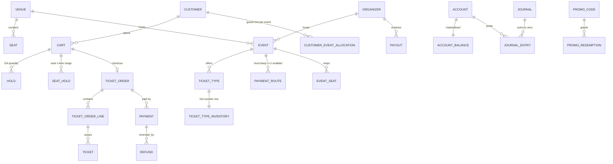

# 4 · Database Design

PostgreSQL 16. Four schemas, one per bounded context: `catalog`, `sales`, `money`, `ops`.

Every table below is annotated with **why it exists**, **which invariant it protects**, and
**which ACID concept it demonstrates** — because in this project the schema *is* most of the
concurrency-control design. Nine of the twelve invariants in §1.4 are enforced by something in
this file rather than by application code.

---

## 4.0 Prerequisites and conventions

```sql
CREATE EXTENSION IF NOT EXISTS btree_gist;   -- required: uuid equality inside a GiST EXCLUDE

CREATE SCHEMA IF NOT EXISTS catalog;   -- parties, venues, events, ticket types, payment routes
CREATE SCHEMA IF NOT EXISTS sales;     -- carts, holds, orders, tickets, inventory, promos
CREATE SCHEMA IF NOT EXISTS money;     -- accounts, double-entry ledger, payments, refunds, payouts
CREATE SCHEMA IF NOT EXISTS ops;       -- outbox, jobs, idempotency, dedup
```

| Convention | Rule |
|---|---|
| Business primary keys | `uuid`, generated by the application as **UUIDv7** (time-ordered ⇒ right-edge B-tree inserts, no random-write amplification). `gen_random_uuid()` is the fallback default. |
| High-volume append-only keys | `bigint GENERATED ALWAYS AS IDENTITY` (`journal_entry`, `outbox`, `job`) |
| Money | `bigint` minor units + `char(3) currency`. Never float. |
| Time | `timestamptz`, server in UTC. Validity windows are `tstzrange`. |
| Enumerations | `text` + `CHECK (col IN (…))`, not PostgreSQL `enum` — adding a value to an `enum` is a catalog change with locking implications; a `CHECK` can be swapped with `NOT VALID` + `VALIDATE`. |
| Soft state | Never `DELETE` financial rows. Reverse them with a new journal. |
| `updated_at` | maintained by the writing statement, not a trigger, so it is visible in the same statement's `RETURNING`. |

**Naming note.** `order` is a reserved word; the table is `sales.ticket_order` so no query ever
needs quoting.

---

## 4.1 Entity overview



---

## 4.2 Schema `catalog`

### `catalog.organizer`, `catalog.customer`

```sql
CREATE TABLE catalog.organizer (
    id            uuid        PRIMARY KEY,
    name          text        NOT NULL CHECK (length(btrim(name)) > 0),
    status        text        NOT NULL DEFAULT 'active'
                              CHECK (status IN ('active','suspended','closed')),
    currency      char(3)     NOT NULL,
    reserve_minor bigint      NOT NULL DEFAULT 0 CHECK (reserve_minor >= 0),
    created_at    timestamptz NOT NULL DEFAULT now()
);

CREATE TABLE catalog.customer (
    id         uuid        PRIMARY KEY,
    email      text        NOT NULL CHECK (position('@' IN email) > 1),
    status     text        NOT NULL DEFAULT 'active'
                           CHECK (status IN ('active','blocked')),
    created_at timestamptz NOT NULL DEFAULT now()
);
-- an expression index, so uniqueness is case-insensitive without needing the citext extension
CREATE UNIQUE INDEX customer_email_uk ON catalog.customer (lower(email));
```

- **Why it exists.** The two parties that own money accounts.
- **Invariant protected.** One account per email (rung 1: a unique index, not a
  `SELECT … WHERE email = …` pre-check, which is a race).
- **ACID concept.** The cheapest correctness rung: a constraint holds against *every* writer at
  *every* isolation level, including a stray `psql` session.
- **`reserve_minor`** is the rolling reserve subtracted from payouts (INV-11).

### `catalog.venue`, `catalog.seat`

```sql
CREATE TABLE catalog.venue (
    id         uuid        PRIMARY KEY,
    name       text        NOT NULL,
    timezone   text        NOT NULL,           -- IANA name, data not server config
    created_at timestamptz NOT NULL DEFAULT now()
);

CREATE TABLE catalog.seat (
    id          uuid PRIMARY KEY,
    venue_id    uuid NOT NULL REFERENCES catalog.venue(id) ON DELETE CASCADE,
    section     text NOT NULL,
    row_label   text NOT NULL,
    seat_number text NOT NULL,
    CONSTRAINT seat_unique_in_venue UNIQUE (venue_id, section, row_label, seat_number)
);
CREATE INDEX seat_venue_section_idx ON catalog.seat (venue_id, section);
```

- **Why.** The physical inventory that reserved-seat events sell.
- **Invariant.** No duplicate seat labels in a venue — the constraint that makes F-1's bulk
  import interesting: it is what *rejects* bad rows, which is why savepoints are needed.
- **ACID concept.** `L01`/`L09` — a `23505` inside an explicit transaction poisons it
  (`25P02`) unless contained by a `SAVEPOINT`.

### `catalog.event`

```sql
CREATE TABLE catalog.event (
    id                       uuid        PRIMARY KEY,
    organizer_id             uuid        NOT NULL REFERENCES catalog.organizer(id),
    venue_id                 uuid        NOT NULL REFERENCES catalog.venue(id),
    name                     text        NOT NULL,
    currency                 char(3)     NOT NULL,
    doors_open_at            timestamptz NOT NULL,
    starts_at                timestamptz NOT NULL,
    status                   text        NOT NULL DEFAULT 'draft'
                                         CHECK (status IN ('draft','onsale','paused','closed','cancelled')),
    max_tickets_per_customer int         NOT NULL DEFAULT 6 CHECK (max_tickets_per_customer BETWEEN 1 AND 50),
    enabled_route_count      int         NOT NULL DEFAULT 0 CHECK (enabled_route_count >= 0),
    version                  int         NOT NULL DEFAULT 0,
    published_at             timestamptz,
    created_at               timestamptz NOT NULL DEFAULT now(),
    updated_at               timestamptz NOT NULL DEFAULT now(),
    CONSTRAINT event_time_order    CHECK (starts_at > doors_open_at),
    CONSTRAINT event_onsale_needs_route
        CHECK (status <> 'onsale' OR enabled_route_count >= 1)   -- INV-9, materialised
);
CREATE INDEX event_onsale_idx ON catalog.event (starts_at) WHERE status = 'onsale';
```

- **Why.** The aggregate root for a show.
- **Invariants protected.**
  - **INV-9** via `enabled_route_count` + the `CHECK`. Read that constraint carefully: a plain
    `CHECK` **cannot** count rows in another table, so the count is *materialised onto this
    row*. That single denormalisation converts a **write-skew** problem (two transactions
    writing two different `payment_route` rows) into a **single-row conflict** that
    `READ COMMITTED` + an atomic `UPDATE` handles. This is the project's clearest example of
    "materialising the conflict".
  - Optimistic concurrency for organizer edits via `version` (F-4, INV — lost update).
- **ACID concepts.** `L05` lost update fix #3 (version column) · `L05` write skew and the
  three ways to kill it · `L03` "the database only enforces the constraints you declared".
- **Design note.** `version` and `enabled_route_count` are both on the *cold* event row. Sales
  counters deliberately live elsewhere (§4.3) so ticket buyers never contend with organizers.

### `catalog.ticket_type`

```sql
CREATE TABLE catalog.ticket_type (
    id           uuid    PRIMARY KEY,
    event_id     uuid    NOT NULL REFERENCES catalog.event(id) ON DELETE CASCADE,
    name         text    NOT NULL,
    kind         text    NOT NULL CHECK (kind IN ('general_admission','reserved')),
    price_minor  bigint  NOT NULL CHECK (price_minor >= 0),
    currency     char(3) NOT NULL,
    sales_window tstzrange NOT NULL,
    version      int     NOT NULL DEFAULT 0,
    CONSTRAINT ticket_type_name_uk UNIQUE (event_id, name)
);
CREATE INDEX ticket_type_event_idx ON catalog.ticket_type (event_id);
```

- **Why.** Price and shape of what is sold. **Cold** data: changed by organizers, read by
  everyone, never written by the sales path.
- **Invariant.** Unique tier names per event; price is server-side (never trust a client price).
- **ACID concept.** Separation of hot and cold columns — see §12.4 for why this matters to MVCC
  bloat and to `40001` rates.

### `catalog.event_seat`

```sql
CREATE TABLE catalog.event_seat (
    event_id       uuid NOT NULL REFERENCES catalog.event(id) ON DELETE CASCADE,
    seat_id        uuid NOT NULL REFERENCES catalog.seat(id),
    ticket_type_id uuid NOT NULL REFERENCES catalog.ticket_type(id),
    status         text NOT NULL DEFAULT 'available'
                        CHECK (status IN ('available','blocked')),
    PRIMARY KEY (event_id, seat_id)
);
CREATE INDEX event_seat_type_idx ON catalog.event_seat (event_id, ticket_type_id);
```

- **Why.** Binds a venue seat to one event and one price tier. `blocked` covers house seats,
  production holds and accessibility pairs.
- **Invariant.** A seat belongs to exactly one ticket type per event (composite PK).

### `catalog.payment_route`

```sql
CREATE TABLE catalog.payment_route (
    id         uuid        PRIMARY KEY,
    event_id   uuid        NOT NULL REFERENCES catalog.event(id) ON DELETE CASCADE,
    provider   text        NOT NULL CHECK (provider IN ('wallet','psp_primary','psp_backup')),
    is_enabled boolean     NOT NULL DEFAULT true,
    priority   int         NOT NULL DEFAULT 100,
    updated_at timestamptz NOT NULL DEFAULT now(),
    CONSTRAINT payment_route_uk UNIQUE (event_id, provider)
);
CREATE INDEX payment_route_enabled_idx ON catalog.payment_route (event_id) WHERE is_enabled;
```

- **Why.** The feature that generates the canonical **write skew** (F-5, INV-9).
- **What it demonstrates.** *You cannot express "at least one enabled row per event" as a
  `CHECK` on this table* — `CHECK` is per-row and cannot see siblings. That fact is the whole
  lesson: this is the shape of invariant that needs `SERIALIZABLE`, a guard-row lock, or
  materialisation onto the parent (`event.enabled_route_count`). Implement all three and
  compare (§6.2).

---

## 4.3 Schema `sales`

### `sales.ticket_type_inventory` — the hot row

```sql
CREATE TABLE sales.ticket_type_inventory (
    ticket_type_id uuid        PRIMARY KEY REFERENCES catalog.ticket_type(id) ON DELETE CASCADE,
    allocated      int         NOT NULL CHECK (allocated >= 0),
    reserved       int         NOT NULL DEFAULT 0 CHECK (reserved >= 0),
    sold           int         NOT NULL DEFAULT 0 CHECK (sold >= 0),
    updated_at     timestamptz NOT NULL DEFAULT now(),
    CONSTRAINT inventory_never_oversells CHECK (reserved + sold <= allocated)   -- INV-3
);
```

- **Why it exists as its own table.** It is the single hottest row in the system (~400
  writes/s). Keeping it away from `ticket_type` means: (a) organizer edits and ticket sales
  never collide; (b) the row has **no indexed columns other than the PK**, so every update is
  a **HOT update** — no index churn, cheaper `VACUUM`, less bloat (`L02 §5.5`).
- **Invariant protected.** INV-3, at rung 1 (`CHECK`) *and* rung 2 (the guarded atomic
  `UPDATE … WHERE reserved + sold + $n <= allocated`).
- **ACID concepts.** `L05` lost update and the atomic-write fix · rows-affected as the business
  signal · why the `CHECK` still matters when the query is already correct: it is the tripwire
  that makes an oversell *impossible* rather than *unlikely*, including from a future code path
  nobody reviewed.

### `sales.cart`

```sql
CREATE TABLE sales.cart (
    id          uuid        PRIMARY KEY,
    customer_id uuid        NOT NULL REFERENCES catalog.customer(id),
    event_id    uuid        NOT NULL REFERENCES catalog.event(id),
    status      text        NOT NULL DEFAULT 'open'
                            CHECK (status IN ('open','checked_out','expired','abandoned')),
    expires_at  timestamptz NOT NULL,
    version     int         NOT NULL DEFAULT 0,
    created_at  timestamptz NOT NULL DEFAULT now()
);
CREATE UNIQUE INDEX cart_one_open_per_customer_event_uk
    ON sales.cart (customer_id, event_id) WHERE status = 'open';
CREATE INDEX cart_expiry_idx ON sales.cart (expires_at) WHERE status = 'open';
```

- **Invariant.** One open cart per customer per event — via a **partial unique index**, so a
  double-click cannot create a second cart and bypass the per-customer limit.
- **ACID concept.** `L05` "check-then-insert is a race; `ON CONFLICT` is not". This is the
  smallest, clearest constraint-beats-isolation-level example in the schema.

### `sales.hold` — general-admission reservations

```sql
CREATE TABLE sales.hold (
    id             uuid        PRIMARY KEY,
    cart_id        uuid        NOT NULL REFERENCES sales.cart(id) ON DELETE CASCADE,
    ticket_type_id uuid        NOT NULL REFERENCES catalog.ticket_type(id),
    quantity       int         NOT NULL CHECK (quantity > 0),
    expires_at     timestamptz NOT NULL,
    created_at     timestamptz NOT NULL DEFAULT now(),
    released_at    timestamptz,
    converted_at   timestamptz,
    CONSTRAINT hold_not_both_terminal CHECK (released_at IS NULL OR converted_at IS NULL)
);
CREATE INDEX hold_reapable_idx ON sales.hold (expires_at, id)
    WHERE released_at IS NULL AND converted_at IS NULL;
CREATE INDEX hold_cart_idx ON sales.hold (cart_id);
```

- **Why.** Paired with the inventory counter: the counter says *how much* is reserved, the hold
  row says *by whom and until when*, so the reaper can give it back.
- **ACID concept.** `L07` — `hold_reapable_idx` is a **partial index matching the reaper's
  claim predicate exactly**, which is what keeps `FOR UPDATE SKIP LOCKED … ORDER BY expires_at
  LIMIT 100` from degenerating into a sequential scan that locks half the table.

### `sales.seat_hold` — reserved seats, the `EXCLUDE` showcase

```sql
CREATE TABLE sales.seat_hold (
    id           uuid        PRIMARY KEY,
    event_id     uuid        NOT NULL,
    seat_id      uuid        NOT NULL,
    cart_id      uuid        NOT NULL REFERENCES sales.cart(id) ON DELETE CASCADE,
    during       tstzrange   NOT NULL,
    created_at   timestamptz NOT NULL DEFAULT now(),
    released_at  timestamptz,
    converted_at timestamptz,
    FOREIGN KEY (event_id, seat_id) REFERENCES catalog.event_seat(event_id, seat_id),
    CONSTRAINT seat_hold_window CHECK (NOT isempty(during) AND lower(during) IS NOT NULL),
    CONSTRAINT seat_hold_no_overlap
        EXCLUDE USING gist (event_id WITH =, seat_id WITH =, during WITH &&)
        WHERE (released_at IS NULL)
);
CREATE INDEX seat_hold_cart_idx ON sales.seat_hold (cart_id);
```

**This is the most important table in the project.** Read it three times.

- **Why.** Holding a seat is not "set a flag"; it is *occupying a seat for a time interval*.
  Modelled that way, the database can enforce non-overlap directly.
- **Invariant protected.** INV-2, and — because a hold is extended to
  `tstzrange(lower(during), 'infinity')` when it converts to a ticket — INV-1 as well, as a
  second line of defence behind the partial unique index on `ticket`.
- **What it demonstrates.**
  - `L05 §4.2` — the *declarative* fix for write skew. Two customers racing for seat `H-12`:
    the first commits, the second gets `23P01 exclusion_violation`, **at any isolation level**,
    even against a `READ COMMITTED` writer or a manual `psql` insert.
  - `L07 §2` — the thing `SELECT … FOR UPDATE` provably cannot do: you cannot lock a row that
    does not exist yet, so row locks cannot stop a competing *insert*. The exclusion constraint
    can.
  - **Time-based expiry with no cleanup dependency.** A hold whose `during` has passed no
    longer overlaps a new `[now, now+15m)` range, so the seat is free the instant the hold
    expires — before any reaper runs. The reaper becomes bookkeeping, not a correctness
    requirement. Contrast this with a `held_until timestamptz` column, where correctness
    depends on every reader remembering to write `AND held_until > now()`.
- **Cost to understand.** GiST is not free: the exclusion check is an index probe plus a
  conflict wait, and a GiST index is larger and slower to update than a B-tree. Measure it.
  §12.6 discusses when a partial unique index on `(event_id, seat_id) WHERE active` is the
  better trade (answer: when holds never need to overlap in time, i.e. no re-sale windows).

### `sales.customer_event_allocation` — the guard row for the per-customer limit

```sql
CREATE TABLE sales.customer_event_allocation (
    customer_id    uuid        NOT NULL REFERENCES catalog.customer(id),
    event_id       uuid        NOT NULL REFERENCES catalog.event(id),
    held           int         NOT NULL DEFAULT 0 CHECK (held  >= 0),
    owned          int         NOT NULL DEFAULT 0 CHECK (owned >= 0),
    limit_snapshot int         NOT NULL CHECK (limit_snapshot > 0),
    updated_at     timestamptz NOT NULL DEFAULT now(),
    PRIMARY KEY (customer_id, event_id),
    CONSTRAINT within_customer_limit CHECK (held + owned <= limit_snapshot)   -- INV-4
);
```

- **Why.** The limit "at most 6 tickets per customer per event" is a predicate over rows that
  **do not exist yet** at decision time. No row lock can cover them; `REPEATABLE READ` will not
  see them; this is textbook **phantom read → write skew**.
- **How this table fixes it.** It *materialises the predicate into a single row*. Every
  concurrent request by that customer for that event now collides on one physical row, so a
  plain `READ COMMITTED` atomic `UPDATE … WHERE held + owned + $n <= limit_snapshot` is
  correct, and the `CHECK` is the backstop.
- **What it demonstrates.** `L04` phantom read · `L05` write skew and "materialising the
  conflict" · `L10` why rung 1+2 beats rung 4. Phase 4 requires implementing the
  `SERIALIZABLE`-only alternative as well and comparing abort rates — the guard row should win
  decisively, and you should be able to explain why in one sentence.
- **`limit_snapshot`** copies `event.max_tickets_per_customer` at first touch so a mid-onsale
  limit change cannot retroactively invalidate existing rows (and so the `CHECK` has everything
  it needs on one row).

### `sales.promo_code`, `sales.promo_redemption`

```sql
CREATE TABLE sales.promo_code (
    id               uuid      PRIMARY KEY,
    event_id         uuid      NOT NULL REFERENCES catalog.event(id) ON DELETE CASCADE,
    code             text      NOT NULL,
    discount_minor   bigint    NOT NULL CHECK (discount_minor > 0),
    budget_minor     bigint    NOT NULL CHECK (budget_minor >= 0),
    redeemed_minor   bigint    NOT NULL DEFAULT 0 CHECK (redeemed_minor >= 0),
    max_redemptions  int       NOT NULL CHECK (max_redemptions > 0),
    redemption_count int       NOT NULL DEFAULT 0 CHECK (redemption_count >= 0),
    valid            tstzrange NOT NULL,
    CONSTRAINT promo_within_budget CHECK (redeemed_minor   <= budget_minor),     -- INV-8
    CONSTRAINT promo_within_count  CHECK (redemption_count <= max_redemptions)
);
CREATE UNIQUE INDEX promo_code_uk ON sales.promo_code (event_id, upper(code));

CREATE TABLE sales.promo_redemption (
    id            uuid        PRIMARY KEY,
    promo_code_id uuid        NOT NULL REFERENCES sales.promo_code(id),
    customer_id   uuid        NOT NULL REFERENCES catalog.customer(id),
    cart_id       uuid        NOT NULL REFERENCES sales.cart(id) ON DELETE CASCADE,
    amount_minor  bigint      NOT NULL CHECK (amount_minor > 0),
    created_at    timestamptz NOT NULL DEFAULT now(),
    CONSTRAINT promo_once_per_customer UNIQUE (promo_code_id, customer_id),
    CONSTRAINT promo_once_per_cart     UNIQUE (promo_code_id, cart_id)
);
```

- **Invariants.** INV-8. Two separate mechanisms: the budget is a **counter + `CHECK`**
  (materialised `SUM`), the per-customer rule is a **`UNIQUE`** (materialised "exists").
- **What it demonstrates.** The same anomaly — write skew on an aggregate predicate — solved by
  two *different* rung-1 constructions. Compare with the naive
  `SELECT SUM(...) … then INSERT`, which the Phase-3 test proves overspends the budget.

### `sales.ticket_order`, `sales.ticket_order_line`

```sql
CREATE TABLE sales.ticket_order (
    id              uuid        PRIMARY KEY,
    cart_id         uuid        NOT NULL REFERENCES sales.cart(id),
    customer_id     uuid        NOT NULL REFERENCES catalog.customer(id),
    event_id        uuid        NOT NULL REFERENCES catalog.event(id),
    status          text        NOT NULL DEFAULT 'pending_payment'
                                CHECK (status IN ('pending_payment','paid','cancelled','expired',
                                                  'partially_refunded','refunded')),
    subtotal_minor  bigint      NOT NULL CHECK (subtotal_minor >= 0),
    discount_minor  bigint      NOT NULL DEFAULT 0 CHECK (discount_minor >= 0),
    total_minor     bigint      NOT NULL CHECK (total_minor >= 0),
    currency        char(3)     NOT NULL,
    idempotency_key text        NOT NULL,
    expires_at      timestamptz NOT NULL,
    version         int         NOT NULL DEFAULT 0,
    created_at      timestamptz NOT NULL DEFAULT now(),
    paid_at         timestamptz,
    CONSTRAINT order_total_consistent CHECK (total_minor = subtotal_minor - discount_minor),
    CONSTRAINT order_idempotency_uk   UNIQUE (idempotency_key),
    CONSTRAINT order_one_per_cart     UNIQUE (cart_id)
);
CREATE INDEX ticket_order_pending_idx ON sales.ticket_order (expires_at)
    WHERE status = 'pending_payment';

CREATE TABLE sales.ticket_order_line (
    id               uuid   PRIMARY KEY,
    order_id         uuid   NOT NULL REFERENCES sales.ticket_order(id) ON DELETE CASCADE,
    ticket_type_id   uuid   NOT NULL REFERENCES catalog.ticket_type(id),
    seat_id          uuid,
    quantity         int    NOT NULL CHECK (quantity > 0),
    unit_price_minor bigint NOT NULL CHECK (unit_price_minor >= 0),
    CONSTRAINT line_seat_is_single CHECK (seat_id IS NULL OR quantity = 1),
    CONSTRAINT line_uk UNIQUE (order_id, ticket_type_id, seat_id)
);
```

- **Invariants.** INV-10 (`UNIQUE (idempotency_key)`), one order per cart, arithmetic
  consistency of the total (a `CHECK` that catches a whole class of discount bugs).
- **ACID concepts.** `L08` idempotency key as a database constraint rather than an application
  check · `L03` a `CHECK` expressing a business rule so it survives every future code path.

### `sales.ticket`

```sql
CREATE TABLE sales.ticket (
    id                 uuid        PRIMARY KEY,
    order_line_id      uuid        NOT NULL REFERENCES sales.ticket_order_line(id),
    seq                int         NOT NULL CHECK (seq > 0),
    event_id           uuid        NOT NULL REFERENCES catalog.event(id),
    ticket_type_id     uuid        NOT NULL REFERENCES catalog.ticket_type(id),
    seat_id            uuid,
    holder_customer_id uuid        NOT NULL REFERENCES catalog.customer(id),
    barcode            text        NOT NULL,
    status             text        NOT NULL DEFAULT 'issued'
                                   CHECK (status IN ('issued','void','scanned')),
    issued_at          timestamptz NOT NULL DEFAULT now(),
    CONSTRAINT ticket_natural_uk UNIQUE (order_line_id, seq),
    CONSTRAINT ticket_barcode_uk UNIQUE (barcode)
);
CREATE UNIQUE INDEX ticket_one_live_per_seat_uk
    ON sales.ticket (event_id, seat_id)
    WHERE seat_id IS NOT NULL AND status <> 'void';                              -- INV-1
```

- **Invariant.** INV-1 — the seat can be on exactly one live ticket, forever, regardless of
  isolation level, code path, or how clever the hold logic was.
- **ACID concept.** `L08 §8.3` — `UNIQUE (order_line_id, seq)` is the **natural key that makes
  the retried transaction body idempotent**: after a `40001` the retry re-runs the inserts, and
  `ON CONFLICT (order_line_id, seq) DO NOTHING` absorbs them. Without it, one retry means two
  tickets for one paid seat.

---

## 4.4 Schema `money`

### `money.account`, `money.account_balance`

```sql
CREATE TABLE money.account (
    id       uuid    PRIMARY KEY,
    kind     text    NOT NULL CHECK (kind IN ('customer_wallet','organizer_payable',
                                              'platform_fee','psp_clearing','payout_clearing',
                                              'promo_liability')),
    owner_id uuid,                                   -- customer/organizer; NULL for platform accounts
    currency char(3) NOT NULL,
    CONSTRAINT account_identity_uk UNIQUE (kind, owner_id, currency),
    CONSTRAINT account_kind_uk     UNIQUE (id, kind)  -- lets account_balance trust its copy of kind
);

CREATE TABLE money.account_balance (
    account_id    uuid        PRIMARY KEY,
    account_kind  text        NOT NULL,
    balance_minor bigint      NOT NULL DEFAULT 0,
    version       bigint      NOT NULL DEFAULT 0,
    updated_at    timestamptz NOT NULL DEFAULT now(),
    FOREIGN KEY (account_id, account_kind) REFERENCES money.account(id, kind),
    CONSTRAINT wallet_never_negative
        CHECK (account_kind <> 'customer_wallet' OR balance_minor >= 0)   -- INV-5
);
```

- **Why a separate balance table.** Same reason as the inventory row: it is the hot,
  frequently-updated part of an otherwise immutable entity. Keeping it alone means HOT updates
  and no index churn.
- **Why `account_kind` is duplicated here.** A `CHECK` cannot join. To express "only *customer
  wallet* accounts must stay non-negative" declaratively, the kind has to be on the same row —
  and the composite FK to `account(id, kind)` guarantees the copy can never drift. This is a
  small, defensible denormalisation in service of a rung-1 constraint, and it is worth being
  able to explain in an interview.
- **Invariants.** INV-5 (no negative wallet) at rung 1; INV-6 (materialised balance equals the
  journal) at rung 2 — *because both are written in the same transaction*.
- **ACID concepts.** `L05` lost update on a balance and all four fixes · `L07` `FOR UPDATE`
  with canonical ordering · `L03` the `C` in ACID being the constraints you chose to declare.

### `money.journal`, `money.journal_entry` — the double-entry ledger

```sql
CREATE TABLE money.journal (
    id              uuid        PRIMARY KEY,
    kind            text        NOT NULL CHECK (kind IN ('topup','order_payment','refund',
                                                         'payout','fee','adjustment','transfer')),
    reference_type  text        NOT NULL,
    reference_id    uuid        NOT NULL,
    currency        char(3)     NOT NULL,
    created_at      timestamptz NOT NULL DEFAULT now(),
    CONSTRAINT journal_reference_uk UNIQUE (kind, reference_type, reference_id)
);

CREATE TABLE money.journal_entry (
    id           bigint GENERATED ALWAYS AS IDENTITY PRIMARY KEY,
    journal_id   uuid   NOT NULL REFERENCES money.journal(id),
    account_id   uuid   NOT NULL REFERENCES money.account(id),
    amount_minor bigint NOT NULL CHECK (amount_minor <> 0),
    currency     char(3) NOT NULL,
    created_at   timestamptz NOT NULL DEFAULT now()
);
CREATE INDEX journal_entry_account_idx ON money.journal_entry (account_id, id);
CREATE INDEX journal_entry_journal_idx ON money.journal_entry (journal_id);

-- INV-5: every journal balances, checked at COMMIT, not per statement
CREATE OR REPLACE FUNCTION money.assert_journal_balanced() RETURNS trigger
LANGUAGE plpgsql AS $$
DECLARE
    v_journal uuid := coalesce(NEW.journal_id, OLD.journal_id);
    v_sum     bigint;
BEGIN
    SELECT coalesce(sum(amount_minor), 0) INTO v_sum
      FROM money.journal_entry WHERE journal_id = v_journal;
    IF v_sum <> 0 THEN
        RAISE EXCEPTION 'journal % does not balance (sum = %)', v_journal, v_sum
            USING ERRCODE = 'check_violation';
    END IF;
    RETURN NULL;
END $$;

CREATE CONSTRAINT TRIGGER journal_entry_balanced
    AFTER INSERT OR UPDATE OR DELETE ON money.journal_entry
    DEFERRABLE INITIALLY DEFERRED
    FOR EACH ROW EXECUTE FUNCTION money.assert_journal_balanced();

-- the ledger is append-only
CREATE RULE journal_entry_no_update AS ON UPDATE TO money.journal_entry DO INSTEAD NOTHING;
CREATE RULE journal_entry_no_delete AS ON DELETE TO money.journal_entry DO INSTEAD NOTHING;
```

- **Why.** Money movement recorded as balanced entries is what turns "did a concurrency bug
  happen?" from a judgement call into a query. Every anomaly in the payment path shows up as a
  journal that does not sum to zero or a balance that disagrees with its entries.
- **Invariants.** INV-5 and INV-6.
- **ACID concepts.**
  - **`DEFERRABLE INITIALLY DEFERRED`** is the point of the constraint trigger: the transaction
    is *allowed* to pass through an unbalanced intermediate state (after the first `INSERT`)
    and is only checked at `COMMIT`. That is `L03 §3`'s deferred constraint, made load-bearing
    rather than theoretical.
  - `journal_reference_uk` makes ledger posting **idempotent**: a retried transaction body
    re-inserting the same journal gets `23505`, which the caller treats as "already posted".
  - The append-only rules encode "`ROLLBACK` is how you undo, a reversing entry is how you
    correct" — you can never quietly rewrite financial history.
- **Watch out.** `DO INSTEAD NOTHING` silently discards writes. It is used here deliberately as
  a hard architectural boundary; the trade-off (silent no-op vs. an error) is discussed in
  §12.9, where a `BEFORE` trigger raising an exception is offered as the stricter alternative.

### `money.payment`, `money.payment_attempt`, `money.refund`, `money.payout`

```sql
CREATE TABLE money.payment (
    id              uuid        PRIMARY KEY,
    order_id        uuid        NOT NULL REFERENCES sales.ticket_order(id),
    customer_id     uuid        NOT NULL REFERENCES catalog.customer(id),
    method          text        NOT NULL CHECK (method IN ('wallet','card')),
    status          text        NOT NULL CHECK (status IN ('initiated','authorizing','authorized',
                                                           'captured','failed','voided')),
    amount_minor    bigint      NOT NULL CHECK (amount_minor > 0),
    captured_minor  bigint      NOT NULL DEFAULT 0 CHECK (captured_minor >= 0),
    refunded_minor  bigint      NOT NULL DEFAULT 0 CHECK (refunded_minor  >= 0),
    currency        char(3)     NOT NULL,
    psp_reference   text,
    idempotency_key text        NOT NULL,
    version         int         NOT NULL DEFAULT 0,
    created_at      timestamptz NOT NULL DEFAULT now(),
    updated_at      timestamptz NOT NULL DEFAULT now(),
    CONSTRAINT payment_idempotency_uk UNIQUE (idempotency_key),       -- INV-10
    CONSTRAINT payment_capture_bound  CHECK (captured_minor <= amount_minor),
    CONSTRAINT payment_refund_bound   CHECK (refunded_minor <= captured_minor)  -- INV-7
);
CREATE INDEX payment_stranded_idx ON money.payment (updated_at)
    WHERE status IN ('initiated','authorizing');   -- the reconciler's claim predicate

CREATE TABLE money.payment_attempt (
    id           uuid        PRIMARY KEY,
    payment_id   uuid        NOT NULL REFERENCES money.payment(id),
    attempt_no   int         NOT NULL CHECK (attempt_no > 0),
    outcome      text        NOT NULL CHECK (outcome IN ('pending','success','declined','error','timeout')),
    psp_response jsonb,
    created_at   timestamptz NOT NULL DEFAULT now(),
    CONSTRAINT payment_attempt_uk UNIQUE (payment_id, attempt_no)
);

CREATE TABLE money.refund (
    id              uuid        PRIMARY KEY,
    payment_id      uuid        NOT NULL REFERENCES money.payment(id),
    order_id        uuid        NOT NULL REFERENCES sales.ticket_order(id),
    amount_minor    bigint      NOT NULL CHECK (amount_minor > 0),
    reason          text        NOT NULL,
    status          text        NOT NULL DEFAULT 'completed' CHECK (status IN ('completed','failed')),
    idempotency_key text        NOT NULL,
    created_at      timestamptz NOT NULL DEFAULT now(),
    CONSTRAINT refund_idempotency_uk UNIQUE (idempotency_key)
);

CREATE TABLE money.payout (
    id            uuid        PRIMARY KEY,
    organizer_id  uuid        NOT NULL REFERENCES catalog.organizer(id),
    business_date date        NOT NULL,
    amount_minor  bigint      NOT NULL CHECK (amount_minor > 0),
    status        text        NOT NULL DEFAULT 'pending'
                              CHECK (status IN ('pending','sent','failed')),
    created_at    timestamptz NOT NULL DEFAULT now(),
    CONSTRAINT payout_once_per_day_uk UNIQUE (organizer_id, business_date)   -- INV-11 / rerun safety
);
```

- **Invariants.** INV-7 (`payment_refund_bound` — the counter that turns a write-skewing `SUM`
  predicate into a rung-1 constraint), INV-10, INV-11 (`payout_once_per_day_uk` makes the
  nightly job safe to re-run).
- **ACID concepts.** `L05` write skew → counter + `CHECK` · `L08` idempotency keys · `L09`
  `payment.status` is an explicit **saga state machine** because the PSP call cannot be inside
  a transaction · `payment_stranded_idx` is the reconciler's claim index.

---

## 4.5 Schema `ops`

```sql
CREATE TABLE ops.outbox (
    id             bigint GENERATED ALWAYS AS IDENTITY PRIMARY KEY,
    aggregate_type text        NOT NULL,
    aggregate_id   uuid        NOT NULL,
    event_type     text        NOT NULL,
    dedup_key      text        NOT NULL,
    payload        jsonb       NOT NULL,
    occurred_at    timestamptz NOT NULL DEFAULT now(),
    published_at   timestamptz,
    attempts       int         NOT NULL DEFAULT 0,
    next_attempt_at timestamptz NOT NULL DEFAULT now(),
    last_error     text,
    CONSTRAINT outbox_dedup_uk UNIQUE (dedup_key)
);
CREATE INDEX outbox_pending_idx ON ops.outbox (next_attempt_at, id) WHERE published_at IS NULL;

CREATE TABLE ops.processed_event (
    consumer     text        NOT NULL,
    dedup_key    text        NOT NULL,
    processed_at timestamptz NOT NULL DEFAULT now(),
    PRIMARY KEY (consumer, dedup_key)
);

CREATE TABLE ops.job (
    id          bigint GENERATED ALWAYS AS IDENTITY PRIMARY KEY,
    kind        text        NOT NULL,
    dedup_key   text        NOT NULL,
    state       text        NOT NULL DEFAULT 'ready'
                            CHECK (state IN ('ready','processing','done','failed')),
    run_after   timestamptz NOT NULL DEFAULT now(),
    locked_by   text,
    locked_at   timestamptz,
    attempts    int         NOT NULL DEFAULT 0,
    payload     jsonb       NOT NULL,
    last_error  text,
    CONSTRAINT job_dedup_uk UNIQUE (dedup_key),
    CONSTRAINT job_lock_pair CHECK ((locked_by IS NULL) = (locked_at IS NULL))
);
CREATE INDEX job_claimable_idx ON ops.job (run_after, id) WHERE state = 'ready';
CREATE INDEX job_stuck_idx     ON ops.job (locked_at)     WHERE state = 'processing';

CREATE TABLE ops.idempotency_key (
    key                 text        PRIMARY KEY,
    endpoint            text        NOT NULL,
    actor_id            uuid        NOT NULL,
    request_fingerprint text        NOT NULL,
    state               text        NOT NULL CHECK (state IN ('in_progress','completed')),
    response_status     int,
    response_body       jsonb,
    created_at          timestamptz NOT NULL DEFAULT now(),
    expires_at          timestamptz NOT NULL,
    CONSTRAINT idem_completed_has_response
        CHECK (state <> 'completed' OR response_status IS NOT NULL)
);
CREATE INDEX idempotency_expiry_idx ON ops.idempotency_key (expires_at);
```

| Table | Why it exists | ACID concept demonstrated |
|---|---|---|
| `outbox` | Events are written **in the same transaction** as the state change, published after commit by a poller | `L03 §8.1`, `L08` — atomicity does not extend to a message broker; the outbox is how you get "committed ⟺ will be published" |
| `processed_event` | Consumer-side dedup so at-least-once delivery becomes effectively-once | `L08` idempotent consumers |
| `job` | Generic claimable work (reaper, reconciler, payouts) | `L07` `FOR UPDATE SKIP LOCKED`; `locked_by`/`locked_at` + `job_stuck_idx` for the "slow job" variant where holding a row lock for minutes is wrong |
| `idempotency_key` | Client-facing replay protection with a stored response and a request fingerprint | `L08 §4.4`, `L03 §8.2` — "the client's knowledge of the outcome" is not covered by atomicity |

`outbox_pending_idx` and `job_claimable_idx` are **partial indexes on the claim predicate**.
Once `published_at IS NOT NULL` the row leaves the index entirely, so the index stays small
even as the table grows to millions of rows — the difference between a queue that works at
month 6 and one that does not.

---

## 4.6 Index summary and rationale

| Index | Purpose | Concurrency reason |
|---|---|---|
| `cart_one_open_per_customer_event_uk` (partial unique) | INV — one open cart | Turns a check-then-insert race into a constraint |
| `seat_hold_no_overlap` (GiST EXCLUDE, partial) | INV-2 / INV-1 | The only mechanism that can reject a *competing insert* |
| `ticket_one_live_per_seat_uk` (partial unique) | INV-1 | Final backstop against double-selling a seat |
| `promo_code_uk` on `(event_id, upper(code))` | Case-insensitive uniqueness | Expression index; avoids a `SELECT`-then-`INSERT` |
| `hold_reapable_idx` (partial) | Reaper claim | Keeps `FOR UPDATE SKIP LOCKED` from scanning and locking the world |
| `outbox_pending_idx`, `job_claimable_idx` (partial) | Queue claim | Same, and the index shrinks as work completes |
| `payment_stranded_idx` (partial) | Reconciler claim | Finds saga rows abandoned by a crash |
| `journal_entry_account_idx` on `(account_id, id)` | INV-6 reconciliation, statements | Supports the "balance equals the sum of its entries" check without a full scan |
| `event_onsale_idx` (partial) | Hot-path listing | Small index over the few live events |
| `ticket_order_pending_idx` (partial) | Order-expiry sweeper | Same pattern as the reaper |

**Deliberately absent:** no index on `ticket_type_inventory` or `account_balance` beyond the
primary key. Those rows are updated hundreds of times a second and every extra index would
convert a cheap HOT update into an index write plus extra dead index entries (`L02 §5.5`).
Being able to say *why you did not create an index* is part of the deliverable.

---

## 4.7 Migration rules

1. Every schema change is a numbered, forward-only migration checked into source control.
2. `SET lock_timeout = '3s'` at the top of every migration, so a migration blocked behind a
   long query fails fast instead of queueing every reader behind it (`L07 §5.3`).
3. New indexes: `CREATE INDEX CONCURRENTLY` (outside a transaction block).
4. New constraints on populated tables: `ADD CONSTRAINT … NOT VALID`, then `VALIDATE
   CONSTRAINT` in a separate migration, so the `ACCESS EXCLUSIVE` window stays tiny.
5. Adding `seat_hold_no_overlap` to a table with existing overlaps is an explicit Phase-7
   exercise: find and quarantine violators first, then build the GiST index `CONCURRENTLY`,
   then attach the constraint using that index.
6. Seed/demo data lives in a separate, idempotent script — never in a migration.
