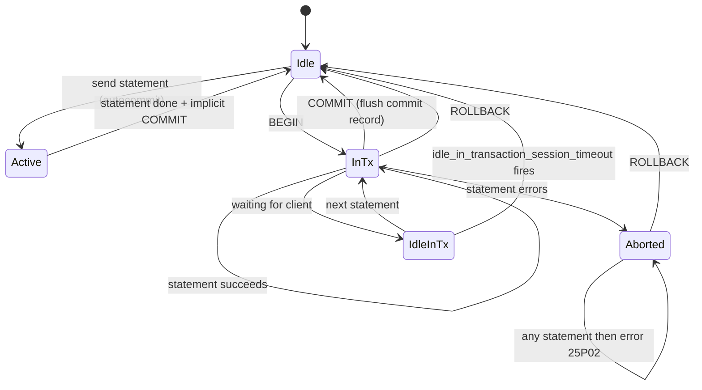
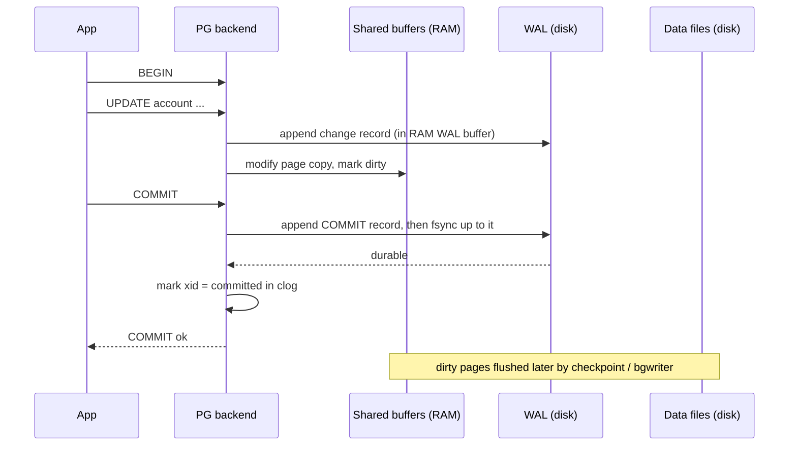

# 01 · What Is a Transaction

> Covers `ACID.json` item **L06.6.1** (transaction boundaries) at the mechanical level.
> The *design* question — where the boundary belongs in a backend service — is lesson 09.

---

## 1. Learning objectives

After this lesson you can:

- Explain what `BEGIN`, `COMMIT`, and `ROLLBACK` actually do inside PostgreSQL.
- Describe the states a session moves through and why `idle in transaction` is dangerous.
- Explain how atomicity and durability are implemented (WAL + commit record) without hand-waving.
- Start and end a transaction correctly from Npgsql, including the failure paths.
- Distinguish an *implicit* (autocommit) transaction from an *explicit* one.

---

## 2. Mental model

**The intuitive picture:** a transaction is a pair of braces around several statements. Either
every statement inside takes effect, or none of them do. While you are inside the braces, you
are working on a private draft; `COMMIT` publishes the draft atomically.

**Where the simple picture is wrong:**

- The "private draft" is not a copy. Your `INSERT`/`UPDATE`/`DELETE` write **real rows into
  the real table immediately**, tagged with your transaction id. Other transactions simply
  can't *see* them yet (lesson 02). This is why a huge `UPDATE` inside an uncommitted
  transaction already consumes disk and can already block other writers.
- `COMMIT` is not "now write everything." Most of the work is already on disk. `COMMIT` is
  mostly a single tiny durable record that says *"transaction 1234 is valid."* That is what
  makes commit fast and rollback cheap.
- `ROLLBACK` does **not** carefully undo your statements one by one. It writes an abort
  record; the rows you wrote are simply never made visible and are cleaned up later by
  `VACUUM`. Rollback of a 10-million-row `DELETE` is nearly instant.
- A transaction is **not** automatically isolated from concurrency. Wrapping code in
  `BEGIN … COMMIT` gives you atomicity and durability. It does *not*, by itself, stop another
  session from interleaving with you in ways that corrupt an invariant. That is the whole
  rest of this course.

**Common misconceptions:**

| Misconception | Reality |
|---|---|
| "Nothing is written until `COMMIT`." | Rows are written during the transaction; commit only flips them to *visible/valid*. |
| "`ROLLBACK` is expensive." | `ROLLBACK` is O(1)-ish; the cost is deferred to `VACUUM`. |
| "`BEGIN` takes a snapshot / a lock." | `BEGIN` alone does almost nothing. The snapshot is taken by the **first real statement**. Locks are taken per statement. |
| "One statement outside a transaction isn't a transaction." | Every statement runs in a transaction. A lone statement is its own single-statement (autocommit) transaction. |
| "A transaction = a database connection." | A connection is a long-lived pipe; it hosts a sequence of transactions over its life. PostgreSQL does not support nested or concurrent transactions on one connection. |

---

## 3. Key terms

- **Transaction** — a sequence of operations executed as a single logical unit of work that
  either completes entirely (`COMMIT`) or has no effect (`ROLLBACK`).
- **Autocommit / implicit transaction** — when you send a bare statement with no `BEGIN`,
  the server wraps it in its own transaction and commits automatically if it succeeds.
- **Explicit transaction** — one you open with `BEGIN` (or `START TRANSACTION`) and close
  with `COMMIT` or `ROLLBACK`.
- **WAL (Write-Ahead Log)** — an append-only on-disk log. Every change is written to the WAL
  *before* the corresponding data page is allowed to reach disk. This is what makes crash
  recovery possible.
- **Commit record** — a WAL entry that records "transaction X committed." A transaction's
  effects become durable and official at the moment its commit record is flushed to disk.
- **`clog` / `pg_xact`** — a small on-disk array holding 2 bits of state per transaction id
  (in progress / committed / aborted / sub-committed). Visibility checks consult it.
- **Backend** — the OS process PostgreSQL forks to serve one connection.

---

## 4. Why transactions exist

Two problems make raw statement-at-a-time writes unusable for real systems:

1. **Partial failure.** "Debit account 1, credit account 2" is two `UPDATE`s. If the process
   crashes, the disk fills, or a constraint fails between them, money is destroyed or created.
   Transactions make the pair all-or-nothing (**atomicity**).
2. **Crash durability.** Once you tell a user "payment accepted," that fact must survive an
   immediate power loss. Transactions give you a precise, durable commit point
   (**durability**).

They *also* provide the hook for **isolation** (controlling concurrent interleavings) and
**consistency** (constraint checking at commit), but atomicity + durability are the reason
the concept exists at all.

---

## 5. How it works internally

### 5.1 The lifecycle

```sql
BEGIN;                       -- start an explicit transaction block; assigns a virtual xid only
SELECT ...;                  -- first statement: a snapshot is taken; a real xid is assigned lazily on first write
UPDATE account SET ...;      -- writes new tuple versions tagged with this xid; takes row locks; WAL records appended
SAVEPOINT s1;                -- optional: sub-transaction marker
UPDATE ...;
COMMIT;                      -- flush commit record to WAL, mark xid committed in clog, release locks
```

Key facts:

- **A real transaction id (`xid`) is assigned lazily**, on the first statement that actually
  writes data. Read-only transactions often never consume an `xid` at all (they use a
  lightweight *virtual* xid). This keeps the 32-bit `xid` space from burning on read traffic.
- **Every write appends WAL first**, then modifies the shared-buffer copy of the data page.
  The dirty data page is flushed later by a checkpoint or the background writer. If the
  server crashes, recovery replays WAL from the last checkpoint and the data pages are
  reconstructed.
- **`COMMIT`**: append a commit record to WAL → `fsync` the WAL up to that record (subject to
  `synchronous_commit`) → set the transaction's state to *committed* in `clog` → release all
  locks → advance the session out of the transaction. The `fsync` of the commit record is the
  single durability point.
- **`ROLLBACK`**: mark the `xid` *aborted* in `clog`, release locks. The tuples this
  transaction inserted, and the delete-marks it placed, are now dead and will be reclaimed by
  `VACUUM`. No per-row undo is performed. (PostgreSQL has no UNDO log; this is a deliberate
  design trade-off — cheap rollback, but `VACUUM` is required.)

### 5.2 When do other sessions see my changes?

At the instant your commit record is flushed and your `xid` is marked committed in `clog`.
There is no separate "publish" step and no gradual reveal. Before that instant, other
sessions never see your uncommitted rows (that is *dirty read* prevention, lesson 04, and it
is not optional in PostgreSQL).

### 5.3 Session / transaction states

`psql`'s `%x` prompt and the `pg_stat_activity.state` column show these:

| State | Meaning | Risk |
|---|---|---|
| `idle` | Connected, no transaction open. | Fine. |
| `active` | Running a statement right now. | Fine unless long. |
| `idle in transaction` | `BEGIN` issued, a statement ran, now waiting for the client to send more. | **Holds a snapshot and any locks it already took.** Blocks `VACUUM` cleanup and can block other writers indefinitely. |
| `idle in transaction (aborted)` | A statement errored; the transaction is poisoned. Every further statement returns `25P02` until you `ROLLBACK`. | Wastes a connection; usually a missing error handler. |

`idle in transaction` is the classic production incident: an app opens a transaction, then
makes a slow HTTP call, then writes. For that whole HTTP call the database cannot advance its
cleanup horizon. Guard it server-side:

```sql
-- kill transactions left idle for over 15s (set in postgresql.conf or per-role)
ALTER ROLE app SET idle_in_transaction_session_timeout = '15s';
```

### 5.4 Subtransactions (savepoints)

`SAVEPOINT s1` starts a *subtransaction* with its own `xid`. `ROLLBACK TO SAVEPOINT s1`
aborts just the work after `s1` and lets the outer transaction continue. `RELEASE SAVEPOINT
s1` discards the marker (the work stays, pending the outer commit). Details and the "is it
worth it" judgement are in lesson 09. Cost note: each savepoint that does work consumes an
`xid`, and having many active subtransactions per session degrades visibility-check
performance (the "subtransaction SLRU" overflow problem).

---

## 6. Diagrams

### 6.1 Session state machine



**Reading the diagram.** A bare statement goes `Idle → Active → Idle` and is committed for
you. `BEGIN` moves you to `InTx`, where statements accumulate. Success paths leave through
`COMMIT` or `ROLLBACK`. Any error inside the block drops you into `Aborted`, where the *only*
accepted commands are `ROLLBACK` / `ROLLBACK TO SAVEPOINT` — everything else returns
`25P02 (in_failed_sql_transaction)`. `IdleInTx` is a real, observable state you can sit in
between statements; it is where snapshots and locks are held hostage by a slow client.

### 6.2 What COMMIT makes durable



**Reading the diagram.** By the time you send `COMMIT`, the row changes are already in the
shared-buffer page copies and described in the WAL buffer. `COMMIT`'s real work is appending
the commit record and `fsync`-ing the WAL. The heap data files can still be stale in RAM for
seconds afterwards — that is safe, because a crash replays the WAL to rebuild them. This is
why commit latency is dominated by one WAL `fsync`, and why `synchronous_commit = off` (which
skips waiting for that `fsync`) trades a few hundred ms of possibly-lost commits for
throughput without risking corruption.

---

## 7. Hands-on lab

### 7.1 Rollback is cheap and invisible to others

| Step | Session A | Session B | Expected result |
|---|---|---|---|
| 1 | `BEGIN;` | | `BEGIN` |
| 2 | `INSERT INTO counter VALUES ('tmp', 5);` | | `INSERT 0 1` |
| 3 | | `SELECT * FROM counter WHERE id='tmp';` | **0 rows** — B cannot see A's uncommitted insert |
| 4 | `SELECT * FROM counter WHERE id='tmp';` | | 1 row — A sees its own write (command visibility) |
| 5 | `ROLLBACK;` | | `ROLLBACK` |
| 6 | `SELECT * FROM counter WHERE id='tmp';` | | **0 rows** — the insert never became visible |

Takeaway: uncommitted writes exist on disk but are private; rollback discards them with no
per-row work.

### 7.2 The aborted-transaction trap

| Step | Session A | Expected result |
|---|---|---|
| 1 | `BEGIN;` | `BEGIN` |
| 2 | `INSERT INTO account (id, owner, balance) VALUES (1, 'dupe', 0);` | `ERROR: duplicate key value violates unique constraint "account_pkey"` |
| 3 | `SELECT 1;` | `ERROR: current transaction is aborted, commands ignored until end of transaction block` (`25P02`) |
| 4 | `ROLLBACK;` | `ROLLBACK` — session usable again |

Takeaway: after any error, the transaction is poisoned. Application code must catch the error
and issue `ROLLBACK` (or roll back to a savepoint taken *before* the risky statement).

### 7.3 Watch an `idle in transaction` session

| Step | Session A | Session B | Expected result |
|---|---|---|---|
| 1 | `BEGIN;` | | |
| 2 | `UPDATE account SET balance = balance WHERE id = 1;` | | takes a row lock, assigns an xid |
| 3 | | `SELECT pid, state, now()-state_change AS idle_for, wait_event_type FROM pg_stat_activity WHERE state LIKE 'idle in transaction%';` | one row, `idle_for` climbing |
| 4 | | `SELECT backend_xmin FROM pg_stat_activity WHERE pid = pg_backend_pid();` then compare to A's | A's `backend_xmin` pins the VACUUM horizon |
| 5 | `ROLLBACK;` | | horizon released |

Takeaway: a transaction that is open but doing nothing still costs the whole database (cleanup
horizon) and can still block writers on any row it already touched.

---

## 8. In application code (C# / Npgsql)

### 8.1 The correct shape

```csharp
await using var conn = await dataSource.OpenConnectionAsync();
await using var tx = await conn.BeginTransactionAsync(IsolationLevel.ReadCommitted);
try
{
    await using (var debit = new NpgsqlCommand(
        "UPDATE account SET balance = balance - $1 WHERE id = $2", conn, tx))
    {
        debit.Parameters.Add(new() { Value = 100m });
        debit.Parameters.Add(new() { Value = 1L });
        await debit.ExecuteNonQueryAsync();
    }

    await using (var credit = new NpgsqlCommand(
        "UPDATE account SET balance = balance + $1 WHERE id = $2", conn, tx))
    {
        credit.Parameters.Add(new() { Value = 100m });
        credit.Parameters.Add(new() { Value = 2L });
        await credit.ExecuteNonQueryAsync();
    }

    await tx.CommitAsync();
}
catch
{
    await tx.RollbackAsync();   // also happens automatically on dispose, but be explicit
    throw;
}
```

Notes:

- `await using` on the `NpgsqlTransaction` means: if you never call `CommitAsync`, disposal
  issues a `ROLLBACK`. An exception before `CommitAsync` is therefore safe even without the
  `catch`, but an explicit `RollbackAsync` makes intent and timing obvious and frees the
  server sooner.
- Passing `conn, tx` to each `NpgsqlCommand` is optional (commands on that connection join
  the active transaction automatically) but recommended for clarity and portability.
- Do **not** hold this transaction open across an `await httpClient.GetAsync(...)` or a queue
  publish. That is the `idle in transaction` incident from §5.3. Lesson 09 covers boundary
  placement.

### 8.2 Autocommit

With no `BeginTransaction`, each `ExecuteNonQueryAsync` is its own committed transaction:

```csharp
await using var conn = await dataSource.OpenConnectionAsync();
await using var cmd = new NpgsqlCommand("UPDATE account SET balance = balance + 1 WHERE id = 1", conn);
await cmd.ExecuteNonQueryAsync();   // committed immediately if it succeeds
```

Fine for a single self-contained statement. The moment you have two statements that must
both apply or neither, you need an explicit transaction.

### 8.3 What `SqlState` you will see on the failure paths

| Situation | Exception | `SqlState` |
|---|---|---|
| Constraint violation | `PostgresException` | `23505` unique, `23503` FK, `23514` check, `23502` not-null |
| Statement after an error, no rollback | `PostgresException` | `25P02` |
| Server killed your idle transaction | `PostgresException` | `25P03` (idle-in-transaction timeout) |
| Serialization / deadlock (lessons 06–08) | `PostgresException` | `40001` / `40P01` |

---

## 9. Practical exercises

### Beginner

1. In your own words, what does `COMMIT` physically do that `BEGIN` does not?
2. Explain why `ROLLBACK` of a million-row `DELETE` is fast in PostgreSQL but the disk space
   is not freed immediately.
3. Run lab 7.2. After the `25P02` error, try `COMMIT;` instead of `ROLLBACK;`. What happens
   to the transaction's effects, and why is that the safe default?

### Intermediate

4. Write a `psql` script that leaves a session `idle in transaction` for 20 seconds, and from
   a second session capture `pg_stat_activity.backend_xmin` and the output of
   `SELECT age(backend_xmin) FROM pg_stat_activity WHERE state LIKE 'idle in transaction%'`.
   Then set `idle_in_transaction_session_timeout = '5s'` for your role, repeat, and confirm
   the session is terminated with `25P03`.
5. In the C# skeleton, deliberately throw an exception between the debit and the credit.
   Prove (with a follow-up `SELECT`) that neither `UPDATE` persisted. Now remove the
   `await using` on the transaction and the `catch`; show the connection is returned to the
   pool with an open transaction and what Npgsql does about it.

### Advanced

6. Your service opens a transaction at the start of each HTTP request and commits at the end
   (a "transaction-per-request" filter). List three concrete production failure modes this
   causes under load, tie each to a mechanism from §5, and propose where the boundary should
   move instead.
7. `synchronous_commit` can be set per-transaction (`SET LOCAL synchronous_commit = off`).
   Describe a class of writes in a real backend where `off` is acceptable and a class where
   it is not, and state precisely what you can lose in each case (and what you cannot —
   e.g. corruption vs. a few recent commits).
8. PostgreSQL has no UNDO log. Explain the two major operational consequences of that design
   choice (one good, one bad) and how `VACUUM` and `autovacuum` relate to the bad one.

---

## 10. Key takeaways

- A transaction gives you **atomicity** (all-or-nothing) and **durability** (survives crash)
  almost for free; it does **not** give you isolation from concurrency by itself.
- Writes hit real tables *during* the transaction, tagged with your `xid`; `COMMIT` flips
  them to visible/valid by flushing one commit record and updating `clog`.
- `ROLLBACK` is cheap (no per-row undo); the cleanup cost is paid later by `VACUUM`.
- The snapshot is taken by the **first statement**, not by `BEGIN`. Locks are per statement.
- `idle in transaction` holds snapshots and locks — never span external I/O with an open
  transaction; enforce `idle_in_transaction_session_timeout` server-side.
- After any error the transaction is poisoned (`25P02`) until `ROLLBACK`.

Next: `02-mvcc-snapshots-and-visibility.md` — how PostgreSQL decides which row version your
query is allowed to see.
