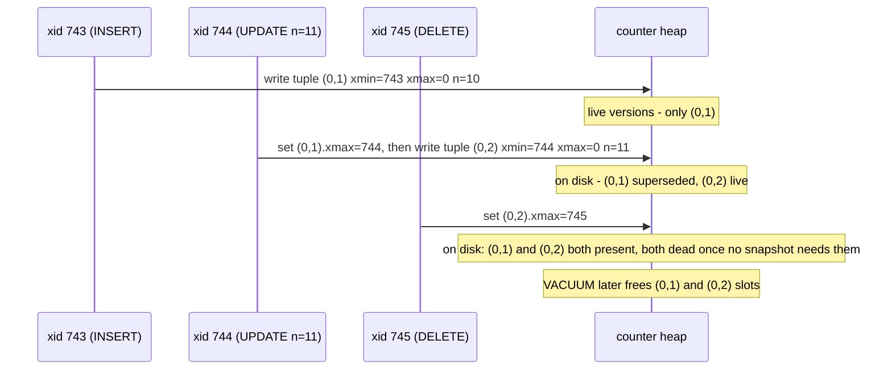
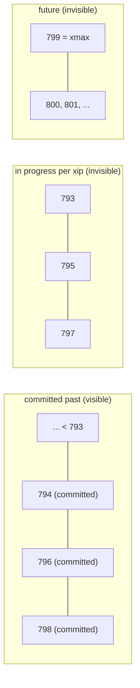

# 02 · MVCC, Snapshots & Visibility

This is the foundation lesson. Every anomaly and every isolation level in lessons 04–10 is a
direct consequence of the two mechanisms here: **how PostgreSQL stores multiple versions of a
row**, and **how a query decides which version it may see**.

---

## 1. Learning objectives

After this lesson you can:

- Explain what `INSERT`, `UPDATE`, and `DELETE` do to the physical heap in terms of tuples,
  `xmin`, and `xmax`.
- Describe a snapshot as `(xmin, xmax, xip[])` and apply the visibility rule by hand.
- Explain precisely when a snapshot is taken under `READ COMMITTED` vs `REPEATABLE READ`/
  `SERIALIZABLE`.
- Explain why long-running transactions cause table bloat (the "xmin horizon").
- Use `xmin`, `xmax`, `ctid`, `age()`, `pg_current_snapshot()`, and `pg_stat_activity.backend_xmin`
  to observe all of this directly.

---

## 2. Mental model

**The intuitive picture:** the database keeps a **history** of every row. A reader is handed
a *timestamp* (a snapshot) when its statement or transaction starts, and it sees the version
of each row that was committed as of that timestamp — regardless of what writers do
afterwards. Readers never block writers; writers never block readers. Two writers touching
the *same row* still fight (via row locks); everything else runs in parallel.

**Where the simple picture is wrong:**

- The "timestamp" is not a clock value. It is a set of transaction ids:
  *"everything committed by xid < N, minus this explicit list of ids that were still running."*
- "The version committed as of my snapshot" is not stored as a diff/history table. Every
  version is a full physical row (**tuple**) sitting in the same table's data file. `SELECT`
  walks the tuples and skips the ones its snapshot must not see. Old versions accumulate
  until `VACUUM` removes them — that is *bloat*, and it is the price of MVCC.
- Under `READ COMMITTED` the "timestamp" is refreshed for **every statement**. So two
  `SELECT`s in one transaction are effectively two different points in time.

**Common misconceptions:**

| Misconception | Reality |
|---|---|
| "`UPDATE` changes the row in place." | `UPDATE` = mark the old tuple deleted (`xmax`) + insert a brand-new tuple. The old one lingers. |
| "Deleted rows are gone." | `DELETE` just stamps `xmax`. The tuple stays until `VACUUM`, still visible to older snapshots. |
| "MVCC means no locks." | MVCC removes *read* locks. Row-level *write* locks, and all the locks in lesson 07, still exist. |
| "A `SELECT` in a transaction sees a consistent view for the whole transaction." | Only at `REPEATABLE READ`+. At `READ COMMITTED` each statement re-snapshots. |
| "`VACUUM` is optional tuning." | Without it: unbounded bloat and, eventually, transaction-id wraparound shutdown. |

---

## 3. Key terms

- **Heap** — the unordered data file holding a table's tuples.
- **Tuple** — one physical version of a row (block number + offset = its `ctid`).
- **`xmin`** — the xid of the transaction that **inserted** this tuple.
- **`xmax`** — the xid of the transaction that **deleted or row-locked** this tuple; `0`
  (shown as `0`) means "still live, not deleted."
- **`cmin` / `cmax`** — command ids: which statement *within* a transaction created / removed
  the tuple. Lets a statement avoid seeing its own not-yet-executed effects.
- **xid** — 32-bit transaction id, handed out in increasing order, wraps around (§5.6).
- **Snapshot** — `(xmin, xmax, xip[])`: the youngest xid all of whose predecessors are
  decided, the first xid not yet assigned, and the list of in-progress xids in between.
- **Hint bits** — per-tuple cached flags ("xmin committed", "xmax aborted", …) set on first
  visit so later visibility checks skip the `clog` lookup.
- **HOT (Heap-Only Tuple)** — an `UPDATE` that changes no indexed column and fits on the same
  page: the new tuple is chained on-page and **no index entry is added**. Reduces bloat.
- **Dead tuple** — a version no longer visible to any possible snapshot; `VACUUM` reclaims it.
- **xmin horizon / `OldestXmin`** — the oldest xid still needed by *some* snapshot anywhere.
  `VACUUM` may only remove tuples whose deleting xid is older than this. Long transactions
  hold it back.

---

## 4. Why MVCC exists

The alternative is **two-phase locking**: a reader takes a shared lock on every row it reads
and holds it to end-of-transaction; a writer needs an exclusive lock and therefore waits for
all readers. Under that scheme a long analytical `SELECT` blocks every `UPDATE` to the rows
it scans, and vice versa. Read/write contention becomes the system's ceiling.

MVCC's bet: **keep old row versions around so readers can be given a consistent past instead
of being blocked.** Consequences of the bet:

- Readers and writers almost never block each other. Huge win for mixed OLTP workloads.
- The database must store, then later garbage-collect, obsolete versions → `VACUUM`,
  `autovacuum`, bloat management (skill refs: `postgres-pro/references/maintenance.md`).
- "Which version do I see?" becomes an explicit, tunable decision → **isolation levels**.

---

## 5. How it works internally

### 5.1 What each statement does to the heap

Start clean:

```sql
TRUNCATE lab.counter;
INSERT INTO lab.counter (id, n) VALUES ('x', 10);
```

Inspect the physical tuple (system columns are always there, you just have to ask):

```sql
SELECT ctid, xmin, xmax, n FROM lab.counter WHERE id = 'x';
--  ctid  | xmin | xmax | n
-- (0,1)  | 743  | 0    | 10        -- inserted by xid 743, not deleted
```

Now update it **in its own transaction** and look again:

```sql
UPDATE lab.counter SET n = 11 WHERE id = 'x';
SELECT ctid, xmin, xmax, n FROM lab.counter WHERE id = 'x';
--  ctid  | xmin | xmax | n
-- (0,2)  | 744  | 0    | 11
```

The row "moved" from `ctid (0,1)` to `(0,2)`. What actually happened:

| Event | Old tuple `(0,1)` | New tuple `(0,2)` |
|---|---|---|
| `INSERT` (xid 743) | `xmin=743, xmax=0` | — |
| `UPDATE` (xid 744) | `xmin=743, xmax=744` | `xmin=744, xmax=0` |
| `DELETE` (xid 745) | `xmin=743, xmax=744` | `xmin=744, xmax=745` |

So:

- **INSERT** writes a new tuple with `xmin = my xid`, `xmax = 0`.
- **UPDATE** is *delete + insert*: it sets `xmax = my xid` on the current tuple **and** writes
  a new tuple with `xmin = my xid`. Both versions are on disk simultaneously.
- **DELETE** just sets `xmax = my xid` on the current tuple.
- **`SELECT ... FOR UPDATE`** also stamps `xmax` with your xid (plus lock-strength flags) even
  though it deletes nothing — a lock is recorded on the tuple itself.

Old tuples become **dead** once no snapshot can see them; `VACUUM` frees their slots. Until
then the table file only grows.

### 5.2 A snapshot, concretely

```sql
SELECT pg_current_snapshot();
-- 793:799:793,795,797
--  ^    ^   ^^^^^^^^^^^
-- xmin xmax  xip list (in-progress xids)
```

Interpretation of that snapshot:

- `xmin = 793` — every xid **< 793** is finished (committed or aborted); their state is
  already decided.
- `xmax = 799` — `799` is the next xid not yet handed out. Every xid **≥ 799** started after
  this snapshot and must be treated as invisible.
- `xip = {793, 795, 797}` — these xids are **in progress** as of this snapshot. Anything they
  did is invisible, even if they commit one microsecond later.
- Therefore visible "committed past" = `{794, 796, 798}` plus everything `< 793`.

### 5.3 The visibility rule (apply it by hand)

A tuple is **visible to snapshot S** if **both** hold:

1. **Its `xmin` is visible** — the inserting transaction is *committed* and *not hidden* by S:
   `xmin` committed **and** (`xmin < S.xmin` **or** (`xmin < S.xmax` **and** `xmin ∉ S.xip`)).
   Special case: if `xmin` is *my own* transaction, use `cmin` — I see it only if the
   inserting command already ran.
2. **Its `xmax` does NOT hide it** — the deleting/locking transaction has *not* committed as
   far as S is concerned: `xmax = 0/invalid`, **or** `xmax` aborted, **or** `xmax` is
   in-progress/future per S, **or** `xmax` was only a lock (not a real delete).

If `xmin` is invisible → the row "doesn't exist yet" for you. If `xmin` is visible but `xmax`
is also visible → the row "has been deleted" for you.

`clog` (a.k.a. `pg_xact`) stores the committed/aborted bit per xid that these checks consult;
hint bits cache the answer on the tuple after the first check.

### 5.4 When is the snapshot taken? (the crux for lessons 04–06)

| Isolation level | Snapshot taken… | Effect |
|---|---|---|
| `READ COMMITTED` (default) | **at the start of every statement** | consecutive statements in one transaction can see different committed data |
| `REPEATABLE READ` | **once, at the first real statement** of the transaction (not at `BEGIN`) | the whole transaction sees one frozen view |
| `SERIALIZABLE` | same as `REPEATABLE READ` (one snapshot) **plus** SSI conflict tracking | as above, but conflicting transactions get aborted with `40001` |

> **`BEGIN` does not take the snapshot.** Under `REPEATABLE READ`, if you run `BEGIN`, wait,
> then run your first `SELECT`, the snapshot is from the `SELECT`. Use
> `BEGIN TRANSACTION ISOLATION LEVEL REPEATABLE READ` and issue the first read promptly.
> (There is also `SET TRANSACTION SNAPSHOT` for sharing an exact snapshot between sessions,
> used by `pg_dump` parallel jobs.)

### 5.5 `ctid`, HOT, and index bloat

- `ctid` is *not* a stable row id. A non-HOT `UPDATE` moves the live version to a new `ctid`
  and adds a new index entry pointing at it. Never store `ctid` as a key.
- A **HOT update** (no indexed column changed, room on the page) links the new tuple to the
  old one on the same page and adds **no** index entries. `pg_stat_user_tables.n_tup_hot_upd`
  vs `n_tup_upd` tells you your HOT ratio — high is good, it means less index churn and
  cheaper `VACUUM`.

### 5.6 The xmin horizon and bloat (why lesson 01 hated `idle in transaction`)

`VACUUM` can only remove a dead tuple if its `xmax` is older than **every** live snapshot's
requirement — the global `OldestXmin`. That value is held back by whichever is oldest of:

- the oldest running transaction's snapshot (`pg_stat_activity.backend_xmin`),
- a `hot_standby_feedback` replica,
- a stale replication slot (`pg_replication_slots.xmin`),
- a prepared (two-phase) transaction.

One transaction that stays open for an hour means an hour of dead tuples from the *entire
database* cannot be reclaimed. This is the number-one cause of runaway bloat.

```sql
-- who is holding the horizon back, worst first
SELECT pid, state, age(backend_xmin) AS xmin_age, now() - xact_start AS xact_age, query
FROM pg_stat_activity
WHERE backend_xmin IS NOT NULL
ORDER BY age(backend_xmin) DESC;
```

### 5.7 Transaction-id wraparound (know it exists)

`xid` is 32-bit and circular, so "older/newer" is defined modulo 2^32. To stop a 2-billion-
transaction-old tuple from appearing to be "in the future," `VACUUM` **freezes** old tuples
(marks them "visible to everyone", recorded via `relfrozenxid`). If freezing falls too far
behind, PostgreSQL forces aggressive autovacuum and, at the last resort, refuses new xids
until you vacuum. Monitor:

```sql
SELECT datname, age(datfrozenxid) AS xid_age
FROM pg_database ORDER BY xid_age DESC;   -- alarm well before 2^31
```

(Full treatment: `postgres-pro/references/maintenance.md` → "Transaction ID Wraparound".)

---

## 6. Diagrams

### 6.1 One row's version history



**Reading the diagram.** A single logical row `id='x'` produced three physical tuples over
its life. At every moment, *all* still-relevant versions coexist in the heap; `xmin`/`xmax`
are the bookkeeping that lets each snapshot pick the right one. Nothing is ever edited in
place, and nothing is physically removed until `VACUUM` decides it is safe.

### 6.2 Snapshot as a number line



**Reading the diagram.** Snapshot `793:799:793,795,797`. Visibility is not "xid < some
number." It is "xid is committed **and** not in the `xip` hole **and** not past `xmax`." xids
794, 796, 798 are visible even though they are numerically *between* invisible ones, because
they had already committed when the snapshot was taken.

### 6.3 Snapshot timing per isolation level

```mermaid
sequenceDiagram
    participant RC as READ COMMITTED txn
    participant RR as REPEATABLE READ txn
    participant DB

    Note over RC,DB: BEGIN (no snapshot yet)
    RC->>DB: SELECT #1  -> snapshot S1
    RC->>DB: SELECT #2  -> snapshot S2 (fresh, may differ from S1)
    RC->>DB: UPDATE     -> snapshot S3 (+ concurrent-update re-check)

    Note over RR,DB: BEGIN (no snapshot yet)
    RR->>DB: SELECT #1  -> snapshot S (taken now)
    RR->>DB: SELECT #2  -> reuses S
    RR->>DB: UPDATE     -> reuses S ; if row changed since S -> ERROR 40001
```

**Reading the diagram.** The *only* structural difference between the two most common levels
is how often the snapshot is refreshed. `READ COMMITTED` re-snapshots per statement, so it
tracks other people's commits but is internally inconsistent across statements. `REPEATABLE
READ` freezes one snapshot, so it is internally consistent but must reject writes that
collide with changes it cannot see.

---

## 7. Hands-on lab

### 7.1 See the two versions an UPDATE leaves behind

| Step | Session A | Expected result |
|---|---|---|
| 1 | `TRUNCATE lab.counter; INSERT INTO lab.counter VALUES ('x', 10);` | |
| 2 | `SELECT ctid, xmin, xmax, n FROM lab.counter WHERE id='x';` | one row, `xmax = 0` |
| 3 | `BEGIN;` | |
| 4 | `UPDATE lab.counter SET n = 11 WHERE id='x';` | `UPDATE 1` |
| 5 | `SELECT ctid, xmin, xmax, n FROM lab.counter WHERE id='x';` | new `ctid`, new `xmin` (this txn), `xmax=0` |
| 6 | `SELECT lp, t_ctid, t_xmin, t_xmax FROM heap_page_items(get_raw_page('lab.counter', 0));` *(needs `CREATE EXTENSION pageinspect;`)* | **two** line pointers: old one with `t_xmax` = this txn, new one live |
| 7 | `COMMIT;` then `VACUUM lab.counter;` then repeat step 6 | back to one live item; dead slot reclaimed |

### 7.2 `READ COMMITTED` re-snapshots every statement

| Step | Session A (`READ COMMITTED`) | Session B | Expected result |
|---|---|---|---|
| 1 | `BEGIN;` | | |
| 2 | `SELECT n FROM lab.counter WHERE id='x';` | | `11` |
| 3 | | `UPDATE lab.counter SET n = 99 WHERE id='x';` *(autocommit)* | `UPDATE 1` |
| 4 | `SELECT n FROM lab.counter WHERE id='x';` | | **`99`** — same transaction, new value |
| 5 | `COMMIT;` | | |

### 7.3 `REPEATABLE READ` freezes the view — and the snapshot is at the first statement, not `BEGIN`

| Step | Session A | Session B | Expected result |
|---|---|---|---|
| 1 | `BEGIN TRANSACTION ISOLATION LEVEL REPEATABLE READ;` | | no snapshot yet |
| 2 | | `UPDATE lab.counter SET n = 500 WHERE id='x';` | `UPDATE 1` — committed **before** A's first read |
| 3 | `SELECT n FROM lab.counter WHERE id='x';` | | **`500`** — snapshot taken *now*, so B's commit is included |
| 4 | | `UPDATE lab.counter SET n = 501 WHERE id='x';` | `UPDATE 1` — after A's snapshot |
| 5 | `SELECT n FROM lab.counter WHERE id='x';` | | **`500`** — frozen; B's second commit is invisible |
| 6 | `COMMIT;` | | |

Takeaway: if you want `REPEATABLE READ`'s frozen view to start "at BEGIN", you must issue a
read immediately after `BEGIN`.

### 7.4 A long transaction pins the VACUUM horizon

| Step | Session A | Session B | Expected result |
|---|---|---|---|
| 1 | `BEGIN; SELECT 1;` (leave open) | | A now has a `backend_xmin` |
| 2 | | `UPDATE lab.counter SET n = n + 1 WHERE id='x';` ×5 (autocommit) | 5 dead tuples created |
| 3 | | `VACUUM (VERBOSE) lab.counter;` | VERBOSE reports dead tuples **not** removable ("nonremovable ... oldest xmin: …") |
| 4 | `COMMIT;` | `VACUUM (VERBOSE) lab.counter;` | now they are removed |

---

## 8. In application code (C# / Npgsql)

You rarely touch `xmin`/`xmax` from C#, but three MVCC facts shape correct code:

1. **A read and a later write in the same transaction are not automatically consistent under
   `READ COMMITTED`.** If you `SELECT balance` then `UPDATE ... SET balance = @newValue`,
   another transaction can commit in between and you will overwrite it (lost update, lesson
   05). Fix by computing in SQL (`SET balance = balance - @amount`), locking
   (`FOR UPDATE`), or raising the isolation level.

2. **Keep transactions short.** Every open transaction (even a read-only one that ran one
   query) contributes to the xmin horizon. A request handler that opens a transaction and
   then awaits a slow downstream call is directly causing database bloat.

3. **Choose the snapshot model explicitly.** If a request must read several tables and see a
   single consistent point in time (e.g. "export this customer's full state"), use
   `RepeatableRead`; do not stitch together several `ReadCommitted` statements and hope.

```csharp
// "consistent multi-table read" — one snapshot for the whole unit of work
await using var conn = await dataSource.OpenConnectionAsync();
await using var tx = await conn.BeginTransactionAsync(IsolationLevel.RepeatableRead);

var header  = await ReadHeaderAsync(conn, tx, customerId);
var lines   = await ReadLinesAsync(conn, tx, customerId);   // guaranteed same snapshot as header
var balance = await ReadBalanceAsync(conn, tx, customerId);

await tx.CommitAsync();   // read-only, but still commit to release the snapshot promptly
```

Observability from the app side: expose `SELECT max(age(backend_xmin)) FROM pg_stat_activity`
and `SELECT max(now()-xact_start) FROM pg_stat_activity WHERE state <> 'idle'` as metrics;
alert when either climbs. (Lesson 10 lists the full alert set.)

---

## 9. Practical exercises

### Beginner

1. Given snapshot `100:110:103,107`, which of these committed xids are visible: 98, 103, 105,
   107, 109, 111? Explain each.
2. A row shows `xmin = 8123`, `xmax = 8140`. Your snapshot is `8150:8155:` (empty `xip`), and
   xid 8140 **committed**. Do you see the row? What if xid 8140 **aborted**? What if 8140 is
   in your `xip` list?
3. Why does `SELECT count(*)` sometimes get *slower* right after a big `DELETE`, before
   `VACUUM` runs?

### Intermediate

4. Using `pageinspect` (`heap_page_items` + `get_raw_page`), craft a sequence that leaves
   exactly **3** tuple versions of one logical row live on the page at once (one visible to
   you, two visible only to two other open transactions). Show the page contents proving it.
5. Reproduce lab 7.3, then change step 1 to `BEGIN;` followed immediately by
   `SELECT n FROM lab.counter WHERE id='x';` *before* step 2's update. Explain how the
   observed value in step 3 changes and why.
6. Measure HOT: create `lab.counter2(id text primary key, n bigint, note text)`, add an index
   on `note`. Do 1000 updates that change only `n`, then 1000 that change `note`. Compare
   `n_tup_hot_upd` / `n_tup_upd` and index size (`pg_relation_size`) for each batch.

### Advanced

7. A reporting replica has `hot_standby_feedback = on`. Explain the exact mechanism by which a
   30-minute analytical query on the replica causes bloat on the **primary**, name the two
   `pg_stat_*` / `pg_replication_slots` columns you would watch, and give two mitigations that
   do **not** involve killing the query.
8. Your team proposes "just run everything at `REPEATABLE READ` so reads are always
   consistent." Using the snapshot-timing table in §5.4 and the horizon mechanism in §5.6,
   list two ways this backfires operationally and one class of bug it *does* fix.
9. Explain why `UPDATE`-heavy tables with several indexes bloat faster than append-mostly
   tables, and connect your answer to the choice between an in-place counter row
   (`UPDATE ... SET n = n + 1`) and an append-then-aggregate design
   (`INSERT` events, `SUM()` on read).

---

## 10. Key takeaways

- **MVCC keeps every row version on disk.** `INSERT` = new tuple; `UPDATE` = delete-mark old
  + new tuple; `DELETE` = delete-mark. `VACUUM` reclaims versions no snapshot can see.
- **A snapshot is `(xmin, xmax, xip[])`** — committed-and-not-in-the-hole is visible.
- **`READ COMMITTED` re-snapshots per statement; `REPEATABLE READ`/`SERIALIZABLE` take one
  snapshot at the first statement** (not at `BEGIN`).
- **Long-lived transactions pin `OldestXmin`** and cause database-wide bloat — keep them
  short, watch `age(backend_xmin)`.
- `ctid` is not a stable key. HOT updates avoid index churn when no indexed column changes.

Next: `03-acid-honestly.md` — what each of A, C, I, D actually guarantees, and the popular
claims about them that are false.
