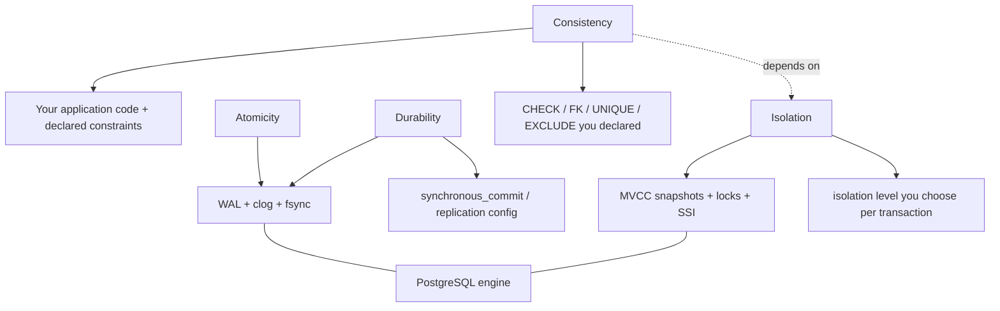
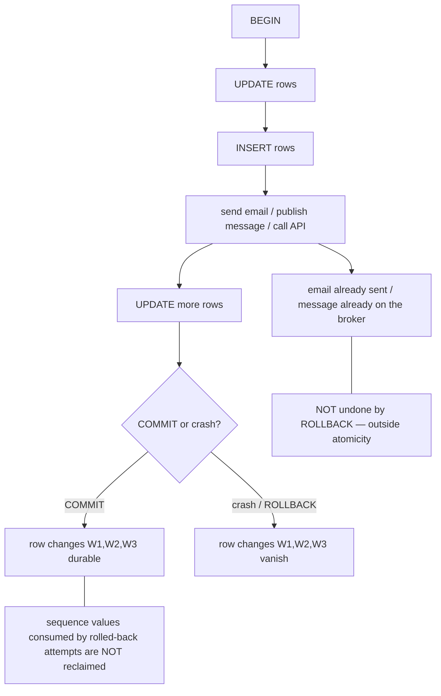

# 03 · ACID, Honestly

> Covers `ACID.json` item **L06.6.2**: say precisely what each letter buys you, why
> **isolation** is the one negotiable dial, and find a claim about ACID in your own past
> code that was actually false.

---

## 1. Learning objectives

After this lesson you can:

- State what **A**, **C**, **I**, **D** each guarantee — and, just as important, what they do
  **not**.
- Explain why **Consistency** is mostly *your* job and **Isolation** is the only letter you
  routinely tune.
- Rebut five ACID claims that sound correct but are false.
- Run the self-audit: find a false ACID assumption in code you have already shipped.

---

## 2. Mental model

**The intuitive picture:** "ACID means my data is always correct." That sentence is a slogan,
not a specification, and it causes real bugs.

**A sharper picture — what each letter is a promise about:**

| Letter | It is a promise about… | Who enforces it | What breaks it if you are careless |
|---|---|---|---|
| **Atomicity** | *the set of SQL statements between `BEGIN` and `COMMIT`* | the engine (WAL, `clog`) | side effects outside the DB; treating a client crash after `COMMIT` as "unknown" |
| **Consistency** | *constraints you declared + invariants you coded* | **you**, with help from declared constraints | invariants you never expressed as a constraint or a lock |
| **Isolation** | *what concurrent transactions can observe of each other* | the engine, **at the level you select** | leaving it at the default and assuming serial behaviour |
| **Durability** | *a committed transaction survives a crash* | the engine + your `fsync`/replication config | `synchronous_commit=off`, async replicas + failover, lying disks |

**The key realisation:** only **Isolation** has a dial you turn per transaction
(`READ COMMITTED` / `REPEATABLE READ` / `SERIALIZABLE`). Atomicity and Durability are
essentially on/off and on by default. Consistency isn't a database setting at all — it's the
sum of your `CHECK`/`FOREIGN KEY`/`UNIQUE`/`EXCLUDE` constraints plus whatever your
application logic maintains. So "tuning ACID" almost always means "choosing an isolation
level and a concurrency-control strategy," which is lessons 04–10.

**Common misconceptions:**

| Misconception | Reality |
|---|---|
| "ACID = serializable." | Default isolation is `READ COMMITTED`. Serializable is opt-in and needs retries. |
| "The C in ACID is the database keeping data valid." | The database only enforces the constraints *you gave it*. Business rules you didn't encode are not "C". |
| "In a transaction, concurrency can't hurt me." | Only true at `SERIALIZABLE` with every participant serializable and a retry loop. |
| "`COMMIT` returned, so the data is safe everywhere." | It's durable on the primary's WAL. Replicas and `synchronous_commit` are separate promises. |
| "`ROLLBACK` undoes everything the transaction did." | It undoes DB row changes. Not sequences, not `NOTIFY` already delivered, not emails sent. |

---

## 3. Key terms

- **Invariant** — a statement about your data that must always be true (e.g. "an account
  balance is never negative", "every order has ≥ 1 line", "at least one engineer is on call").
- **Constraint** — an invariant the database enforces for you: `NOT NULL`, `CHECK`, `UNIQUE`,
  `PRIMARY KEY`, `FOREIGN KEY`, `EXCLUDE`.
- **Deferred constraint** — a constraint checked at `COMMIT` instead of per statement
  (`SET CONSTRAINTS ... DEFERRED`); lets you make temporarily-inconsistent intermediate states.
- **`synchronous_commit`** — how much durability `COMMIT` waits for: `on` (local WAL flushed),
  `off` (don't wait — may lose recent commits on crash, **no corruption**), `remote_apply` /
  `remote_write` / `on` with `synchronous_standby_names` (wait for a replica).
- **Two-phase commit (2PC)** — `PREPARE TRANSACTION` / `COMMIT PREPARED`: durability of a
  *prepared* state so an external coordinator can commit several resources atomically.

---

## 4. Why "ACID" is stated as four separate letters

Because they are enforced by different machinery, fail in different ways, and cost different
amounts:

- **A** and **D** come from the **WAL**: write-ahead logging + a durable commit record
  (lesson 01 §5). Cheap, automatic, hard to get wrong from the application.
- **I** comes from **MVCC snapshots + locks + SSI** (lesson 02, lessons 06–07). This is the
  part with a performance/correctness trade-off, so it is exposed as a knob.
- **C** is the *goal* the other three serve, but the database can only guarantee the portion
  you expressed as constraints. The rest rides on **I** being strong enough that your coded
  checks aren't defeated by interleaving.

Keeping them separate lets you reason precisely: "this bug is an **isolation** bug, not an
atomicity bug" tells you exactly where to look.

---

## 5. Each letter, precisely

### 5.1 Atomicity — "all of the statements, or none"

**Guarantees:** every data change between `BEGIN` and `COMMIT` becomes visible together; if
`COMMIT` is never reached (error, `ROLLBACK`, crash), none of them do. Recovery after a crash
replays WAL and discards transactions with no commit record.

**Does NOT guarantee:**

- **Side effects outside the database.** Emails sent, files written, messages published to
  Kafka/RabbitMQ, HTTP calls made, `RAISE NOTICE`/`NOTIFY` already delivered — none are rolled
  back. If your "unit of work" includes those, it is not atomic; you need the *transactional
  outbox* pattern (write the intent to a table in the same transaction, publish after commit).
- **Sequence / identity values.** `nextval()` is non-transactional by design (so concurrent
  inserters don't block). A rolled-back transaction still consumed those ids — gaps are
  normal and not a bug.
- **The client's knowledge of the outcome.** If the network drops between the server flushing
  the commit record and the client receiving "OK", the transaction *did* commit but your code
  doesn't know. Retrying blindly can double-apply. → make the operation **idempotent**
  (lesson 08).
- **Statement-level atomicity is separate:** a single statement that errors rolls back just
  itself, but in an explicit block it also poisons the transaction (`25P02`) until you
  `ROLLBACK` — unless you wrapped it in a `SAVEPOINT`.

### 5.2 Consistency — "a transaction moves the DB from one valid state to another valid state"

**Guarantees:** at `COMMIT`, all *declared* constraints hold. Immediate constraints are
checked per statement; `DEFERRABLE INITIALLY DEFERRED` ones are checked at `COMMIT` (so a
transaction can pass through states that momentarily violate them).

**Does NOT guarantee:**

- **Invariants you didn't declare.** "At least one engineer on call" is not a `CHECK` you can
  write over multiple rows without a trigger or an exclusion trick. The database will happily
  let both on-call engineers go off call (that's *write skew*, lesson 05). Consistency here is
  entirely on your code + isolation level.
- **Cross-row / cross-table rules** unless expressed as `FOREIGN KEY`, `EXCLUDE`, a trigger,
  or a materialised guard row you lock.
- **Anything if isolation is too weak.** Your `SELECT count(*) FROM on_call WHERE is_on_call`
  check can read a value that another transaction is about to invalidate. C depends on I.

**Practical takeaway:** for every business invariant, decide *where* it is enforced —
a constraint (best: the DB guarantees it regardless of app bugs), a lock/`SERIALIZABLE`
(when it spans rows/predicates), or "we accept the risk" (say so out loud).

### 5.3 Isolation — "the degree to which concurrent transactions are hidden from each other"

**Guarantees:** exactly what the chosen level promises — no more:

| Level | Prevents | Still allows |
|---|---|---|
| `READ COMMITTED` (default) | dirty reads | non-repeatable reads, phantoms, lost updates (via read-then-write), write skew |
| `REPEATABLE READ` | + non-repeatable reads, + phantoms (PG is stricter than the standard), + lost updates (2nd writer gets `40001`) | write skew, read-only serialization anomaly |
| `SERIALIZABLE` | + write skew, + read-only anomaly — result equals *some* serial order | nothing (but you must retry `40001`) |

**Does NOT guarantee:**

- **Serial behaviour at the default level.** This is the single most common false assumption.
- **Protection when only *some* transactions are `SERIALIZABLE`.** SSI only reasons about
  transactions that opted in. One `READ COMMITTED` writer can still break an invariant a
  `SERIALIZABLE` reader relied on.
- **No blocking.** Higher isolation converts some races into `40001` aborts (which you retry)
  and some into lock waits.

This is *the* negotiable dial. Lessons 04–06 are entirely about reading it correctly.

### 5.4 Durability — "once COMMIT returns, it survives a crash"

**Guarantees (defaults):** the commit record is flushed (`fsync`) to the primary's WAL before
`COMMIT` returns. A power loss immediately after replays WAL on restart and the transaction
is still there.

**Does NOT guarantee:**

- **Durability on replicas**, unless `synchronous_commit` ≥ `on` *and*
  `synchronous_standby_names` is set. With the common async-replication setup, a primary that
  dies before shipping the last WAL segments, followed by a failover, loses those commits.
- **Anything if `synchronous_commit = off`.** Then `COMMIT` returns before the `fsync`; a
  crash in the next moment can lose the last fraction of a second of commits. (It still never
  *corrupts* — you lose whole recent transactions, not half-written rows.)
- **Correctness on hardware that lies about `fsync`** (consumer SSDs with volatile write
  caches). Out of scope here, but it's why "we have ACID" and "we tested pulling the plug"
  are different sentences.

---

## 6. Diagrams

### 6.1 Who actually enforces each letter



**Reading the diagram.** A and D are almost entirely the engine's job via the WAL, with one
config knob for D (replication/`synchronous_commit`). I is the engine's job *but only up to
the level you pick*. C is mostly yours: the engine helps only with the constraints you
declared, and even that help is undermined if I is too weak (the dashed arrow).

### 6.2 What a transaction boundary does and does not roll back



**Reading the diagram.** Atomicity draws a box around the row changes only. The `send email`
step punched a hole in the box: whatever it did to the outside world persists regardless of
the transaction's fate. This is why external effects belong *after* `COMMIT` (or behind an
outbox), never in the middle of the transaction.

---

## 7. Hands-on lab

### 7.1 Consistency only covers declared constraints

| Step | Session A | Expected result |
|---|---|---|
| 1 | `SELECT count(*) FROM lab.on_call WHERE is_on_call;` | `2` |
| 2 | `BEGIN; UPDATE lab.on_call SET is_on_call = false WHERE engineer = 'ada'; COMMIT;` | `COMMIT` — allowed |
| 3 | `BEGIN; UPDATE lab.on_call SET is_on_call = false WHERE engineer = 'grace'; COMMIT;` | `COMMIT` — allowed; now **zero** on call |
| 4 | reset: `UPDATE lab.on_call SET is_on_call = true;` | |

The DB never objected: "at least one on call" was never a constraint. (Lesson 05 shows how
two *concurrent* transactions cause the same outcome even when each one checks first.)

### 7.2 Atomicity does not reclaim sequence values

| Step | Session A | Expected result |
|---|---|---|
| 1 | `CREATE TABLE lab.t (id bigint GENERATED ALWAYS AS IDENTITY, v int);` | |
| 2 | `BEGIN; INSERT INTO lab.t (v) VALUES (1) RETURNING id;` | `id = 1` |
| 3 | `ROLLBACK;` | |
| 4 | `INSERT INTO lab.t (v) VALUES (2) RETURNING id;` | **`id = 2`** — the value 1 is gone forever |
| 5 | `DROP TABLE lab.t;` | |

### 7.3 `ROLLBACK` does not un-send `NOTIFY`… but it does defer it

| Step | Session A | Session B | Expected result |
|---|---|---|---|
| 1 | | `LISTEN chan;` | |
| 2 | `BEGIN; NOTIFY chan, 'hello';` | | |
| 3 | | *(no notification yet)* | `NOTIFY` is queued until commit |
| 4 | `ROLLBACK;` | | |
| 5 | | *(still nothing)* | rolled-back `NOTIFY` is dropped |
| 6 | `BEGIN; NOTIFY chan, 'hello2'; COMMIT;` | `\; ` then check | B receives `hello2` |

`NOTIFY` is one of the few things PostgreSQL *does* make transactional. Emails, HTTP calls,
and broker publishes done from your app are not — that is the point of contrast.

---

## 8. In application code (C# / Npgsql)

### 8.1 Put external side effects after `COMMIT`, or use an outbox

```csharp
// WRONG: publish inside the transaction — not atomic, and holds the txn open across I/O
await using (var tx = await conn.BeginTransactionAsync())
{
    await InsertOrderAsync(conn, tx, order);
    await bus.PublishAsync(new OrderPlaced(order.Id));   // if COMMIT later fails: ghost event
    await tx.CommitAsync();                              // if this throws: event already sent
}

// BETTER: transactional outbox — the intent commits atomically with the order
await using (var tx = await conn.BeginTransactionAsync())
{
    await InsertOrderAsync(conn, tx, order);
    await InsertOutboxAsync(conn, tx, new OutboxRow("OrderPlaced", Serialize(order)));
    await tx.CommitAsync();
}
// a separate poller reads lab.outbox, publishes, marks sent — at-least-once, idempotent consumers
```

### 8.2 Do not treat a failed `CommitAsync` / dropped connection as "definitely rolled back"

```csharp
try
{
    await tx.CommitAsync();
    return CommitOutcome.Committed;
}
catch (Exception ex) when (ex is NpgsqlException or TimeoutException)
{
    // The COMMIT record may or may not have been flushed before the link dropped.
    // Do NOT blindly retry a non-idempotent unit of work. Verify:
    return await VerifyByNaturalKeyAsync(conn2, order.NaturalKey);   // did it land?
}
```

The clean way to avoid this whole problem: give the unit of work a **natural key** or a
client-supplied **idempotency key** with a `UNIQUE` constraint, so a retry either no-ops
(`ON CONFLICT DO NOTHING`) or is detectable.

### 8.3 Isolation is the knob you actually turn

```csharp
// declare intent per unit of work; never rely on "the default is fine"
IsolationLevel level = unitOfWork switch
{
    UnitOfWork.PlainCrud            => IsolationLevel.ReadCommitted,
    UnitOfWork.ConsistentReport     => IsolationLevel.RepeatableRead,
    UnitOfWork.InvariantAcrossRows  => IsolationLevel.Serializable,   // + retry loop (lesson 08)
    _ => IsolationLevel.ReadCommitted
};
await using var tx = await conn.BeginTransactionAsync(level);
```

---

## 9. Practical exercises

### Beginner

1. For each letter A/C/I/D, write one sentence: "It guarantees ___" and one sentence:
   "It does **not** guarantee ___."
2. Which letter is the one you tune per transaction, and what are its three settings in
   PostgreSQL?
3. Classify each as covered / not covered by Atomicity when the transaction rolls back:
   (a) an `UPDATE`, (b) a consumed `nextval()`, (c) a row inserted then deleted in the same
   transaction, (d) a message published to Kafka mid-transaction, (e) a committed `NOTIFY`.

### Intermediate

4. Take the "at least one engineer on call" invariant. Implement it three different ways:
   (a) an `EXCLUDE`/partial-unique or trigger-based **constraint** that the DB enforces
   unconditionally; (b) a **pessimistic lock** on a guard row; (c) `SERIALIZABLE` + retry.
   For each, state what still breaks it (app bug? a `READ COMMITTED` writer? nothing?).
5. Configure `synchronous_commit = off` for one transaction with `SET LOCAL`. Insert a row,
   commit, then `docker kill` the container within a second and restart it. Is the row there?
   Run the experiment 10 times and report. Then explain why you never observed a *corrupted*
   row, only present/absent whole rows.
6. Build a minimal transactional outbox (`lab.outbox(id, type, payload jsonb, sent_at)`),
   write an order + outbox row in one transaction, and a poller that publishes (just
   `RAISE NOTICE`) and stamps `sent_at`. Kill the poller mid-batch; show no event is lost and
   at-least-once delivery.

### Advanced

7. Write the five-item "false ACID claims" list for your own codebase style. For each: the
   claim, the code pattern that assumes it, the exact failure, and the fix. Start from these
   usual suspects and keep the ones that apply:
   - `SELECT` then `UPDATE ... SET col = @valueComputedInApp` (assumes no one writes between).
   - "We're in a transaction so the `count(*)` check is safe" (assumes serializable).
   - `INSERT ... RETURNING id` used to publish an event *before* `COMMIT`.
   - "Retry the whole request on any DB error" with a non-idempotent unit of work.
   - "`COMMIT` succeeded" logged, but the connection actually dropped during commit.
   - Relying on no id gaps from a `serial`/identity column.
   - "`ROLLBACK` cleaned everything up" after code already sent an email / wrote a file.
   - A `DEFERRABLE` constraint assumed to be checked per statement.
8. Your system spans PostgreSQL **and** a payment provider. "Atomic" across both is
   impossible with a single DB transaction. Design the flow so the observable outcome is
   still correct (choose: 2PC, outbox + reconciliation, or saga), and state the failure
   window each design leaves and how you detect/repair it.
9. Argue for or against: "our team should set `default_transaction_isolation = 'repeatable
   read'` globally." Cover: which bugs it removes, which it doesn't, the new `40001` handling
   burden, and the horizon/bloat implications from lesson 02 §5.6.

---

## 10. Key takeaways

- **A**: only the SQL statements between `BEGIN`/`COMMIT`. Not external effects, not sequence
  values, not the client's knowledge of the outcome.
- **C**: your invariants. The engine only enforces the constraints you declared, and only if
  **I** is strong enough that your coded checks aren't defeated by interleaving.
- **I**: exactly what the level promises. Default `READ COMMITTED` ≠ serial. This is the only
  routinely-tuned letter.
- **D**: durable on the primary's WAL by default; replicas and `synchronous_commit` are
  separate promises; `off` risks losing recent whole commits, never corruption.
- The honest one-liner: *"ACID gives me atomic, durable writes and a **tunable** amount of
  isolation; keeping my data *valid* is still my job."*

Next: `04-anomalies-part1-read-phenomena.md` — dirty reads, non-repeatable reads, phantom
reads, with two-session proofs.
