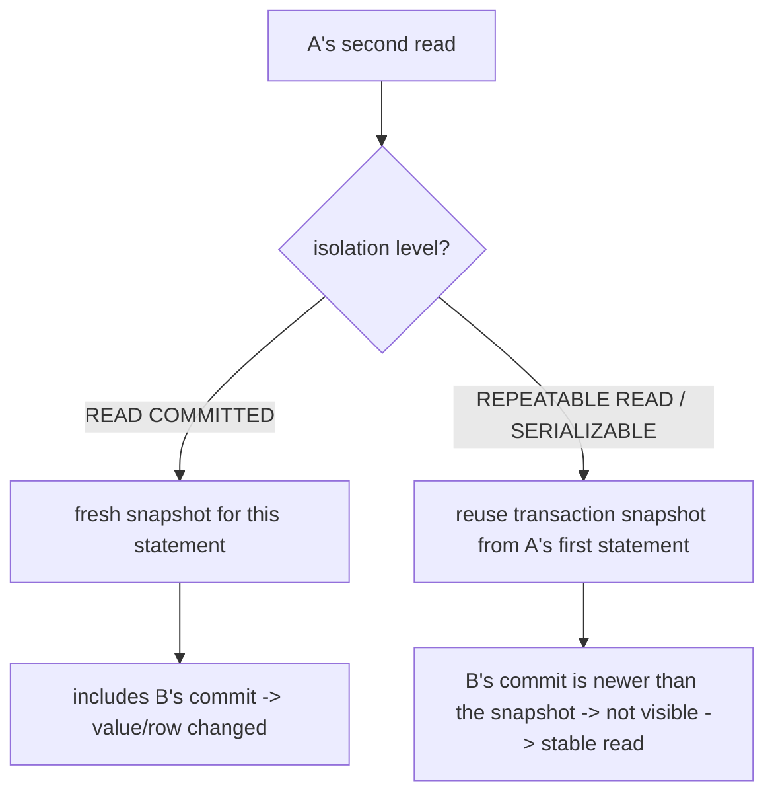

# 04 · Anomalies, Part 1 — Read Phenomena

> Covers `ACID.json` items **L06.6.3 (dirty reads)**, **L06.6.4 (non-repeatable reads)**,
> **L06.6.5 (phantom reads)**. Lesson 05 covers lost update and write skew.

An **anomaly** (a.k.a. *phenomenon*) is an observable result that no serial (one-at-a-time)
execution of the same transactions could produce. The three here are the "read" family: a
transaction reads something it shouldn't, or gets two different answers to the same read.

---

## 1. Learning objectives

After this lesson you can:

- Define dirty read, non-repeatable read, and phantom read — in **SQL-standard** terms and in
  terms of what **PostgreSQL** actually does.
- Explain, from MVCC (lesson 02), *why* PostgreSQL never shows a dirty read even at
  `READ UNCOMMITTED`, and *why* it shows the other two at `READ COMMITTED` but not at
  `REPEATABLE READ`.
- Reproduce all three with two `psql` sessions.
- Recognise the application code shapes that turn each anomaly into a bug, and fix them.

---

## 2. Mental model

Picture two people editing a shared spreadsheet you can only view through a snapshot:

- **Dirty read** — you see a cell value the other person typed but has **not saved**; they
  might still hit Ctrl-Z. Acting on it is acting on a guess. PostgreSQL simply refuses to
  ever show you unsaved cells.
- **Non-repeatable read** — you read cell B2 = 100, look away, look back, and B2 = 130,
  because the other person **saved** an edit in between. The *same row* changed under you.
- **Phantom read** — you count "rows where status = active" and get 5; you count again and
  get 6, because the other person **saved a new row** that matches your filter. No row you
  already saw changed; the *set* changed.

**The distinction that matters:** non-repeatable read is about a **row you already read**
changing or disappearing. Phantom read is about **new rows appearing** (or matching rows
disappearing) in a **predicate/range** you re-evaluate. Same cause (someone committed between
your two reads), different shape.

**Where the simple picture is wrong / misconceptions:**

| Misconception | Reality |
|---|---|
| "`READ UNCOMMITTED` lets me see dirty data in PostgreSQL." | PostgreSQL accepts the syntax but runs it as `READ COMMITTED`. Dirty reads are **impossible** in PostgreSQL at any level. |
| "`READ COMMITTED` gives my transaction a consistent view." | Only per *statement*. Across two statements in one transaction, rows can change (non-repeatable) and appear (phantom). |
| "Phantom reads need `SERIALIZABLE` to prevent (like the standard says)." | In PostgreSQL, `REPEATABLE READ` already prevents phantom reads for a transaction's own re-reads. PG is stricter than the standard here. |
| "If `REPEATABLE READ` stops phantoms, it stops all multi-row race bugs." | No. Write skew (lesson 05) is a phantom-flavoured *write* anomaly that `REPEATABLE READ` does **not** stop. |
| "These are read-only problems." | Each becomes a *data-corruption* bug the moment you write back a decision based on the stale/dirty read. |

---

## 3. Key terms

- **Dirty read (P1)** — reading a row version written by a transaction that has not committed
  (and might abort).
- **Non-repeatable read (P2)** — re-reading a specific row within one transaction and getting
  a different committed value (or finding it deleted).
- **Phantom read (P3)** — re-running a query with a search condition within one transaction
  and getting a different **set** of rows because another transaction committed an
  insert/delete matching that condition.
- **Read phenomenon** — collective name for P1–P3 as defined in the SQL standard's isolation
  table.
- **Snapshot isolation** — the model PostgreSQL's `REPEATABLE READ` implements: one snapshot
  per transaction; prevents P1–P3 but not all serialization anomalies.

---

## 4. Why PostgreSQL behaves the way it does

Everything below falls out of lesson 02:

### 4.1 Dirty read — impossible in PostgreSQL, by construction

MVCC visibility rule step 1 (lesson 02 §5.3): a tuple is visible only if its `xmin` is
**committed** and not hidden by your snapshot. An uncommitted transaction's `xid` is either
`≥ snapshot.xmax` or in the `xip` list, so its tuples fail the check. There is no code path
that returns an uncommitted tuple to a normal query.

> **SQL standard says:** `READ UNCOMMITTED` *may* expose dirty reads; it's the weakest level.
> **PostgreSQL does:** treat `READ UNCOMMITTED` as an alias for `READ COMMITTED`. Dirty reads
> never occur. (The only ways to see "in-flight" data are `pageinspect`, logical decoding of
> in-progress transactions, or `dirtyread`-style extensions — not regular SQL.)

### 4.2 Non-repeatable read — allowed at `READ COMMITTED` because each statement re-snapshots

At `READ COMMITTED`, statement #2 gets a **fresh** snapshot (lesson 02 §5.4). If another
transaction committed an `UPDATE` to your row between statement #1 and #2, statement #2's
snapshot includes that commit, so you see the new value. Nothing is "wrong" — it is the
defined behaviour.

At `REPEATABLE READ`, statement #2 **reuses** the transaction's original snapshot, which was
taken before the other commit, so you still see the old value. Prevented.

### 4.3 Phantom read — same mechanism, applied to a set

A range query (`WHERE created_at >= ...`, `WHERE status = 'active'`) is evaluated against a
snapshot. At `READ COMMITTED` the re-run uses a new snapshot and picks up rows other
transactions inserted-and-committed in between → phantom. At `REPEATABLE READ` the re-run
uses the frozen snapshot; the new rows have an `xmin` that snapshot can't see → no phantom.

> **SQL standard says:** phantoms are allowed at `REPEATABLE READ`; only `SERIALIZABLE`
> forbids them.
> **PostgreSQL does:** forbid phantoms at `REPEATABLE READ` too, because snapshot isolation
> gives the whole transaction one consistent view. PostgreSQL's `REPEATABLE READ` is strictly
> stronger than the standard's minimum.

### 4.4 The catch that motivates lesson 05

`REPEATABLE READ` stops your transaction from *seeing* concurrent changes. It does **not**
stop two transactions from each making a decision on their own frozen view and then both
committing writes that, together, violate an invariant. When the "phantom" is something the
*other* transaction inserted that would have changed *your* write decision, snapshot
isolation can't help — that is **write skew**, and only `SERIALIZABLE` catches it.

---

## 5. Diagrams

### 5.1 The three read phenomena side by side

```mermaid
sequenceDiagram
    participant A as Reader txn A
    participant B as Writer txn B
    participant DB

    rect rgb(240,240,240)
    Note over A,DB: Non-repeatable read (row A already saw changes)
    A->>DB: SELECT balance WHERE id=1  => 1000
    B->>DB: UPDATE account SET balance=1300 WHERE id=1 ; COMMIT
    A->>DB: SELECT balance WHERE id=1  => 1300  (READ COMMITTED) / 1000 (REPEATABLE READ)
    end

    rect rgb(240,240,240)
    Note over A,DB: Phantom read (a new row appears in A's predicate)
    A->>DB: SELECT count(*) WHERE balance > 500  => 2
    B->>DB: INSERT account(id=3, balance=900) ; COMMIT
    A->>DB: SELECT count(*) WHERE balance > 500  => 3  (READ COMMITTED) / 2 (REPEATABLE READ)
    end

    rect rgb(240,240,240)
    Note over A,DB: Dirty read (never happens in PostgreSQL)
    B->>DB: UPDATE account SET balance=0 WHERE id=1   (NOT committed)
    A->>DB: SELECT balance WHERE id=1  => 1000  (B's uncommitted 0 is invisible at every level)
    end
```

**Reading the diagram.** All three are "A reads, B commits (or doesn't), A reads again."
Non-repeatable and phantom differ only in whether A re-reads *a specific row* or *a set*.
Dirty read is drawn to show the non-event: B never commits, and A never sees B's value —
in PostgreSQL there is no isolation level where that last line returns `0`.

### 5.2 Why the level changes the outcome



**Reading the diagram.** There is one lever: does the second read get a new snapshot or reuse
the old one? `READ COMMITTED` = new (tracks reality, inconsistent across statements).
`REPEATABLE READ` = reuse (consistent, but may later reject a colliding write with `40001`).

---

## 6. Hands-on lab

Reset first: `UPDATE lab.account SET balance = 1000.00, version = 0;`

### 6.1 Dirty read cannot be produced (L06.6.3)

| Step | Session A | Session B | Expected result |
|---|---|---|---|
| 1 | `SET default_transaction_isolation = 'read uncommitted';` | | `SET` (accepted) |
| 2 | `BEGIN;` | | |
| 3 | `SHOW transaction_isolation;` | | **`read committed`** — PG upgraded it |
| 4 | | `BEGIN; UPDATE lab.account SET balance = 0 WHERE id = 1;` (no commit) | `UPDATE 1` |
| 5 | `SELECT balance FROM lab.account WHERE id = 1;` | | **`1000.00`** — B's uncommitted 0 is invisible |
| 6 | | `ROLLBACK;` | |
| 7 | `COMMIT;` `RESET default_transaction_isolation;` | | |

Conclusion: there is no PostgreSQL setting that yields a dirty read. `READ UNCOMMITTED` ≡
`READ COMMITTED`.

### 6.2 Non-repeatable read under `READ COMMITTED`, gone under `REPEATABLE READ` (L06.6.4)

**Part A — `READ COMMITTED` (default): the anomaly appears**

| Step | Session A | Session B | Expected result |
|---|---|---|---|
| 1 | `BEGIN;` *(READ COMMITTED)* | | |
| 2 | `SELECT balance FROM lab.account WHERE id = 1;` | | `1000.00` |
| 3 | | `UPDATE lab.account SET balance = 1300 WHERE id = 1;` *(autocommit)* | `UPDATE 1` |
| 4 | `SELECT balance FROM lab.account WHERE id = 1;` | | **`1300.00`** — changed under A |
| 5 | `COMMIT;` | | |

**Part B — `REPEATABLE READ`: prevented**

Reset: `UPDATE lab.account SET balance = 1000 WHERE id = 1;`

| Step | Session A | Session B | Expected result |
|---|---|---|---|
| 1 | `BEGIN TRANSACTION ISOLATION LEVEL REPEATABLE READ;` | | |
| 2 | `SELECT balance FROM lab.account WHERE id = 1;` | | `1000.00` (snapshot taken now) |
| 3 | | `UPDATE lab.account SET balance = 1300 WHERE id = 1;` *(autocommit)* | `UPDATE 1` |
| 4 | `SELECT balance FROM lab.account WHERE id = 1;` | | **`1000.00`** — stable |
| 5 | `COMMIT;` then `SELECT balance ...;` | | `1300.00` — visible only after A ends |

### 6.3 Phantom read under `READ COMMITTED`, gone under `REPEATABLE READ` (L06.6.5)

Reset: `DELETE FROM lab.account WHERE id = 3;`

**Part A — `READ COMMITTED`: the phantom appears**

| Step | Session A | Session B | Expected result |
|---|---|---|---|
| 1 | `BEGIN;` *(READ COMMITTED)* | | |
| 2 | `SELECT count(*) FROM lab.account WHERE balance > 500;` | | `2` |
| 3 | | `INSERT INTO lab.account (id, owner, balance) VALUES (3, 'carol', 900);` | `INSERT 0 1` |
| 4 | `SELECT count(*) FROM lab.account WHERE balance > 500;` | | **`3`** — a phantom row |
| 5 | `SELECT id FROM lab.account WHERE balance > 500 ORDER BY id;` | | `1, 2, 3` — row 3 appeared |
| 6 | `COMMIT;` | | |

**Part B — `REPEATABLE READ`: prevented**

Reset: `DELETE FROM lab.account WHERE id = 3;`

| Step | Session A | Session B | Expected result |
|---|---|---|---|
| 1 | `BEGIN TRANSACTION ISOLATION LEVEL REPEATABLE READ;` | | |
| 2 | `SELECT count(*) FROM lab.account WHERE balance > 500;` | | `2` |
| 3 | | `INSERT INTO lab.account (id, owner, balance) VALUES (3, 'carol', 900);` | `INSERT 0 1` |
| 4 | `SELECT count(*) FROM lab.account WHERE balance > 500;` | | **`2`** — no phantom (PG stricter than the standard) |
| 5 | `COMMIT;` | | |

### 6.4 The subtlety: `READ COMMITTED` + `UPDATE ... WHERE <predicate>` sees rows newer than the statement snapshot

| Step | Session A (`READ COMMITTED`) | Session B | Expected result |
|---|---|---|---|
| 1 | `BEGIN;` | | |
| 2 | | `BEGIN; UPDATE lab.account SET balance = 600 WHERE id = 2;` (no commit) | holds row lock on id 2 |
| 3 | `UPDATE lab.account SET balance = balance + 1 WHERE balance > 500;` | | **blocks** on id 2 |
| 4 | | `COMMIT;` | |
| 5 | *(A unblocks)* | | A re-checks id 2 against the **new** value 600, still `> 500`, so it updates it to 601 |
| 6 | `SELECT id, balance FROM lab.account ORDER BY id;` | | id 1 = 1001, id 2 = **601** |
| 7 | `COMMIT;` | | |

Takeaway: at `READ COMMITTED`, a writing statement that hits a row another transaction just
changed **waits, then re-reads the latest version and re-evaluates its `WHERE`** (internally
called *EvalPlanQual*). It does not fail and does not use the value from its own scan
snapshot. Under `REPEATABLE READ` step 3 would instead raise `40001` (lesson 06).

---

## 7. In application code (C# / Npgsql)

### 7.1 The bug shape for non-repeatable read: read, decide, write with an app-computed value

```csharp
// BUG under READ COMMITTED: another txn can change the balance between the SELECT and the UPDATE
await using var tx = await conn.BeginTransactionAsync(IsolationLevel.ReadCommitted);

var current = (decimal)(await new NpgsqlCommand(
    "SELECT balance FROM account WHERE id = $1", conn, tx)
    { Parameters = { new() { Value = id } } }.ExecuteScalarAsync())!;

if (current < amount) throw new InsufficientFundsException();

await new NpgsqlCommand(
    "UPDATE account SET balance = $1 WHERE id = $2", conn, tx)   // <-- overwrites, ignores concurrent change
    { Parameters = { new() { Value = current - amount }, new() { Value = id } } }
    .ExecuteNonQueryAsync();

await tx.CommitAsync();
```

Three ways to make it correct (full treatment in lesson 05):

```csharp
// (a) compute in SQL so the write re-reads under a row lock
"UPDATE account SET balance = balance - $1 WHERE id = $2 AND balance >= $1"
// check rows-affected == 1, else insufficient funds / lost race

// (b) pessimistic lock the row first
"SELECT balance FROM account WHERE id = $1 FOR UPDATE"   // now the decision + write are serialized on this row

// (c) raise isolation and retry
await conn.BeginTransactionAsync(IsolationLevel.RepeatableRead);  // 2nd writer gets 40001 -> retry
```

### 7.2 The bug shape for phantom read: aggregate, decide, write

```csharp
// "allow at most 3 active sessions per user"
// BUG: two requests both count 2, both insert -> 4 active sessions
var active = (long)(await new NpgsqlCommand(
    "SELECT count(*) FROM session WHERE user_id = $1 AND ended_at IS NULL", conn, tx)
    { Parameters = { new() { Value = userId } } }.ExecuteScalarAsync())!;

if (active >= 3) throw new TooManySessionsException();

await InsertSessionAsync(conn, tx, userId);
await tx.CommitAsync();
```

`RepeatableRead` does **not** fix this (each transaction's count is frozen and correct *for
its own snapshot*; both still commit). This is write skew — fix with `SERIALIZABLE` + retry,
or a real constraint (`EXCLUDE`, or a per-user counter row locked `FOR UPDATE`). Lesson 05.

### 7.3 When you genuinely want a stable multi-read

```csharp
// a report that reads 4 tables and must reflect one instant
await using var tx = await conn.BeginTransactionAsync(IsolationLevel.RepeatableRead);
var a = await ReadAsync(conn, tx, "...");
var b = await ReadAsync(conn, tx, "...");   // same snapshot as a
var c = await ReadAsync(conn, tx, "...");
var d = await ReadAsync(conn, tx, "...");
await tx.CommitAsync();
```

---

## 8. Interactions with the rest of the course

- **Lesson 05** — lost update is "non-repeatable read that you then overwrote"; write skew is
  "phantom read that changed a write decision, across two transactions."
- **Lesson 06** — the mechanism that prevents P2/P3 at `REPEATABLE READ` is the single
  transaction snapshot; the mechanism that then rejects colliding writes is the `40001`
  serialization failure.
- **Lesson 08** — once you use `REPEATABLE READ`/`SERIALIZABLE` to kill these anomalies, you
  inherit the duty to retry `40001`.

---

## 9. Practical exercises

### Beginner

1. Fill in the table for **PostgreSQL** (not the standard): for each of dirty / non-repeatable
   / phantom, write "possible" or "prevented" at `READ COMMITTED` and at `REPEATABLE READ`.
2. In one sentence each, distinguish a non-repeatable read from a phantom read.
3. Why can't you demonstrate a dirty read in PostgreSQL even by setting
   `default_transaction_isolation = 'read uncommitted'`? Tie the answer to the visibility rule
   from lesson 02.

### Intermediate

4. Reproduce labs 6.2 and 6.3. Then modify 6.3 Part B so Session B does a `DELETE` of an
   existing matching row instead of an `INSERT`. Does `REPEATABLE READ` still keep A's count
   stable? Explain via the snapshot.
5. Reproduce lab 6.4. Then rerun it with Session A at `REPEATABLE READ`. Capture the exact
   error (`SQLSTATE`, message) A gets at step 3/5 and explain why the behaviour differs.
6. Write a C# reproduction of the "at most 3 active sessions" phantom bug: 10 parallel tasks,
   each opening its own connection + `ReadCommitted` transaction, counting then inserting.
   Show more than 3 rows land. Then switch to `Serializable` + a retry loop and show it holds
   at 3.

### Advanced

7. A dashboard runs `SELECT sum(balance) FROM account` and, in the same `READ COMMITTED`
   transaction, `SELECT count(*) FROM account`. Under concurrent transfers between accounts,
   can the two results be mutually inconsistent (a sum that never existed for that count)?
   Demonstrate it, then show `REPEATABLE READ` fixes it and explain the cost you just took on.
8. You maintain a materialised summary row `account_totals(total numeric)` updated by a
   trigger on `account`. Under `READ COMMITTED`, describe a phantom-style interleaving that
   leaves `total` disagreeing with `SELECT sum(balance) FROM account`, and two designs that
   prevent it (one lock-based, one `SERIALIZABLE`-based).
9. Explain precisely why PostgreSQL's `REPEATABLE READ` can forbid phantom reads while the SQL
   standard only requires `SERIALIZABLE` to. What did the standard's authors assume about the
   implementation (locking) that snapshot isolation violates, and what did they *not*
   anticipate (write skew) that makes PG's `REPEATABLE READ` still not serializable?

---

## 10. Key takeaways

- **Dirty read:** impossible in PostgreSQL at every level. `READ UNCOMMITTED` = `READ COMMITTED`.
  *SQL standard allows it at `READ UNCOMMITTED`; PostgreSQL never does.*
- **Non-repeatable read:** a row you already read changes. Possible at `READ COMMITTED`,
  prevented at `REPEATABLE READ`+.
- **Phantom read:** new rows appear in a predicate you re-run. Possible at `READ COMMITTED`;
  **prevented at `REPEATABLE READ` in PostgreSQL** (stricter than the standard, which needs
  `SERIALIZABLE`).
- All three come from one lever: re-snapshot per statement vs one snapshot per transaction.
- Preventing your transaction from *seeing* concurrent change ≠ preventing two transactions
  from *jointly* breaking an invariant. That gap is lesson 05.

Next: `05-anomalies-part2-lost-update-write-skew.md`.
