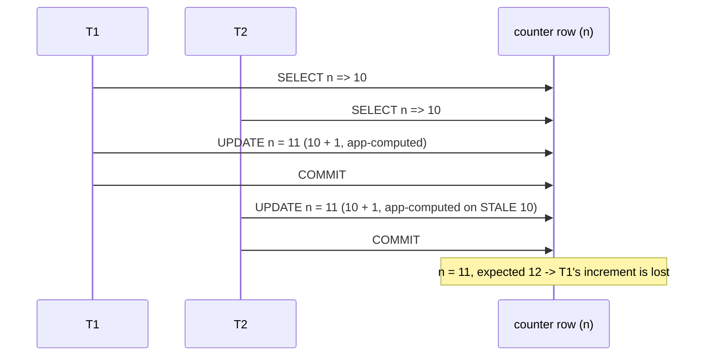
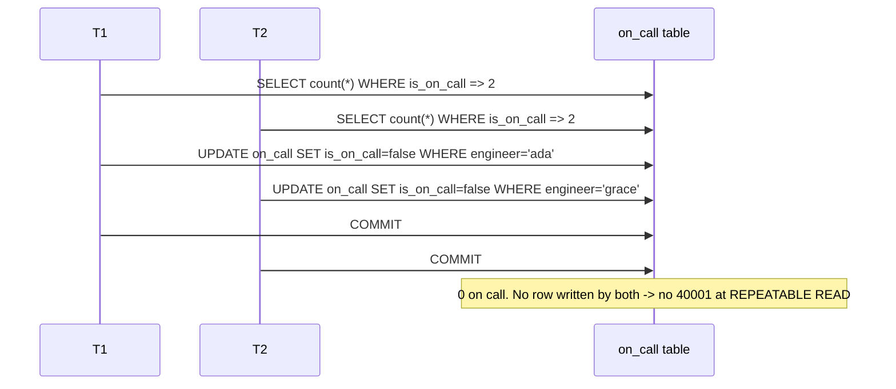
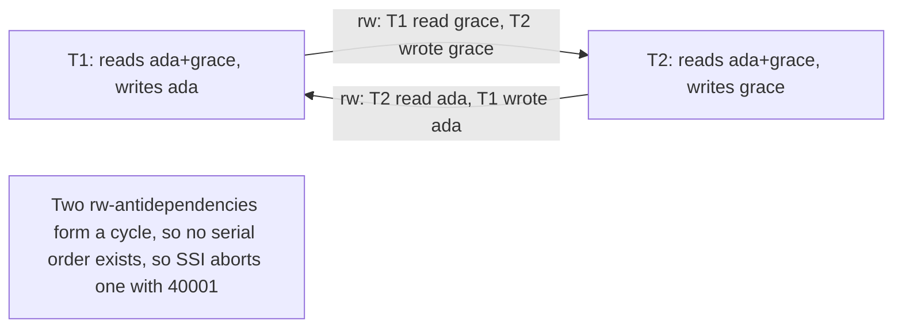

# 05 · Anomalies, Part 2 — Lost Update & Write Skew

> Covers `ACID.json` items **L06.6.6 (lost updates)** and **L06.6.7 (write skew)**, plus the
> **read-only serialization anomaly**. These are the "write" anomalies — the ones that
> actually corrupt data, and the reason `SERIALIZABLE` exists.

---

## 1. Learning objectives

After this lesson you can:

- Define **lost update** and **write skew** precisely, and explain why write skew is *not*
  just "a phantom read."
- Reproduce both with two `psql` sessions.
- Fix lost update **four** ways (atomic write, `FOR UPDATE`, optimistic version check,
  `REPEATABLE READ` + retry) and say which to use when.
- Explain why `REPEATABLE READ` stops lost update but **not** write skew, and why only
  `SERIALIZABLE` (or a constraint / explicit lock) stops write skew.
- Recognise the read-only anomaly and know its one fix.

---

## 2. Mental model

**Lost update:** two transactions both do `x = f(x)` on the *same row*. T1 reads x=10, T2
reads x=10, T1 writes 11, T2 writes 11. One increment vanished. The tell: **both wrote the
same row**, and the second write was computed from a value that was already stale.

**Write skew:** two transactions read an **overlapping set** of rows, each checks an
invariant that currently holds, then each writes a **different** row. Individually each write
keeps the invariant true *given what that transaction saw*. Together they break it. The tell:
**they wrote different rows**, so there is no row-level conflict for MVCC or a row lock to
catch — the conflict is between *what each read* and *what the other wrote*.

Analogy — two on-call engineers, invariant "≥ 1 on call":

- T1: "Are at least 2 of us on call? Yes (me + Grace). Then I can go off call." → sets
  `ada = false`.
- T2 (concurrently): "Are at least 2 of us on call? Yes (me + Ada). Then I can go off call."
  → sets `grace = false`.
- Both commit. Zero on call. Each transaction's logic was correct *in isolation*; the
  interleaving is the bug.

**Where the simple picture is wrong / misconceptions:**

| Misconception | Reality |
|---|---|
| "`REPEATABLE READ` gives a consistent snapshot, so it prevents write skew." | It prevents your transaction from *seeing* changes. Write skew doesn't need you to see anything — both sides act on the old snapshot and write *different* rows. Only `SERIALIZABLE` (SSI) detects the read/write dependency. |
| "A lost update is just a non-repeatable read." | Lost update is the *write-back* of a decision made on a value that changed. `READ COMMITTED` won't even show you the change if you don't re-read; you just clobber it. |
| "`SELECT ... FOR UPDATE` fixes write skew." | Only if you lock **every row whose value your decision depends on**, including rows that don't exist yet (which you can't lock). Usually you must lock a *guard row* or use a constraint or `SERIALIZABLE`. |
| "Adding a `version` column makes everything safe." | Optimistic version checks fix *single-row* lost update. They do nothing for a decision that spans multiple rows (write skew). |
| "`SERIALIZABLE` makes my code correct." | Only if **every** transaction touching that data is `SERIALIZABLE`, and you **retry `40001`**. One `READ COMMITTED` writer defeats it. |

---

## 3. Key terms

- **Lost update (P4)** — T1 reads a row, T2 reads the same row, both update it based on the
  value read, and one update overwrites the other's without incorporating it.
- **Write skew (A5B)** — two transactions read overlapping data, make disjoint writes, and
  the combined result violates an invariant that each transaction individually preserved.
  Not preventable by snapshot isolation.
- **Read-only serialization anomaly** — a read-only transaction observes a state that is
  inconsistent with every serial ordering of the concurrent read-write transactions, even
  though those writers are themselves fine under snapshot isolation.
- **Optimistic concurrency control (OCC)** — don't lock; detect a conflict at write time
  (via a `version`/`updated_at` guard) and retry.
- **Pessimistic concurrency control** — take a lock (`FOR UPDATE`, advisory lock) so the
  conflicting transaction waits instead of racing.
- **Materialising the conflict** — creating a real row (a guard/summary row, or an `EXCLUDE`
  constraint entry) so a predicate-level conflict becomes a row-level one the engine can see.

---

## 4. Why these happen and what stops them

### 4.1 Lost update

At `READ COMMITTED`, the classic sequence:

1. T1 `SELECT n` → 10 (snapshot at that statement).
2. T2 `SELECT n` → 10.
3. T1 `UPDATE counter SET n = 11 WHERE id='hits'` → commits.
4. T2 `UPDATE counter SET n = 11 WHERE id='hits'` → **T2's statement re-reads the row under a
   row lock, sees 11, but T2 is writing the literal `11` it computed from its stale read**, so
   it overwrites. Final: 11. Expected: 12. One increment lost.

Note the difference from lesson 04 §6.4: there the update was `SET x = x + 1` (recomputed by
the engine from the current row) — safe. Here the app computed the new value and passed a
**literal**, so the re-read doesn't help.

**Fixes and their mechanism:**

| Fix | Mechanism | Prevents lost update because… |
|---|---|---|
| **Atomic write**: `UPDATE counter SET n = n + 1 WHERE id = $1` | the engine takes a row lock, re-reads the current `n`, adds 1 | the new value is derived from the row *as locked*, never from a stale app copy |
| **Pessimistic**: `SELECT n ... FOR UPDATE` then compute then `UPDATE` | the `FOR UPDATE` row lock makes T2 wait until T1 commits; T2 then reads 11 | T2's read happens *after* T1's write; its decision uses fresh data |
| **Optimistic**: `UPDATE counter SET n = $new, version = version + 1 WHERE id = $1 AND version = $old` | the `WHERE version = $old` fails to match if anyone bumped `version`; rows-affected = 0 | a lost update is *detected* (0 rows) and the caller re-reads and retries |
| **`REPEATABLE READ` + retry** | T2's `UPDATE` collides with a row T1 changed after T2's snapshot → `40001` | PostgreSQL refuses the second writer ("first-updater-wins"); you retry with a fresh snapshot |

> **SQL standard vs PostgreSQL.** The standard doesn't name "lost update" in its main table;
> it's implied to be prevented at `REPEATABLE READ`. PostgreSQL at `REPEATABLE READ` prevents
> it by **raising `40001` on the second writer**, not by blocking. At `READ COMMITTED`
> PostgreSQL prevents the *"first updater wins then re-read"* form for `SET x = x + 1`, but
> **not** the read-modify-write-with-app-literal form.

### 4.2 Write skew

Under snapshot isolation (`REPEATABLE READ`):

1. T1 snapshot; reads `count(*) FROM on_call WHERE is_on_call` → 2.
2. T2 snapshot; reads the same → 2.
3. T1 `UPDATE on_call SET is_on_call = false WHERE engineer = 'ada'` — writes row *ada*.
4. T2 `UPDATE on_call SET is_on_call = false WHERE engineer = 'grace'` — writes row *grace*.
5. Both `COMMIT`. **No row was written by both**, so there is no update conflict, no `40001`.
   Result: 0 on call. Invariant broken.

Why `REPEATABLE READ` can't catch it: MVCC and first-updater-wins only look at **rows written
by both**. Here the danger is the *read/write dependency*: T1 **read** something T2 **wrote**,
and vice versa. Detecting that requires tracking reads — which is exactly what SSI adds.

**What stops write skew:**

| Approach | How |
|---|---|
| **`SERIALIZABLE` (SSI)** + retry | tracks that T1 read the set T2 wrote and T2 read the set T1 wrote → a "dangerous structure" → aborts one with `40001`. Lesson 06. |
| **Explicit predicate lock via a guard row** | both transactions `SELECT ... FOR UPDATE` a single row that represents "the on-call roster" (e.g. `team(id, name)` row), serialising them. |
| **Lock all involved rows** `FOR UPDATE` | `SELECT engineer FROM on_call WHERE is_on_call FOR UPDATE` in both — but this fails if the invariant also concerns rows that *don't exist yet* (e.g. "no overlapping booking"). |
| **A real constraint** | for "no overlapping booking": `EXCLUDE USING gist (room_id WITH =, during WITH &&)`. The DB rejects the second insert unconditionally — no isolation level needed, works even against `READ COMMITTED` writers. **Best when expressible.** |

### 4.3 Read-only serialization anomaly

Even a purely read-only transaction can see an impossible state. Canonical example (from the
PostgreSQL docs): two accounts, a batch job that adds interest if the *total* is positive, a
receipt-printing transaction that reads both balances. Certain interleavings let the receipt
show a state that no serial order of the two writers could produce. `SERIALIZABLE` prevents
it — possibly by aborting the read-only transaction with `40001`, or, if you mark it
`SERIALIZABLE READ ONLY DEFERRABLE`, by making it wait for a safe snapshot and then never
aborting. It's rare, but it's why "reads don't need isolation" is false at the strict end.

---

## 5. Diagrams

### 5.1 Lost update



**Reading the diagram.** Both transactions wrote the **same row**, and T2's write carried a
value computed before T1's commit. The engine's row lock made T2 *wait* for T1, but T2 then
wrote a literal, not `n + 1`, so waiting didn't save it. Any of the four fixes breaks this
picture: atomic `n = n + 1` recomputes from the locked row; `FOR UPDATE` moves T2's *read*
after T1's commit; the version check makes T2's `UPDATE` affect 0 rows; `REPEATABLE READ`
turns T2's `UPDATE` into a `40001`.

### 5.2 Write skew



**Reading the diagram.** Contrast with 5.1: the two `UPDATE`s target **different rows**
(`ada` vs `grace`). There is no row-level collision, so MVCC / first-updater-wins sees
nothing wrong. The only signal that something is wrong is that each transaction *read* rows
the other *wrote* — a read/write dependency in both directions.

### 5.3 Why SSI catches write skew: the dangerous structure



**Reading the diagram.** SSI adds lightweight **predicate (SIRead) locks** recording *what
each transaction read*. When it sees a cycle of read→write dependencies like this one, it
knows no serial order exists and aborts a participant. Lesson 06 details when the abort fires
and which transaction loses.

---

## 6. Hands-on lab

Reset: `UPDATE lab.counter SET n = 0 WHERE id='hits'; UPDATE lab.on_call SET is_on_call = true;`

### 6.1 Produce a lost update (L06.6.6)

Simulate app read-modify-write with a literal:

| Step | Session A | Session B | Expected result |
|---|---|---|---|
| 1 | `BEGIN;` | `BEGIN;` | |
| 2 | `SELECT n FROM lab.counter WHERE id='hits';` → 0 | | |
| 3 | | `SELECT n FROM lab.counter WHERE id='hits';` → 0 | |
| 4 | `UPDATE lab.counter SET n = 1 WHERE id='hits';` | | `UPDATE 1` |
| 5 | `COMMIT;` | | |
| 6 | | `UPDATE lab.counter SET n = 1 WHERE id='hits';` | blocks until A commits, then `UPDATE 1` |
| 7 | | `COMMIT;` | |
| 8 | `SELECT n FROM lab.counter WHERE id='hits';` | | **`1`** — two increments, final value 1 |

### 6.2 Fix 1 — atomic write

Reset `n = 0`.

| Step | Session A | Session B | Expected result |
|---|---|---|---|
| 1 | `BEGIN; UPDATE lab.counter SET n = n + 1 WHERE id='hits';` | | |
| 2 | | `BEGIN; UPDATE lab.counter SET n = n + 1 WHERE id='hits';` | blocks |
| 3 | `COMMIT;` | *(unblocks)* re-reads row, computes 0+1 from the **committed** value 1 → 2 | `UPDATE 1` |
| 4 | | `COMMIT;` | |
| 5 | | `SELECT n FROM lab.counter WHERE id='hits';` | **`2`** — correct |

### 6.3 Fix 2 — `SELECT ... FOR UPDATE`

Reset `n = 0`.

| Step | Session A | Session B | Expected result |
|---|---|---|---|
| 1 | `BEGIN; SELECT n FROM lab.counter WHERE id='hits' FOR UPDATE;` → 0 | | row locked |
| 2 | | `BEGIN; SELECT n FROM lab.counter WHERE id='hits' FOR UPDATE;` | **blocks** |
| 3 | `UPDATE lab.counter SET n = 1 WHERE id='hits'; COMMIT;` | | |
| 4 | | *(unblocks)* returns **`1`** | B now computes 1+1 |
| 5 | | `UPDATE lab.counter SET n = 2 WHERE id='hits'; COMMIT;` | correct |

### 6.4 Fix 3 — optimistic version check

Reset: `UPDATE lab.account SET balance = 1000, version = 0 WHERE id = 1;`

| Step | Session A | Session B | Expected result |
|---|---|---|---|
| 1 | `SELECT balance, version FROM lab.account WHERE id=1;` → (1000, 0) | | |
| 2 | | `SELECT balance, version FROM lab.account WHERE id=1;` → (1000, 0) | |
| 3 | `UPDATE lab.account SET balance = 900, version = 1 WHERE id = 1 AND version = 0;` | | `UPDATE 1` |
| 4 | | `UPDATE lab.account SET balance = 800, version = 1 WHERE id = 1 AND version = 0;` | **`UPDATE 0`** — conflict detected |
| 5 | | *(app sees 0 rows → re-read → version is 1, balance 900 → recompute → retry)* | |

### 6.5 Produce write skew, then show only `SERIALIZABLE` stops it (L06.6.7)

**Part A — `REPEATABLE READ`: write skew still happens**

Reset: `UPDATE lab.on_call SET is_on_call = true;`

| Step | Session A | Session B | Expected result |
|---|---|---|---|
| 1 | `BEGIN TRANSACTION ISOLATION LEVEL REPEATABLE READ;` | `BEGIN TRANSACTION ISOLATION LEVEL REPEATABLE READ;` | |
| 2 | `SELECT count(*) FROM lab.on_call WHERE is_on_call;` → 2 | | |
| 3 | | `SELECT count(*) FROM lab.on_call WHERE is_on_call;` → 2 | |
| 4 | `UPDATE lab.on_call SET is_on_call=false WHERE engineer='ada';` | | `UPDATE 1` |
| 5 | | `UPDATE lab.on_call SET is_on_call=false WHERE engineer='grace';` | `UPDATE 1` (different row, no block) |
| 6 | `COMMIT;` | `COMMIT;` | both succeed |
| 7 | `SELECT count(*) FROM lab.on_call WHERE is_on_call;` | | **`0`** — invariant broken |

**Part B — `SERIALIZABLE`: one transaction aborts**

Reset: `UPDATE lab.on_call SET is_on_call = true;`

| Step | Session A | Session B | Expected result |
|---|---|---|---|
| 1 | `BEGIN TRANSACTION ISOLATION LEVEL SERIALIZABLE;` | `BEGIN TRANSACTION ISOLATION LEVEL SERIALIZABLE;` | |
| 2 | `SELECT count(*) FROM lab.on_call WHERE is_on_call;` → 2 | | SIRead lock recorded on the scanned rows |
| 3 | | `SELECT count(*) FROM lab.on_call WHERE is_on_call;` → 2 | |
| 4 | `UPDATE lab.on_call SET is_on_call=false WHERE engineer='ada';` | | `UPDATE 1` |
| 5 | | `UPDATE lab.on_call SET is_on_call=false WHERE engineer='grace';` | `UPDATE 1` |
| 6 | `COMMIT;` | | `COMMIT` (first committer wins) |
| 7 | | `COMMIT;` | **`ERROR: could not serialize access due to read/write dependencies among transactions` (SQLSTATE 40001)** |
| 8 | | *(app retries the whole unit of work; the retry now reads count = 1 and the rule blocks Grace)* | invariant held |

**Part C — the declarative fix for the booking variant**

```sql
ALTER TABLE lab.room_booking
    ADD CONSTRAINT room_no_overlap
    EXCLUDE USING gist (room_id WITH =, during WITH &&);
```

Now two concurrent `INSERT`s of overlapping bookings for the same room: the first commits,
the second fails with `23P01 exclusion_violation` — at **any** isolation level, even against a
`READ COMMITTED` writer. No retry-on-`40001` needed. When the invariant is expressible as a
constraint, prefer it.

### 6.6 (Optional) read-only serialization anomaly

Follow the PostgreSQL docs example in "Serializable Isolation Level": two writers plus a
read-only transaction under `SERIALIZABLE`; observe the read-only transaction (or a writer)
abort with `40001`, then rerun the read-only one as
`BEGIN TRANSACTION ISOLATION LEVEL SERIALIZABLE READ ONLY DEFERRABLE` and watch it briefly
wait for a safe snapshot and then never abort.

---

## 7. In application code (C# / Npgsql)

### 7.1 Lost update — pick the fix by shape

```csharp
// Shape A: pure accumulation (counter, balance delta, stock decrement) -> atomic write
const string sql = "UPDATE account SET balance = balance - $1 WHERE id = $2 AND balance >= $1";
await using var cmd = new NpgsqlCommand(sql, conn, tx);
cmd.Parameters.Add(new() { Value = amount });
cmd.Parameters.Add(new() { Value = id });
var affected = await cmd.ExecuteNonQueryAsync();
if (affected == 0) throw new InsufficientFundsOrRaceException();   // 0 rows = guard failed
```

```csharp
// Shape B: read a whole aggregate, mutate it in C#, write it back -> optimistic version
var (state, version) = await LoadAggregateAsync(conn, tx, id);
state.Apply(command);                                   // arbitrary domain logic in C#
var affected = await new NpgsqlCommand(
    "UPDATE aggregate SET data = $1, version = version + 1 WHERE id = $2 AND version = $3",
    conn, tx) { Parameters = { new(){Value=Serialize(state)}, new(){Value=id}, new(){Value=version} } }
    .ExecuteNonQueryAsync();
if (affected == 0) throw new ConcurrencyConflictException();   // caller retries from LoadAggregateAsync
```

```csharp
// Shape C: you must read several related rows, then write one, and the read must be fresh -> FOR UPDATE
await new NpgsqlCommand("SELECT 1 FROM account WHERE id = $1 FOR UPDATE", conn, tx)
    { Parameters = { new() { Value = id } } }.ExecuteNonQueryAsync();
// ... now read details, decide, write; the row lock serialises writers on this account
```

EF Core: a `[Timestamp]`/`IsRowVersion()` property (mapped to `xmin` or a real `version`
column) makes `SaveChanges` emit the `WHERE version = @original` guard and throw
`DbUpdateConcurrencyException` on 0 rows — that is Shape B built in.

### 7.2 Write skew — constraint first, else `SERIALIZABLE` + retry

```csharp
// Best: let the database enforce it (works even against non-serializable writers)
try
{
    await InsertBookingAsync(conn, tx, roomId, during);   // EXCLUDE constraint enforces no overlap
    await tx.CommitAsync();
}
catch (PostgresException e) when (e.SqlState == PostgresErrorCodes.ExclusionViolation) // "23P01"
{
    throw new SlotAlreadyBookedException();
}
```

```csharp
// When not expressible as a constraint (multi-table invariant): SERIALIZABLE + retry (lesson 08)
await Retry.OnSerializationFailureAsync(async () =>
{
    await using var conn = await dataSource.OpenConnectionAsync();
    await using var tx = await conn.BeginTransactionAsync(IsolationLevel.Serializable);

    var onCall = await CountOnCallAsync(conn, tx);
    if (onCall <= 1) throw new LastEngineerCannotLeaveException();   // business error: do NOT retry
    await SetOffCallAsync(conn, tx, engineer);

    await tx.CommitAsync();
});
```

---

## 8. Interactions with the rest of the course

- **Lesson 06** explains *when* SSI fires the `40001` in lab 6.5 Part B and why the **second
  committer** is usually the victim.
- **Lesson 07** covers `FOR UPDATE` / `FOR NO KEY UPDATE` / `SKIP LOCKED` and deadlock
  avoidance for the pessimistic fixes.
- **Lesson 08** is the retry loop that fixes 6.4/6.5 must be wrapped in.
- **Lesson 03**: the "at least one on call" invariant is a *Consistency* rule the DB does not
  know about — that's why the interleaving in 6.5A is allowed.

---

## 9. Practical exercises

### Beginner

1. State the one-sentence tell that distinguishes lost update from write skew (hint: *same
   row* vs *different rows*).
2. Which of the four lost-update fixes work for a multi-row decision like "≥ 1 engineer on
   call"? Which don't, and why?
3. Why does `REPEATABLE READ` stop lost update but not write skew? Answer in terms of "rows
   written by both" vs "read/write dependency."

### Intermediate

4. Reproduce lab 6.1 (lost update). Then fix it with each of 6.2, 6.3, 6.4 and confirm the
   final value is 2. For 6.4, write the client-side retry (re-`SELECT`, recompute, re-`UPDATE`)
   and show it converges.
5. Reproduce lab 6.5 Parts A and B. In Part B, capture which session gets `40001` if you
   commit them in the other order. Formulate the rule for who loses.
6. Add the `EXCLUDE` constraint from 6.5C. Write a 20-parallel-task C# test that tries to book
   overlapping slots for one room; assert exactly one succeeds and the rest get `23P01`,
   with **no** transaction at `SERIALIZABLE`.

### Advanced

7. You have "a user may have at most one `active` subscription." Implement and compare:
   (a) a partial unique index `CREATE UNIQUE INDEX ... ON subscription(user_id) WHERE status='active'`;
   (b) `SERIALIZABLE` + retry; (c) `SELECT ... FOR UPDATE` on the `users` row as a guard.
   For each: does it hold against a `READ COMMITTED` writer? What's the failure mode under a
   burst of retries? Which would you ship and why?
8. Demonstrate the read-only serialization anomaly from the PostgreSQL docs with three
   sessions. Then show `SERIALIZABLE READ ONLY DEFERRABLE` on the reader removes the abort,
   and measure how long it waits for a safe snapshot under a steady write load.
9. A payments team uses optimistic `version` checks everywhere and reports "retry storms"
   under contention on hot accounts (many writers, same row). Explain why OCC degrades under
   high single-row contention, when a pessimistic `FOR UPDATE` (or a queue via `SKIP LOCKED`)
   is strictly better, and where an append-only ledger design side-steps both.

---

## 10. Key takeaways

- **Lost update** = two writers, **same row**, second write computed from a stale read. Fix
  with atomic `SET x = x + ?`, `FOR UPDATE`, an optimistic `version` guard, or
  `REPEATABLE READ` + retry (first-updater-wins `40001`).
- **Write skew** = two writers, **different rows**, joint result breaks an invariant each side
  individually preserved. `REPEATABLE READ` does **not** stop it. Stop it with a **constraint**
  (`EXCLUDE`, partial unique) when expressible, else a **guard-row lock**, else
  `SERIALIZABLE` + retry.
- `SERIALIZABLE` only helps if **every** participant uses it **and** you retry `40001`.
- **Read-only anomaly**: even reads aren't safe at the strict end; fix with `SERIALIZABLE` or
  `SERIALIZABLE READ ONLY DEFERRABLE`.
- Prefer letting the database enforce an invariant declaratively — a constraint beats an
  isolation level because it holds against *every* writer regardless of their level.

Next: `06-postgresql-isolation-levels.md` — the three levels in depth, SSI, and the
comparison tables (PostgreSQL vs the SQL standard).
