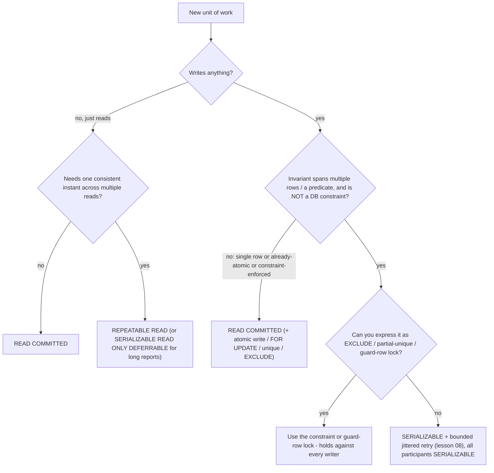
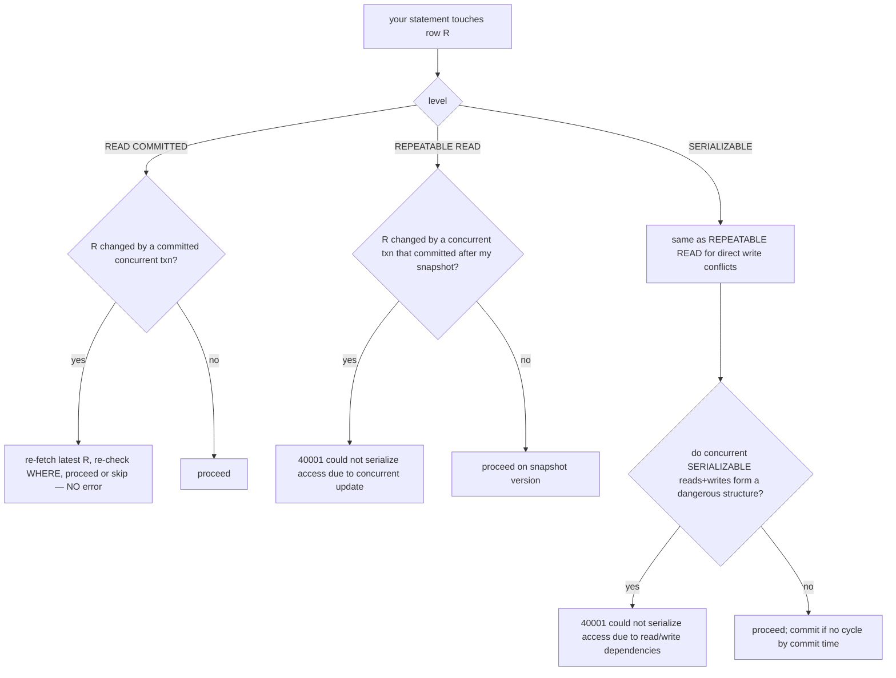

# 06 · PostgreSQL Isolation Levels (READ COMMITTED, REPEATABLE READ, SERIALIZABLE + SSI)

> Covers `ACID.json` items **L06.6.8 (READ COMMITTED)**, **L06.6.9 (REPEATABLE READ)**,
> **L06.6.10 (SERIALIZABLE and SSI)**. This lesson consolidates lessons 02, 04, and 05 into
> the three dials you actually set, and gives the comparison tables.

---

## 1. Learning objectives

After this lesson you can:

- Describe exactly what each of the three effective levels does: snapshot timing, write
  conflict behaviour, and what it costs.
- Explain PostgreSQL's `READ COMMITTED` "re-check on concurrent update" behaviour and why it
  surprises people.
- Explain SSI: predicate (SIRead) locks, rw-antidependencies, "dangerous structures," which
  transaction aborts, and the read-only optimisations.
- Reproduce the `40001` from `REPEATABLE READ` and from `SERIALIZABLE`.
- Read the two anomaly × level tables (PostgreSQL vs SQL standard) and say where PG is
  stricter.
- Set the level per transaction and globally, from `psql` and from Npgsql.

---

## 2. Mental model

Four levels exist in the SQL standard; **PostgreSQL implements three distinct behaviours**
(`READ UNCOMMITTED` is an alias for `READ COMMITTED`):

| Level | One-line intuition | The lever |
|---|---|---|
| `READ COMMITTED` | "Each *statement* sees a fresh, committed-only snapshot." | new snapshot per statement |
| `REPEATABLE READ` | "The whole *transaction* sees one frozen snapshot; colliding writes are rejected." | one snapshot + first-updater-wins |
| `SERIALIZABLE` | "As if the transactions ran one at a time; the engine aborts one if that illusion would break." | one snapshot + SSI read tracking |

**The progression:** `READ COMMITTED` tracks reality but is inconsistent across statements.
`REPEATABLE READ` is internally consistent but can't see concurrent commits, so it rejects
writes that would collide with them. `SERIALIZABLE` additionally watches *what you read* so it
can catch invariant violations that don't involve a shared row (write skew).

**Where the simple picture is wrong / misconceptions:**

| Misconception | Reality |
|---|---|
| "`REPEATABLE READ` blocks writers until my transaction ends." | It never blocks a reader. It *aborts* a writer with `40001` if that writer's row changed since your snapshot. |
| "`SERIALIZABLE` takes lots of locks / is like `LOCK TABLE`." | SSI takes only lightweight, non-blocking **SIRead** locks that record reads. It detects conflicts and aborts; it does not serialise by blocking. |
| "`SERIALIZABLE` is always much slower." | On low-contention workloads the overhead is small. The real cost is the **retry loop** you must add and the abort rate under contention. |
| "If I use `SERIALIZABLE`, my reads are consistent even against `READ COMMITTED` writers." | Snapshot consistency of *your reads* holds. But SSI's anti-anomaly guarantee only covers transactions that are **themselves** `SERIALIZABLE`. |
| "`READ COMMITTED` statements are atomic points in time." | A single `UPDATE ... WHERE p` can act on rows *newer* than its own scan snapshot, because of the concurrent-update re-check. |

---

## 3. Key terms

- **`transaction_isolation`** — the session/transaction GUC holding the current level.
- **`default_transaction_isolation`** — server/role/session default for new transactions
  (ships as `read committed`).
- **First-updater-wins** — under `REPEATABLE READ`/`SERIALIZABLE`, if you `UPDATE`/`DELETE`/
  `SELECT ... FOR UPDATE` a row that another transaction modified after your snapshot and then
  committed, your statement fails with `40001` instead of proceeding.
- **EvalPlanQual (EPQ)** — the internal mechanism by which `READ COMMITTED` `UPDATE`/`DELETE`
  waits for the concurrent writer, then re-fetches the latest row version and re-checks the
  `WHERE` clause against it.
- **SSI** — Serializable Snapshot Isolation (Cahill et al.; PostgreSQL 9.1+): snapshot
  isolation + monitoring of read/write dependencies to guarantee true serializability.
- **SIRead lock (predicate lock)** — a non-blocking marker recording that a transaction read a
  tuple / page / relation. Used only to detect conflicts. Escalates tuple→page→relation under
  memory pressure (`max_pred_locks_*`), which can cause false-positive aborts.
- **rw-antidependency (rw-conflict)** — T1 read a version of x, T2 wrote a later version of x;
  T1 "comes before" T2 in any equivalent serial order.
- **Dangerous structure** — a transaction `Tpivot` with both an inbound and an outbound
  rw-antidependency, where the outbound one is to a transaction that committed first. SSI
  aborts a participant to break it.

---

## 4. Why three levels instead of one

You cannot have maximum concurrency and maximum correctness at once, so PostgreSQL exposes
the trade-off:

- Most OLTP statements are single-row or already-atomic (`INSERT`, `UPDATE ... SET x = x + 1`,
  upserts). `READ COMMITTED` is cheapest and sufficient for them.
- Some units of work read a consistent picture across many rows/tables and then write.
  `REPEATABLE READ` gives them a stable snapshot for a modest cost (occasional `40001`).
- A few units of work enforce an invariant that spans rows or predicates and can't be a
  constraint. `SERIALIZABLE` is the only level that makes those safe automatically — paid for
  with SSI bookkeeping and a mandatory retry loop.

Picking deliberately per unit of work (lesson 03 §8.3, lesson 10 decision guide) is the whole
skill.

---

## 5. How each level works

### 5.1 READ COMMITTED (the default) — L06.6.8

- **Snapshot:** taken at the **start of each statement**. Two `SELECT`s in one transaction can
  see different committed data (lesson 04 lab 6.2A). This is why a long `READ COMMITTED`
  transaction is *not* a consistent view of the database.
- **Reads:** never see uncommitted data (no dirty reads — impossible in PG). See everything
  committed before the statement started.
- **Concurrent update re-check (EPQ):** if an `UPDATE`, `DELETE`, `SELECT ... FOR UPDATE/SHARE`,
  or `MERGE` reaches a row that a concurrent transaction has modified:
  - that transaction is still running → **wait** for it;
  - it aborted → proceed with the original row;
  - it committed → **re-fetch the latest row version and re-evaluate the `WHERE`**. If it
    still matches, act on the new version; if it no longer matches, skip it; if it was
    deleted, skip it. The statement does **not** fail.
  - Consequence: a `READ COMMITTED` `UPDATE ... WHERE p` can update rows that did not match
    `p` under its own scan snapshot but do under the latest version, and can *miss* rows that
    matched the snapshot but not the latest version. (Lesson 04 lab 6.4.)
- **What it prevents:** dirty reads only.
- **What it still allows:** non-repeatable reads, phantom reads, lost updates (via app
  read-modify-write with a literal), write skew.
- **Cost:** lowest. No transaction-wide snapshot to maintain; no serialization failures from
  reads.
- **Use for:** the majority of short OLTP writes, especially when each write is already atomic
  or guarded by a `WHERE` condition / unique constraint / `FOR UPDATE`.

### 5.2 REPEATABLE READ (snapshot isolation) — L06.6.9

- **Snapshot:** taken **once**, at the first non-transaction-control statement, and reused for
  the whole transaction. `BEGIN` alone does not take it (lesson 02 lab 7.3).
- **Reads:** completely stable. No non-repeatable reads. **No phantom reads** (PostgreSQL is
  stricter than the SQL standard here — snapshot isolation gives the whole transaction one
  view).
- **Writes / first-updater-wins:** if you modify or `FOR UPDATE`-lock a row that another
  transaction changed after your snapshot and committed, you get:
  `ERROR: could not serialize access due to concurrent update` — **SQLSTATE 40001**. The
  whole transaction is aborted; you must `ROLLBACK` and retry from a fresh `BEGIN`.
- **What it prevents (beyond `READ COMMITTED`):** non-repeatable reads, phantom reads, lost
  updates (the second writer gets `40001`).
- **What it still allows:** write skew, read-only serialization anomaly. (SSI is off; reads
  are not tracked, so cross-predicate conflicts are invisible.)
- **Cost:** maintain one snapshot for the transaction's life (contributes to the xmin
  horizon — keep it short); occasional `40001` retries on write contention.
- **Use for:** multi-statement consistent reads ("export everything about X"); read-modify-
  write of a whole aggregate where you'd rather retry than lock; reports that must reflect one
  instant.

### 5.3 SERIALIZABLE and SSI — L06.6.10

Everything `REPEATABLE READ` does, **plus** the engine records what every `SERIALIZABLE`
transaction reads (SIRead locks) and analyses read/write dependencies between concurrent
`SERIALIZABLE` transactions.

- **Guarantee:** any set of `SERIALIZABLE` transactions that successfully commit produces a
  result identical to *some* serial (one-at-a-time) execution of them. This eliminates **all**
  anomalies — including write skew and the read-only anomaly — **provided every participating
  transaction is `SERIALIZABLE`.**
- **Detection:** when concurrent transactions form a **dangerous structure** (a `Tpivot` with
  an inbound and an outbound rw-antidependency, the outbound one to a transaction that
  committed first), SSI aborts one of them with
  `ERROR: could not serialize access due to read/write dependencies among transactions` —
  **SQLSTATE 40001**.
- **Who aborts:** usually the transaction that would *close* the dangerous cycle — in
  practice, often the **second one to try to commit**, or a transaction that is still running
  when the conflict is finalised. You do not get to choose; you retry whoever lost.
- **False positives:** because SIRead locks escalate from tuple to page to relation under
  memory pressure (`max_pred_locks_per_transaction` × `max_connections`, plus
  `max_pred_locks_per_relation`, `max_pred_locks_per_page`), SSI can abort transactions that
  were not *actually* in conflict. Tune those GUCs up for workloads with large read sets;
  accept some spurious retries.
- **Read-only optimisations:**
  - A `SERIALIZABLE READ ONLY` transaction can sometimes be proven "safe" and exempted from
    further conflict checking early.
  - `SERIALIZABLE READ ONLY DEFERRABLE` **waits** until it can acquire a snapshot guaranteed
    not to be involved in any dangerous structure, then runs with **zero** abort risk — ideal
    for long reports/backups. It may block at the start under heavy write load.
- **`SELECT ... FOR UPDATE` under `SERIALIZABLE`:** not required for correctness, but it turns
  some rw-conflicts into plain lock waits, which can *reduce* the abort/retry rate on hot
  rows.
- **Scope limits:**
  - SSI reasons only about transactions **on this database in this server**. It does not span
    databases, and physical standbys do not participate — a query on a replica behaves like
    `REPEATABLE READ` regardless of the requested level.
  - Every relevant transaction must opt in. One `READ COMMITTED` writer can still break an
    invariant a `SERIALIZABLE` transaction relied on.
- **Cost:** SSI bookkeeping (CPU + shared memory for SIRead locks); a real `40001` rate under
  contention; a mandatory, correct retry loop (lesson 08). On low contention, overhead is
  typically minor.
- **Use for:** invariants that span rows/predicates and can't be a constraint; correctness-
  critical logic where you'd rather retry than reason about every interleaving.

### 5.4 Setting the level

```sql
-- per transaction (preferred: explicit intent)
BEGIN TRANSACTION ISOLATION LEVEL REPEATABLE READ;
BEGIN;  SET TRANSACTION ISOLATION LEVEL SERIALIZABLE;   -- must be before the first query

-- read-only / deferrable variants
BEGIN TRANSACTION ISOLATION LEVEL SERIALIZABLE READ ONLY DEFERRABLE;

-- session default
SET default_transaction_isolation = 'repeatable read';

-- role default (persisted)
ALTER ROLE app SET default_transaction_isolation = 'read committed';

-- inspect
SHOW transaction_isolation;            -- current transaction
SHOW default_transaction_isolation;   -- default for new ones
```

You **cannot** change the level after the transaction's first query (`25001`).

---

## 6. Diagrams

### 6.1 The decision: which level for this unit of work



**Reading the diagram.** Most work lands on `READ COMMITTED` with an atomic write or a
constraint. `REPEATABLE READ` is for consistent multi-read units. `SERIALIZABLE` is the
last resort for cross-row invariants you can't make declarative — and it comes bundled with
"and you must retry."

### 6.2 What triggers 40001 at each level



**Reading the diagram.** `READ COMMITTED` never raises `40001` — it silently re-evaluates.
`REPEATABLE READ` raises it on direct write/write collisions. `SERIALIZABLE` raises it on
those **and** on read/write dependency cycles that `REPEATABLE READ` can't see.

### 6.3 Snapshot lifetime

```mermaid
gantt
    title Snapshot lifetime across one transaction with three statements
    dateFormat X
    axisFormat %s
    section READ COMMITTED
    snapshot for stmt 1 : 0, 1
    snapshot for stmt 2 : 1, 1
    snapshot for stmt 3 : 2, 1
    section REPEATABLE READ or SERIALIZABLE
    one snapshot for stmt 1 to 3 : 0, 3
```



**Reading the diagram.** `READ COMMITTED` = three short-lived snapshots. `REPEATABLE READ` /
`SERIALIZABLE` = one snapshot spanning the transaction. The longer that single snapshot
lives, the longer it pins the VACUUM horizon (lesson 02 §5.6) — another reason to keep
higher-isolation transactions brief.

---

## 7. Hands-on lab

### 7.1 REPEATABLE READ raises 40001 on a write collision (L06.6.9)

Reset: `UPDATE lab.account SET balance = 1000 WHERE id = 1;`

| Step | Session A | Session B | Expected result |
|---|---|---|---|
| 1 | `BEGIN TRANSACTION ISOLATION LEVEL REPEATABLE READ;` | | |
| 2 | `SELECT balance FROM lab.account WHERE id = 1;` → 1000 | | snapshot fixed |
| 3 | | `UPDATE lab.account SET balance = 1200 WHERE id = 1;` *(autocommit)* | `UPDATE 1` |
| 4 | `UPDATE lab.account SET balance = balance - 100 WHERE id = 1;` | | **`ERROR: could not serialize access due to concurrent update`** (`40001`) |
| 5 | `ROLLBACK;` | | |
| 6 | *(retry from step 1)* now step 2 reads 1200, step 4 succeeds → 1100 | | correct |

### 7.2 SERIALIZABLE raises 40001 on write skew (L06.6.10)

See lesson 05 lab 6.5 Part B — the canonical two-on-call experiment. Reproduce it here and
also run:

```sql
-- while both transactions are open, from a third session, watch the predicate locks
SELECT pid, locktype, mode, relation::regclass
FROM pg_locks
WHERE mode = 'SIReadLock'
ORDER BY pid;
```

You will see `SIReadLock` rows for the sessions that ran the `SELECT count(*) ... WHERE
is_on_call` — the record of "this transaction read these rows," which is what lets SSI find
the cycle at commit time.

### 7.3 READ COMMITTED does NOT raise 40001 in the same scenario

Reset: `UPDATE lab.on_call SET is_on_call = true;`

| Step | Session A (`READ COMMITTED`) | Session B (`READ COMMITTED`) | Expected result |
|---|---|---|---|
| 1 | `BEGIN;` | `BEGIN;` | |
| 2 | `SELECT count(*) FROM lab.on_call WHERE is_on_call;` → 2 | `SELECT count(*) FROM lab.on_call WHERE is_on_call;` → 2 | |
| 3 | `UPDATE lab.on_call SET is_on_call=false WHERE engineer='ada';` | `UPDATE lab.on_call SET is_on_call=false WHERE engineer='grace';` | both `UPDATE 1` |
| 4 | `COMMIT;` | `COMMIT;` | **both succeed, 0 on call** — no protection |

### 7.4 The level is locked after the first query

| Step | Session A | Expected result |
|---|---|---|
| 1 | `BEGIN;` | |
| 2 | `SELECT 1;` | `1` |
| 3 | `SET TRANSACTION ISOLATION LEVEL SERIALIZABLE;` | **`ERROR: 25001 SET TRANSACTION ISOLATION LEVEL must be called before any query`** |
| 4 | `ROLLBACK;` | |

---

## 8. The comparison tables

### 8.1 PostgreSQL, as implemented

| Level | Dirty read | Non-repeatable read | Phantom read | Lost update (read-modify-write) | Write skew | Read-only anomaly |
|---|---|---|---|---|---|---|
| `READ UNCOMMITTED` (= `READ COMMITTED`) | **prevented** | possible | possible | possible | possible | possible |
| `READ COMMITTED` | **prevented** | possible | possible | possible | possible | possible |
| `REPEATABLE READ` | **prevented** | **prevented** | **prevented** *(stricter than standard)* | **prevented** *(2nd writer → `40001`)* | possible | possible |
| `SERIALIZABLE` | **prevented** | **prevented** | **prevented** | **prevented** | **prevented** *(SSI → `40001`)* | **prevented** *(SSI; or defer)* |

### 8.2 SQL standard (SQL:92 and later), minimum required

| Level | Dirty read | Non-repeatable read | Phantom read | Serialization anomaly |
|---|---|---|---|---|
| `READ UNCOMMITTED` | **allowed** | allowed | allowed | allowed |
| `READ COMMITTED` | not allowed | allowed | allowed | allowed |
| `REPEATABLE READ` | not allowed | not allowed | **allowed** | allowed |
| `SERIALIZABLE` | not allowed | not allowed | not allowed | not allowed |

### 8.3 Where PostgreSQL is stricter than the standard

| Point | SQL standard says | PostgreSQL does |
|---|---|---|
| `READ UNCOMMITTED` | may expose dirty reads | runs it as `READ COMMITTED`; **no** dirty reads at any level |
| Phantom reads at `REPEATABLE READ` | allowed | **prevented** (snapshot isolation gives the whole transaction one view) |
| Write conflicts at `REPEATABLE READ` | implementation-defined (often blocking) | non-blocking; second writer gets `40001` to retry |
| `SERIALIZABLE` implementation | traditionally strict two-phase locking | **SSI**: snapshot isolation + non-blocking read tracking + conflict-detection aborts |

> **The gap that remains:** PostgreSQL's `REPEATABLE READ` prevents P1–P3 but is still *not*
> serializable — write skew and the read-only anomaly slip through, because those are
> read/write dependency problems, not "did I see stale data" problems. Only `SERIALIZABLE`
> closes them.

---

## 9. In application code (C# / Npgsql)

```csharp
using System.Data;   // IsolationLevel

await using var conn = await dataSource.OpenConnectionAsync();

// explicit per unit of work
await using var tx = await conn.BeginTransactionAsync(IsolationLevel.RepeatableRead);
// ... work ...
await tx.CommitAsync();
```

Mapping recap (lesson 00 §3.4):

| `System.Data.IsolationLevel` | PostgreSQL level |
|---|---|
| `ReadCommitted` | `READ COMMITTED` |
| `RepeatableRead` | `REPEATABLE READ` |
| `Serializable` | `SERIALIZABLE` |
| `ReadUncommitted` | accepted; runs as `READ COMMITTED` |
| `Snapshot` | mapped by Npgsql to `REPEATABLE READ` (prefer `RepeatableRead`) |
| `Unspecified` / `Chaos` | server default (`default_transaction_isolation`) |

Catching the serialization failure (full retry helper in lesson 08):

```csharp
try
{
    // ... unit of work ...
    await tx.CommitAsync();
}
catch (PostgresException e) when (
    e.SqlState == PostgresErrorCodes.SerializationFailure ||   // "40001"
    e.SqlState == PostgresErrorCodes.DeadlockDetected)         // "40P01"
{
    await tx.RollbackAsync();
    // retry the ENTIRE unit of work from a new connection/transaction — see lesson 08
}
```

`SERIALIZABLE READ ONLY DEFERRABLE` for a long report:

```csharp
await using var tx = await conn.BeginTransactionAsync(IsolationLevel.Serializable);
await new NpgsqlCommand("SET TRANSACTION READ ONLY, DEFERRABLE", conn, tx).ExecuteNonQueryAsync();
// first read may pause briefly until a safe snapshot is available, then never aborts
```

Read replicas: even if you request `Serializable` on a physical standby connection, you get
snapshot isolation (`REPEATABLE READ` semantics). Don't rely on SSI on replicas.

---

## 10. Practical exercises

### Beginner

1. From memory, fill in table 8.1 for `READ COMMITTED` and `REPEATABLE READ` (six columns).
2. Name the two different error messages that both carry `SQLSTATE 40001` and which level
   produces each.
3. Why is `READ UNCOMMITTED` pointless to request in PostgreSQL?

### Intermediate

4. Reproduce labs 7.1, 7.2, 7.3. For 7.2, add the `pg_locks` `SIReadLock` query from a third
   session and paste what you see. Explain how those rows let SSI detect the cycle.
5. Take one real unit of work from a service you know. Walk it through the flowchart in §6.1
   and justify the level it lands on. Then argue the case for bumping it one level and for
   dropping it one level.
6. Show, with a 3-statement transaction, that `READ COMMITTED` can produce a result set in
   statement 3 that is inconsistent with statement 1, and that `REPEATABLE READ` cannot.
   Measure the extra `age(backend_xmin)` the `REPEATABLE READ` version holds if you `pg_sleep`
   for 10s mid-transaction.

### Advanced

7. Construct a workload where `SERIALIZABLE` produces **false-positive** `40001` aborts
   (transactions that were not truly in conflict) by forcing SIRead lock escalation. Show the
   escalation via `pg_locks` (`page`/`relation` granularity instead of `tuple`), then raise
   `max_pred_locks_per_transaction` and show the false positives drop.
8. You run `SERIALIZABLE` for a "transfer + invariant" unit of work, but a legacy job updates
   the same tables at `READ COMMITTED`. Demonstrate that the legacy job can still violate the
   invariant despite your `SERIALIZABLE` code, and propose the minimal change (make the job
   serializable? add a constraint? a guard lock?) with trade-offs.
9. Benchmark: a hot-row counter under 32 concurrent workers, comparing (a) `READ COMMITTED` +
   `UPDATE SET n = n + 1`, (b) `REPEATABLE READ` + retry, (c) `SERIALIZABLE` + retry,
   (d) `READ COMMITTED` + `SELECT ... FOR UPDATE`. Report throughput, p99 latency, and
   retry/abort counts. Explain the ranking from the mechanisms in §5.

---

## 11. Key takeaways

- PostgreSQL has **three** effective levels. `READ UNCOMMITTED` ≡ `READ COMMITTED`.
- `READ COMMITTED`: fresh snapshot **per statement**; prevents dirty reads only; `UPDATE`/
  `DELETE` re-check rows changed by concurrent commits (EPQ) rather than failing; never
  raises `40001`.
- `REPEATABLE READ`: **one** snapshot per transaction; also prevents non-repeatable reads,
  phantoms (PG stricter than the standard), and lost updates (second writer → `40001`); still
  allows write skew.
- `SERIALIZABLE`: `REPEATABLE READ` + SSI read tracking (SIRead locks); the only level that
  also prevents write skew and the read-only anomaly — **if all participants are
  `SERIALIZABLE`** and you **retry `40001`**. Non-blocking; can false-positive under lock
  escalation; long reads → `READ ONLY DEFERRABLE`.
- Not on replicas: standbys give snapshot isolation regardless of requested level.

Next: `07-locking-and-explicit-concurrency-control.md`.
