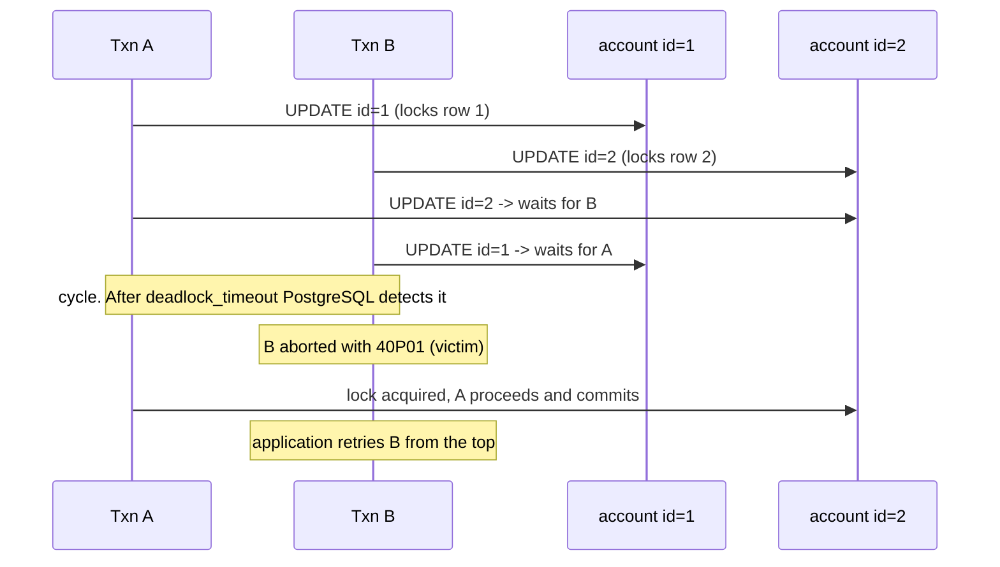
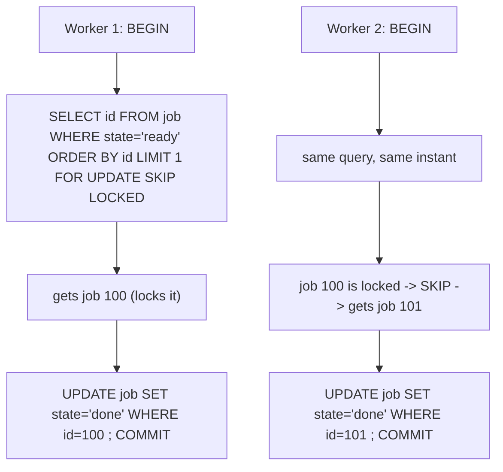

# 07 · Locking & Explicit Concurrency Control

Isolation levels (lesson 06) handle concurrency *implicitly*. Sometimes you need to control it
*explicitly*: make one transaction wait for another, claim a work item so no one else does,
or protect an invariant that spans rows. That means locks. This lesson supports the
pessimistic fixes in lesson 05 (L06.6.6, L06.6.7) and the deadlock retries in lesson 08
(L06.6.11).

---

## 1. Learning objectives

After this lesson you can:

- Name the row-level lock modes, say which SQL statements take which, and read a lock
  conflict.
- Use `SELECT ... FOR UPDATE` / `FOR NO KEY UPDATE` / `FOR SHARE` / `FOR KEY SHARE`,
  `NOWAIT`, `SKIP LOCKED` correctly.
- Build a safe job-queue claim with `FOR UPDATE SKIP LOCKED`.
- Explain how deadlocks form, how PostgreSQL detects and resolves them, and how to avoid them.
- Observe locks with `pg_locks`, `pg_blocking_pids()`, and the blocking-tree query.
- Choose pessimistic vs optimistic locking for a given contention profile.

---

## 2. Mental model

**MVCC removed *read* locks.** Readers get a snapshot; they don't lock rows. So the locks you
still deal with are about **writes and explicit claims**:

- Two transactions updating the **same row** → the second **waits** for the first to
  commit/rollback (a row-level write lock).
- `SELECT ... FOR UPDATE` → "I intend to update these rows; make other writers/lockers wait."
- Table-level locks → mostly taken automatically; the ones you notice come from **DDL**
  (`ALTER TABLE`, `CREATE INDEX` without `CONCURRENTLY`) briefly blocking everything.

**Locks vs `40001`:** at `READ COMMITTED`, write contention shows up as *waiting*. At
`REPEATABLE READ`/`SERIALIZABLE`, some of that same contention shows up as a `40001` *abort*
instead. Explicit `FOR UPDATE` at a higher level can convert would-be aborts back into waits
(fewer retries, more blocking) — a real tuning lever.

**Where the simple picture is wrong / misconceptions:**

| Misconception | Reality |
|---|---|
| "`SELECT` takes a shared lock." | Plain `SELECT` takes **no** row lock (MVCC). Only `SELECT ... FOR ...` does. |
| "`FOR UPDATE` locks the table." | It locks the **rows the query returns**, one by one, plus a weak table-level `ROW SHARE` lock that only conflicts with `ALTER`/`LOCK TABLE`. |
| "`FOR UPDATE` prevents inserts that would match my `WHERE`." | No. It locks existing rows only. New matching rows can still be inserted (that's why write skew needs `SERIALIZABLE` or a constraint, not `FOR UPDATE`). |
| "Locks are released at end of statement." | Row locks and most table locks are held to **end of transaction** (commit/rollback), or to a `ROLLBACK TO SAVEPOINT`. |
| "Deadlocks are a bug I must prevent 100%." | You minimise them (consistent ordering, short transactions) and **retry** the survivors (`40P01`), same as `40001`. |
| "`NOWAIT` / `SKIP LOCKED` change isolation." | They only change what happens when a row is *already locked*: error immediately / silently skip it. |

---

## 3. Key terms

- **Row-level lock modes** (strongest → weakest): `FOR UPDATE`, `FOR NO KEY UPDATE`,
  `FOR SHARE`, `FOR KEY SHARE`.
- **`FOR UPDATE`** — taken by `UPDATE` (of a key column), `DELETE`, and explicit
  `SELECT ... FOR UPDATE`. Conflicts with every other row lock on that row.
- **`FOR NO KEY UPDATE`** — taken by a plain `UPDATE` that doesn't touch a unique-key column.
  Weaker: it still lets `FOR KEY SHARE` proceed (so foreign-key checks on child rows aren't
  blocked).
- **`FOR KEY SHARE`** — taken automatically on the **parent** row when you insert/update a
  **child** row that references it (FK integrity), so the parent's key can't change or vanish
  under you.
- **`NOWAIT`** — if any target row is already locked, fail immediately with `55P03`
  (`lock_not_available`).
- **`SKIP LOCKED`** — silently omit rows that are currently locked by another transaction.
  The basis of concurrent queue consumers.
- **`deadlock_timeout`** (default `1s`) — how long a waiter sleeps before PostgreSQL runs
  deadlock detection.
- **`lock_timeout`** — abort a statement that has waited this long for *any* lock (`55P03`).
- **Advisory lock** — an application-defined lock keyed by one or two integers
  (`pg_advisory_xact_lock(key)`), not attached to any row; you decide what it means.
- **`pg_blocking_pids(pid)`** — array of backend PIDs blocking the given one.

---

## 4. Why explicit locking exists

Snapshot isolation is optimistic: everyone proceeds, conflicts are detected late (or missed,
as with write skew). That's great for throughput and terrible when:

- **You must claim exactly one unit of work** (a job, a seat, a voucher) and never hand it to
  two workers. → `FOR UPDATE SKIP LOCKED`.
- **You want writers to queue, not retry-storm**, on a hot row. → `FOR UPDATE` serialises them
  with waits instead of `40001` aborts.
- **The invariant spans rows and isn't a constraint**, and you'd rather block than run
  `SERIALIZABLE` everywhere. → lock a **guard row** that represents the invariant's scope.
- **You need cross-statement mutual exclusion not tied to a row** (e.g. "only one importer for
  tenant X at a time"). → `pg_advisory_xact_lock(hashtext('import:'||tenant))`.

---

## 5. How it works

### 5.1 Row lock conflict matrix (which modes block which)

| Requested ↓ / Held → | `FOR KEY SHARE` | `FOR SHARE` | `FOR NO KEY UPDATE` | `FOR UPDATE` |
|---|---|---|---|---|
| `FOR KEY SHARE` | ok | ok | ok | **wait** |
| `FOR SHARE` | ok | ok | **wait** | **wait** |
| `FOR NO KEY UPDATE` | ok | **wait** | **wait** | **wait** |
| `FOR UPDATE` | **wait** | **wait** | **wait** | **wait** |

Practical reading: `FOR UPDATE` waits for everything; a plain `UPDATE` (`FOR NO KEY UPDATE`)
does **not** block concurrent FK checks (`FOR KEY SHARE`) — a deliberate design so updating a
parent's non-key column doesn't stall inserts of children.

### 5.2 What each statement locks

| Statement | Row lock taken | Notes |
|---|---|---|
| `SELECT` | none | MVCC snapshot read |
| `SELECT ... FOR UPDATE` | `FOR UPDATE` on returned rows | held to end of transaction |
| `SELECT ... FOR SHARE` | `FOR SHARE` | lets other readers-with-`FOR SHARE` through; blocks updaters |
| `UPDATE` (non-key cols) | `FOR NO KEY UPDATE` | |
| `UPDATE` (key col) / `DELETE` | `FOR UPDATE` | |
| `INSERT` | brief lock on the new tuple + unique-index buffer locks | `INSERT ... ON CONFLICT` may briefly wait on the conflicting tuple |
| `INSERT`/`UPDATE` of a child row | `FOR KEY SHARE` on the referenced parent row | FK integrity |

Table-level locks you might hit: `ACCESS EXCLUSIVE` from `ALTER TABLE`, `DROP`, `TRUNCATE`,
`REINDEX`, non-`CONCURRENTLY` `CREATE INDEX`, `VACUUM FULL` — these block *everything* on the
table, including `SELECT`, for the duration. Use `CREATE INDEX CONCURRENTLY`,
`REINDEX ... CONCURRENTLY`, and short `lock_timeout` on migrations (skill ref:
`postgres-pro` MUST DO — "Use `CREATE INDEX CONCURRENTLY`").

### 5.3 Ordering of waiters

Lock requests on a given object queue roughly FIFO. A pending strong request (e.g. an
`ALTER TABLE` waiting for `ACCESS EXCLUSIVE`) **blocks later weak requests** (`SELECT`) behind
it — a short DDL stuck behind a long query can stall all reads. Keep migration statements
tiny and use `lock_timeout` so they fail fast instead of forming a queue.

### 5.4 Deadlocks

A deadlock is a cycle of waiters: A holds row 1 and wants row 2; B holds row 2 and wants row
1. Neither can proceed.

- **Detection:** when a transaction has waited `deadlock_timeout` (default 1s) for a lock,
  PostgreSQL checks the wait-for graph. If it finds a cycle, it **aborts one transaction** in
  the cycle with `ERROR: deadlock detected` — **SQLSTATE 40P01** — and includes the
  conflicting statements in the detail.
- **Resolution is automatic**; your job is to **retry the aborted one** (`40P01`), exactly
  like `40001` (lesson 08).
- **Avoidance:**
  - **Consistent lock order.** If every transaction locks rows in ascending primary-key
    order, no cycle can form. For "transfer between accounts," `ORDER BY id` the two rows
    before locking, or always lock `least(a,b)` then `greatest(a,b)`.
  - **Short transactions**, so lock hold time is small.
  - **Take the strongest lock first** rather than upgrading `FOR SHARE` → `FOR UPDATE` later
    (lock upgrades are a classic deadlock source).
  - **One statement instead of two** where possible (`UPDATE ... WHERE id IN (a,b)` locks both
    rows in a single, internally ordered pass).

### 5.5 Observing locks

```sql
-- who is blocked, and by whom
SELECT a.pid,
       a.state,
       now() - a.query_start          AS waited,
       a.query                        AS blocked_query,
       pg_blocking_pids(a.pid)        AS blocked_by
FROM pg_stat_activity a
WHERE cardinality(pg_blocking_pids(a.pid)) > 0;

-- ungranted locks with the object
SELECT l.pid, l.locktype, l.mode, l.granted, l.relation::regclass, l.transactionid
FROM pg_locks l
WHERE NOT l.granted;
```

The full blocking-tree query is in `postgres-pro/references/maintenance.md` → "Lock
Monitoring". For SSI predicate locks specifically, filter `pg_locks` on `mode = 'SIReadLock'`
(lesson 06 lab 7.2).

---

## 6. Diagrams

### 6.1 A deadlock and its resolution



**Reading the diagram.** The cycle exists the instant both "wait" arrows are drawn.
PostgreSQL doesn't act immediately — it waits `deadlock_timeout` to avoid the cost of
checking on every brief wait — then picks a victim (`40P01`) so the other can finish. Had
both transactions updated ids in `1,2` order, B's second step would have *waited* for A
without A ever needing row 2 first — no cycle.

### 6.2 Job queue with FOR UPDATE SKIP LOCKED



**Reading the diagram.** Without `SKIP LOCKED`, Worker 2 would *wait* for Worker 1 and both
would serialise on job 100. `SKIP LOCKED` lets Worker 2 step over the locked row and take the
next one, so N workers drain the queue in parallel with no coordination and no double
processing.

---

## 7. Hands-on lab

### 7.1 Plain SELECT does not block; FOR UPDATE does

| Step | Session A | Session B | Expected result |
|---|---|---|---|
| 1 | `BEGIN; SELECT * FROM lab.account WHERE id=1 FOR UPDATE;` | | row 1 locked |
| 2 | | `SELECT * FROM lab.account WHERE id=1;` | returns immediately (MVCC read) |
| 3 | | `SELECT * FROM lab.account WHERE id=1 FOR UPDATE;` | **blocks** |
| 4 | `COMMIT;` | *(B unblocks)* | B gets the row |
| 5 | | `ROLLBACK;` | |

### 7.2 NOWAIT and SKIP LOCKED

| Step | Session A | Session B | Expected result |
|---|---|---|---|
| 1 | `BEGIN; SELECT * FROM lab.account WHERE id=1 FOR UPDATE;` | | |
| 2 | | `SELECT * FROM lab.account WHERE id=1 FOR UPDATE NOWAIT;` | **`ERROR: 55P03 could not obtain lock on row`** |
| 3 | | `SELECT * FROM lab.account WHERE id IN (1,2) FOR UPDATE SKIP LOCKED;` | returns **only id 2** (id 1 skipped) |
| 4 | `ROLLBACK;` | | |

### 7.3 Build a concurrent job queue

```sql
CREATE TABLE IF NOT EXISTS lab.job (
    id     bigint GENERATED ALWAYS AS IDENTITY PRIMARY KEY,
    state  text NOT NULL DEFAULT 'ready',   -- ready | done
    payload text
);
INSERT INTO lab.job (payload) SELECT 'task ' || g FROM generate_series(1,6) g;
```

Claim-and-complete (run the block in two sessions, stepping through):

```sql
BEGIN;
SELECT id, payload
FROM lab.job
WHERE state = 'ready'
ORDER BY id
FOR UPDATE SKIP LOCKED
LIMIT 1;
-- ... do the work in the app ...
UPDATE lab.job SET state = 'done' WHERE id = :claimed_id;
COMMIT;
```

| Step | Session A | Session B | Expected result |
|---|---|---|---|
| 1 | `BEGIN; SELECT ... FOR UPDATE SKIP LOCKED LIMIT 1;` | | gets id 1 |
| 2 | | `BEGIN; SELECT ... FOR UPDATE SKIP LOCKED LIMIT 1;` | gets **id 2** (not blocked, not id 1) |
| 3 | `UPDATE lab.job SET state='done' WHERE id=1; COMMIT;` | | |
| 4 | | `UPDATE lab.job SET state='done' WHERE id=2; COMMIT;` | |

### 7.4 Cause and resolve a deadlock

| Step | Session A | Session B | Expected result |
|---|---|---|---|
| 1 | `BEGIN; UPDATE lab.account SET balance=balance WHERE id=1;` | | A locks row 1 |
| 2 | | `BEGIN; UPDATE lab.account SET balance=balance WHERE id=2;` | B locks row 2 |
| 3 | `UPDATE lab.account SET balance=balance WHERE id=2;` | | A waits for B |
| 4 | | `UPDATE lab.account SET balance=balance WHERE id=1;` | after ~1s: **one session** gets `ERROR: deadlock detected` (`40P01`); the other proceeds |
| 5 | *(winner)* `COMMIT;` / *(loser)* `ROLLBACK;` | | |

Now repeat, but in **both** sessions update ids in the order `1` then `2`. No deadlock — the
second session simply waits at step for row 1 and proceeds after the first commits.

### 7.5 Advisory lock for non-row mutual exclusion

| Step | Session A | Session B | Expected result |
|---|---|---|---|
| 1 | `BEGIN; SELECT pg_advisory_xact_lock(hashtext('import:tenant42'));` | | acquired |
| 2 | | `BEGIN; SELECT pg_advisory_xact_lock(hashtext('import:tenant42'));` | **blocks** |
| 3 | `COMMIT;` | *(B unblocks)* | released automatically at A's commit |

---

## 8. In application code (C# / Npgsql)

### 8.1 Pessimistic single-row guard

```csharp
await using var tx = await conn.BeginTransactionAsync(IsolationLevel.ReadCommitted);

await using (var lockCmd = new NpgsqlCommand(
    "SELECT balance FROM account WHERE id = $1 FOR UPDATE", conn, tx))
{
    lockCmd.Parameters.Add(new() { Value = accountId });
    var balance = (decimal)(await lockCmd.ExecuteScalarAsync())!;
    if (balance < amount) { await tx.RollbackAsync(); throw new InsufficientFundsException(); }
}

await using (var upd = new NpgsqlCommand(
    "UPDATE account SET balance = balance - $1 WHERE id = $2", conn, tx))
{
    upd.Parameters.Add(new() { Value = amount });
    upd.Parameters.Add(new() { Value = accountId });
    await upd.ExecuteNonQueryAsync();
}
await tx.CommitAsync();
```

### 8.2 Queue consumer

```csharp
async Task<Job?> ClaimAsync(NpgsqlConnection conn, NpgsqlTransaction tx)
{
    const string sql = @"
        SELECT id, payload FROM job
        WHERE state = 'ready'
        ORDER BY id
        FOR UPDATE SKIP LOCKED
        LIMIT 1";
    await using var cmd = new NpgsqlCommand(sql, conn, tx);
    await using var r = await cmd.ExecuteReaderAsync();
    return await r.ReadAsync() ? new Job(r.GetInt64(0), r.GetString(1)) : null;
}

// worker loop: BeginTransaction -> ClaimAsync -> (no job? commit, back off) -> do work
// -> UPDATE job SET state='done' WHERE id=@id -> CommitAsync
```

Keep the transaction open only for claim → mark-done. If the actual work is slow, use a
`processing` state + `locked_by`/`locked_at` columns and a reaper for crashed workers, rather
than holding a row lock for minutes.

### 8.3 Bounded lock waits on risky statements

```csharp
await new NpgsqlCommand("SET LOCAL lock_timeout = '3s'", conn, tx).ExecuteNonQueryAsync();
// any statement in this tx that waits > 3s for a lock fails with 55P03 instead of hanging
```

Use this on migrations and on user-facing writes that touch hot rows, so a stuck lock becomes
a fast, retryable error instead of a pile-up.

### 8.4 Deadlock retry

`40P01` is retryable exactly like `40001` — the same helper handles both (lesson 08). Also
enforce a **consistent lock order** in code: when a unit of work locks two accounts, sort the
ids first.

```csharp
var (first, second) = (Math.Min(fromId, toId), Math.Max(fromId, toId));
await LockRowAsync(conn, tx, first);
await LockRowAsync(conn, tx, second);
```

---

## 9. Practical exercises

### Beginner

1. Does a plain `SELECT` ever wait for a row-level lock in PostgreSQL? What about
   `SELECT ... FOR SHARE`?
2. What is the difference in behaviour between `NOWAIT` and `SKIP LOCKED` when a target row is
   already locked?
3. What `SQLSTATE` does a deadlock produce, and what should the application do about it?

### Intermediate

4. Run lab 7.3 with **four** `psql` sessions stepping together. Show all four claim distinct
   jobs and none blocks. Then remove `SKIP LOCKED` and show the pile-up.
5. Reproduce lab 7.4 (deadlock). Capture the full `ERROR: deadlock detected` DETAIL. Then
   implement the consistent-ordering fix and prove no deadlock across 50 randomised transfer
   attempts in C#.
6. Implement a "process a slow job" worker with `state='processing'`, `locked_by`,
   `locked_at`, and a reaper query that returns rows stuck in `processing` for > 5 min back to
   `ready`. Test by killing a worker mid-job.

### Advanced

7. On a table under steady read load, run `CREATE INDEX` (without `CONCURRENTLY`) from another
   session and show it blocks all reads; then show `CREATE INDEX CONCURRENTLY` does not.
   Explain, using §5.3, how a `SELECT` can be blocked by a *pending* `ALTER TABLE` even though
   `SELECT` and the existing data don't conflict.
8. Compare, under 32 workers hammering one hot account: (a) `FOR UPDATE` serialisation,
   (b) `SERIALIZABLE` + retry, (c) an append-only ledger (`INSERT` entries, balance =
   `SUM`). Report throughput, p99, and abort/retry counts, and recommend one per workload
   shape (few hot rows vs many cold rows).
9. Design mutual exclusion for "only one billing run per tenant per day" using
   `pg_advisory_xact_lock`. Address: key derivation and collision risk of `hashtext`, what
   happens if the holder crashes, session vs transaction advisory locks, and how this
   interacts with a connection pooler in transaction-pooling mode.

---

## 10. Key takeaways

- MVCC removed read locks; the locks you manage are for **writes** and **explicit claims**.
- Lock modes strongest→weakest: `FOR UPDATE` ⊃ `FOR NO KEY UPDATE` ⊃ `FOR SHARE` ⊃
  `FOR KEY SHARE`. Row locks are held to **end of transaction**.
- `FOR UPDATE` locks **existing** returned rows only — it does **not** stop matching inserts,
  so it can't prevent write skew on its own.
- `SKIP LOCKED` = concurrent queue consumers; `NOWAIT` = fail fast; `lock_timeout` = bounded
  waits on risky statements.
- Deadlocks (`40P01`) are detected automatically after `deadlock_timeout` and one transaction
  is aborted — **retry it**, and prevent most by locking rows in a **consistent order** and
  keeping transactions short.
- Observe with `pg_blocking_pids()`, `pg_locks` (`NOT granted`, `mode='SIReadLock'`), and the
  blocking-tree query.

Next: `08-serialization-failures-and-retry-patterns.md`.
