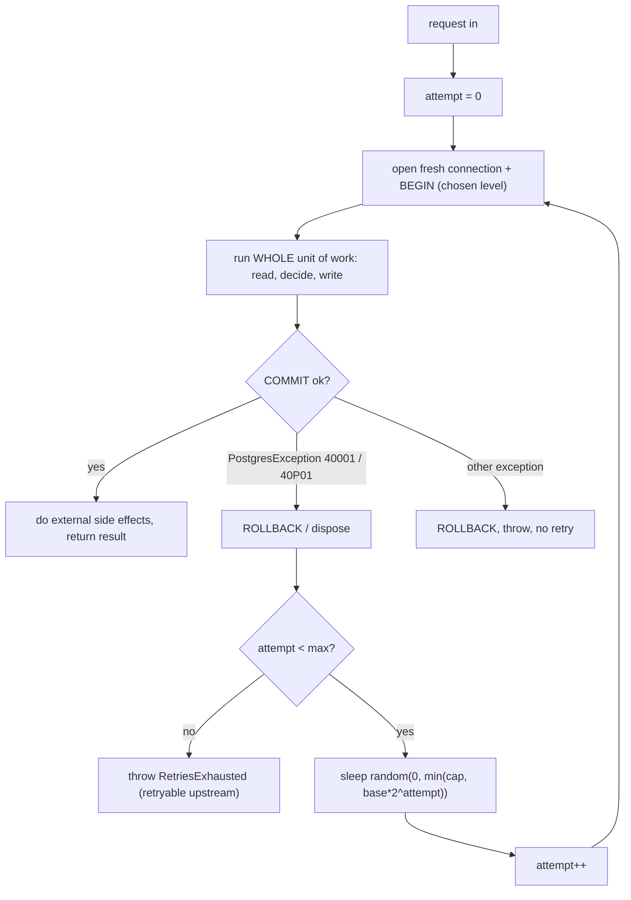
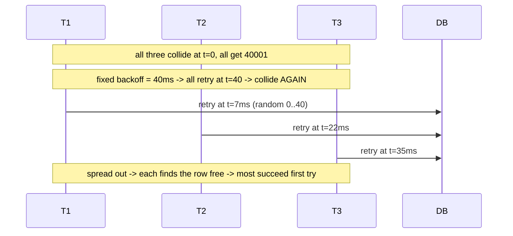
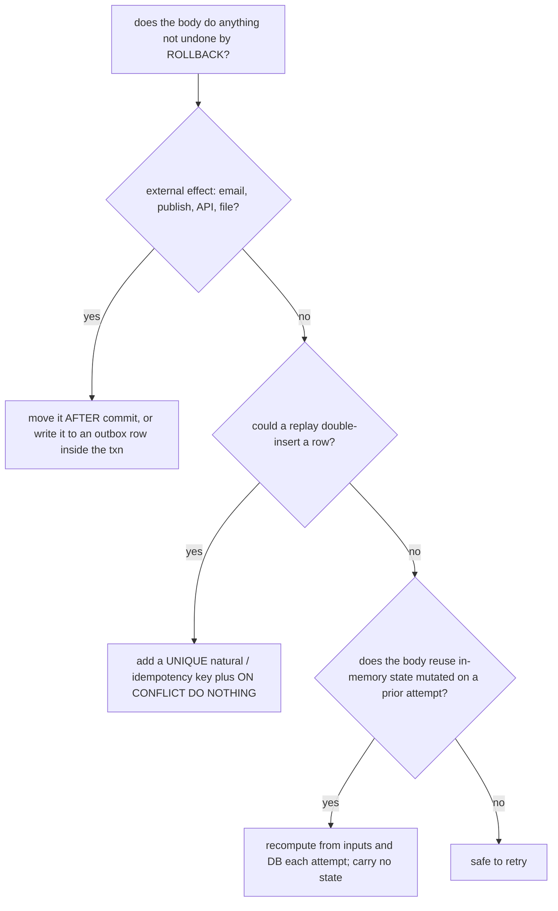

# 08 · Serialization Failures & Retry Patterns

> Covers `ACID.json` item **L06.6.11**: write a bounded retry with jitter around
> `SQLSTATE 40001`, and make sure the retried unit of work is genuinely idempotent before you
> retry it.

If you use `REPEATABLE READ` or `SERIALIZABLE` (lessons 05–06) — and you should, for
cross-row invariants — then some transactions **will** be aborted by the engine with a
serialization failure. That is not an error in your logic; it is the engine telling you
"re-run this and it will probably work." Handling it correctly is a hard requirement, not a
nice-to-have.

---

## 1. Learning objectives

After this lesson you can:

- List the retryable `SQLSTATE`s and distinguish them from business errors you must **not**
  retry.
- Write a bounded retry loop with exponential backoff and **full jitter**, with the right
  code inside vs outside the loop.
- State precisely why the *entire* unit of work (reads included) must re-run, from a fresh
  connection/transaction.
- Audit a unit of work for idempotency and fix the gaps (natural keys, `ON CONFLICT`,
  outbox, deferring side effects).
- Implement all of the above in Npgsql, and know what EF Core's built-in retry does and
  doesn't cover.
- Emit the metrics that tell you retries are healthy vs pathological.

---

## 2. Mental model

**A serialization failure is a retry request, not a failure.** The engine has proven that
committing this transaction would violate serializability (or that a deadlock existed). It
rolled the transaction back cleanly — no partial effects. If you start over with a fresh
snapshot, the conflicting transaction is now committed and visible, so your logic runs
against reality and usually succeeds.

**Two conditions make retry safe:**

1. **Nothing outside the database happened yet** (or whatever happened is idempotent). The
   retry will redo everything between `BEGIN` and `COMMIT`.
2. **The unit of work is a pure function of its inputs** — given the same request, re-running
   it produces the same intended end state. If it reads the DB, decides, and writes, that's
   fine; if it depends on a value it mutated in memory on the first pass, it's not.

**Where the simple picture is wrong / misconceptions:**

| Misconception | Reality |
|---|---|
| "Retry the failed statement." | Retry the **whole transaction** from `BEGIN`. The snapshot is poisoned; a fresh one is the entire point. |
| "Reuse the same open transaction/connection." | The transaction is aborted (`25P02` on any further statement). You need a new `BeginTransaction`, ideally a fresh pooled connection. |
| "A tight `for` loop retrying immediately is fine." | Under contention that creates a retry storm: all losers re-collide at once. You need backoff **and** jitter to spread them out. |
| "Retry any DB exception." | Only `40001` / `40P01` (and arguably `40000`). Retrying `23505`, `23514`, `22P02`, `InsufficientFunds`, etc. just loops on a deterministic failure. |
| "If the transaction only touches the DB, it's idempotent." | Not if it sends an email, publishes an event, calls an API, or writes a file **before** `COMMIT`, or if a retry could double-insert without a unique guard. |
| "EF Core `EnableRetryOnFailure` handles this." | It mainly retries **connection-level transient** errors. For serialization/deadlock retries of a multi-step unit of work you still design the loop and the idempotency. |

---

## 3. Key terms

- **`40001` `serialization_failure`** — `REPEATABLE READ` first-updater-wins conflict, **or**
  `SERIALIZABLE` SSI dangerous-structure abort. Message text differs (lesson 06 §6.2); the
  code is the same.
- **`40P01` `deadlock_detected`** — lock cycle; one transaction chosen as victim (lesson 07).
- **`40000` `transaction_rollback`** — the class; occasionally seen directly.
- **Exponential backoff** — wait ≈ `base · 2^attempt`, capped.
- **Full jitter** — wait = `random(0, min(cap, base · 2^attempt))`. Randomising the *whole*
  interval (not "backoff ± a bit") is what actually de-correlates retriers.
- **Idempotent** — re-executing the unit of work leaves the same end state; a duplicate
  submission is absorbed, not double-applied.
- **Idempotency key** — a client-supplied unique token stored with a `UNIQUE` constraint so
  the server can detect and no-op a replay.
- **Transactional outbox** — write "please publish X" into a table *in the same transaction*;
  a separate process publishes after commit. Makes event emission survive retries and
  rollbacks correctly.

---

## 4. Why the retry loop must look the way it does

### 4.1 Why re-run the whole unit of work

The transaction's snapshot is what conflicted. After `ROLLBACK`, you must take a **new**
snapshot, which means re-running every `SELECT` too — the reads that fed your decision may now
return different values (that's *why* the first attempt was unserializable). Re-running only
the writes would re-apply a decision based on stale reads. So the retry boundary is the
entire "open transaction → read → decide → write → commit" block.

### 4.2 Why a fresh connection/transaction

After `40001`/`40P01` the server-side transaction is aborted. On that connection every
statement returns `25P02` until `ROLLBACK`. Cleanest is to dispose the transaction (Npgsql
issues `ROLLBACK` on dispose), return the connection to the pool, and get a fresh one for the
next attempt. This also avoids inheriting any session state (`SET LOCAL` is gone after
rollback anyway, but `SET` without `LOCAL`, prepared statements, temp tables, advisory
*session* locks could linger).

### 4.3 Why bounded + backoff + jitter

- **Bounded**: a permanent hotspot (everyone updating one row at `SERIALIZABLE`) would retry
  forever. Cap attempts (5–10 typical) and surface a clear, retryable-at-the-caller error
  when exhausted.
- **Backoff**: gives the winning transaction time to commit and clear before the loser tries
  again.
- **Full jitter**: without it, N transactions that collided at time *t* all back off the same
  amount and **collide again** at *t + base*. Randomising the whole wait interval spreads the
  retries and collapses the storm. This is the AWS "exponential backoff and jitter" result.

### 4.4 Why idempotency is a precondition, not an afterthought

The loop **will** execute the body more than once. Anything the body does that is not undone
by `ROLLBACK` (lesson 03 §5.1) — external calls, emails, non-guarded inserts, consumed
sequence values used as business keys — is at risk of happening twice. You make the body
safe to repeat *before* you turn on retries.

---

## 5. The pattern

### 5.1 Structure

```
retry loop (bounded):
    open fresh connection
    begin transaction at the chosen level
    try:
        run the WHOLE unit of work: read -> decide -> write
        commit
        return result
    catch serialization_failure or deadlock_detected:
        rollback (implicit on dispose)
        if attempts exhausted: throw RetriesExhausted (retryable at the caller)
        sleep full-jitter backoff
        continue
    catch anything else:
        rollback
        throw   // business/programming error - do NOT retry
after the loop / after commit:
    perform external side effects (publish, email) — or let the outbox poller do it
```

### 5.2 Full jitter backoff

```
base = 20 ms
cap  = 2 s
wait(attempt) = random_between(0, min(cap, base * 2^attempt))
# attempt 0: 0..20ms   attempt 1: 0..40ms   attempt 2: 0..80ms ... capped at 2s
```

### 5.3 Inside vs outside the loop

| Inside the retried block | Outside (after commit) |
|---|---|
| `BEGIN` at the chosen isolation level | publishing events / sending email / calling APIs |
| all `SELECT`s that feed the decision | logging "succeeded" with the final result |
| the decision logic | returning the HTTP response |
| all `INSERT`/`UPDATE`/`DELETE` | metrics for attempts used |
| writing outbox rows | — |
| `COMMIT` | — |

---

## 6. Diagrams

### 6.1 The retry loop



**Reading the diagram.** The only two exits that retry are `40001` and `40P01`. Every other
exception leaves immediately. External side effects are on the `yes` branch **after** commit,
never inside `BODY`. Each retry gets a brand-new connection and transaction, so it starts from
a fresh snapshot.

### 6.2 Why full jitter beats fixed backoff



**Reading the diagram.** Fixed backoff preserves the herd; jitter disperses it. With full
jitter the expected number of re-collisions drops sharply because the retriers are no longer
synchronised.

### 6.3 Idempotency decision



**Reading the diagram.** Three gaps to close: un-rolled-back side effects, unguarded inserts,
and carried mutable state. Close all three and the body is safe to run N times.

---

## 7. Hands-on lab

### 7.1 Observe a retry succeeding on the second attempt

Use the on-call write-skew scenario (lesson 05 lab 6.5B) with three sessions: A and B are the
conflicting `SERIALIZABLE` transactions, C is a bystander.

| Step | Session A (`SERIALIZABLE`) | Session B (`SERIALIZABLE`) | Expected |
|---|---|---|---|
| 1 | `BEGIN ISOLATION LEVEL SERIALIZABLE; SELECT count(*) FROM lab.on_call WHERE is_on_call;` → 2 | `BEGIN ISOLATION LEVEL SERIALIZABLE; SELECT count(*) FROM lab.on_call WHERE is_on_call;` → 2 | |
| 2 | `UPDATE lab.on_call SET is_on_call=false WHERE engineer='ada';` | `UPDATE lab.on_call SET is_on_call=false WHERE engineer='grace';` | |
| 3 | `COMMIT;` | | ok |
| 4 | | `COMMIT;` | **`40001`** |
| 5 | | `ROLLBACK;` — then **retry the whole unit**: `BEGIN ISOLATION LEVEL SERIALIZABLE; SELECT count(*) FROM lab.on_call WHERE is_on_call;` → **1** | the retry sees reality |
| 6 | | app rule: "count would drop to 0 → refuse" → `ROLLBACK`, return `LastEngineerCannotLeave` | correct outcome, no data damage |

Key point: the retry did **not** blindly redo the `UPDATE`. It re-ran the *read*, which now
returns 1, and the business rule correctly rejected the change.

### 7.2 A non-idempotent body double-applies on retry

```sql
CREATE TABLE IF NOT EXISTS lab.ledger (
    id bigint GENERATED ALWAYS AS IDENTITY PRIMARY KEY,
    account_id bigint NOT NULL,
    amount numeric(12,2) NOT NULL,
    ext_ref text                      -- no UNIQUE yet
);
```

Simulate: a unit of work that (1) inserts a ledger row, (2) hits `40001` on a later
statement, (3) is retried, inserting the ledger row **again**. Result: two ledger rows for one
logical event. Then add `ALTER TABLE lab.ledger ADD CONSTRAINT ledger_ext_ref_uk UNIQUE (ext_ref);`
and change the insert to `INSERT ... ON CONFLICT (ext_ref) DO NOTHING`. Retry now no-ops the
duplicate.

### 7.3 Measure a retry storm and fix it with jitter

Write a C# harness (see §8) that runs 32 concurrent workers each doing a `SERIALIZABLE`
increment of the **same** `counter` row. Run it three ways and record total wall time,
successes, total retry attempts:

1. immediate retry (no sleep),
2. fixed 25 ms backoff,
3. full jitter (`base=10ms, cap=500ms`).

Expected ranking: (3) fewest total attempts and lowest p99; (1) highest attempts (storm).

---

## 8. In application code (C# / Npgsql)

### 8.1 A reusable retry helper

```csharp
using System.Data;
using Npgsql;

public static class TransactionRetry
{
    private static readonly string[] Retryable =
    {
        PostgresErrorCodes.SerializationFailure, // "40001"
        PostgresErrorCodes.DeadlockDetected,     // "40P01"
    };

    /// <summary>
    /// Runs <paramref name="unitOfWork"/> inside a transaction at <paramref name="level"/>,
    /// retrying the WHOLE thing on 40001/40P01 with bounded, full-jitter backoff.
    /// The delegate must be safe to run more than once (see idempotency checklist).
    /// External side effects must be done by the caller AFTER this returns.
    /// </summary>
    public static async Task<T> ExecuteAsync<T>(
        NpgsqlDataSource dataSource,
        IsolationLevel level,
        Func<NpgsqlConnection, NpgsqlTransaction, CancellationToken, Task<T>> unitOfWork,
        int maxAttempts = 6,
        TimeSpan? baseDelay = null,
        TimeSpan? capDelay = null,
        CancellationToken ct = default)
    {
        var @base = baseDelay ?? TimeSpan.FromMilliseconds(20);
        var cap   = capDelay  ?? TimeSpan.FromSeconds(2);

        for (var attempt = 0; ; attempt++)
        {
            await using var conn = await dataSource.OpenConnectionAsync(ct);
            await using var tx   = await conn.BeginTransactionAsync(level, ct);
            try
            {
                var result = await unitOfWork(conn, tx, ct);
                await tx.CommitAsync(ct);
                return result;
            }
            catch (PostgresException ex) when (Array.IndexOf(Retryable, ex.SqlState) >= 0)
            {
                await SafeRollbackAsync(tx);
                if (attempt + 1 >= maxAttempts)
                    throw new TransactionRetriesExhaustedException(maxAttempts, ex);

                var ceiling = Math.Min(cap.TotalMilliseconds, @base.TotalMilliseconds * Math.Pow(2, attempt));
                var wait    = TimeSpan.FromMilliseconds(Random.Shared.NextDouble() * ceiling); // full jitter
                await Task.Delay(wait, ct);
            }
            catch
            {
                await SafeRollbackAsync(tx);
                throw; // business or programming error: never retried
            }
        }
    }

    private static async Task SafeRollbackAsync(NpgsqlTransaction tx)
    {
        try { await tx.RollbackAsync(); } catch { /* connection already broken; dispose will clean up */ }
    }
}

public sealed class TransactionRetriesExhaustedException(int attempts, Exception inner)
    : Exception($"Transaction failed to serialize after {attempts} attempts.", inner);
```

### 8.2 Using it

```csharp
var outcome = await TransactionRetry.ExecuteAsync(
    dataSource,
    IsolationLevel.Serializable,
    async (conn, tx, ct) =>
    {
        // WHOLE unit of work: read -> decide -> write, all inside
        var onCall = (long)(await new NpgsqlCommand(
            "SELECT count(*) FROM on_call WHERE is_on_call", conn, tx).ExecuteScalarAsync(ct))!;

        if (onCall <= 1)
            throw new LastEngineerCannotLeaveException();   // business error -> bubbles out, no retry

        await new NpgsqlCommand(
            "UPDATE on_call SET is_on_call = false WHERE engineer = $1", conn, tx)
            { Parameters = { new() { Value = engineer } } }.ExecuteNonQueryAsync(ct);

        // event goes to an outbox row, in the same transaction — safe across retries
        await new NpgsqlCommand(
            "INSERT INTO outbox (type, payload) VALUES ('EngineerWentOffCall', $1)", conn, tx)
            { Parameters = { new() { Value = engineer } } }.ExecuteNonQueryAsync(ct);

        return Outcome.Ok;
    },
    ct: ct);

// external effects happen out here, once, after a durable commit
// (or the outbox poller publishes them)
```

### 8.3 Idempotency checklist for the delegate

- [ ] No `HttpClient` / message publish / email / file write **inside** the delegate. Move it
      after `ExecuteAsync` returns, or write an **outbox** row inside the transaction.
- [ ] Every `INSERT` that represents a real-world event has a **`UNIQUE`** natural or
      idempotency key and uses `ON CONFLICT DO NOTHING` / `DO UPDATE` (or `MERGE`).
- [ ] The delegate reads everything it needs from the DB on **each** call — it does not close
      over a value computed on a previous attempt.
- [ ] `RETURNING id` values / `nextval()` gaps are acceptable (they will skip on retry).
- [ ] The business-rule rejections (`InsufficientFunds`, `LastEngineerCannotLeave`, …) throw
      **non-`PostgresException`** types so the loop does not retry them.
- [ ] The operation is safe if the client *also* retries at the HTTP layer (idempotency key
      end to end).

### 8.4 What EF Core gives you

```csharp
options.UseNpgsql(connString, o => o.EnableRetryOnFailure(
    maxRetryCount: 6,
    maxRetryDelay: TimeSpan.FromSeconds(2),
    errorCodesToAdd: new[] { "40001", "40P01" }));   // add serialization/deadlock explicitly
```

- The `NpgsqlRetryingExecutionStrategy` retries **connection-level transient** failures out of
  the box (network blips, `57P01` admin shutdown, `53300` too many connections, timeouts).
  Serialization/deadlock codes are **not** all retried by default — add them.
- With an execution strategy, EF requires you to wrap **manual transactions** in
  `strategy.ExecuteAsync(...)` so the whole block (not just one `SaveChanges`) re-runs.
- Inside the retried block, re-fetch entities each attempt; a stale tracked graph from a
  previous attempt is a bug. Concurrency tokens (`IsRowVersion()` / `xmin`) still handle
  single-row lost update and raise `DbUpdateConcurrencyException` (which you handle
  separately, usually by reloading and re-applying).

### 8.5 Metrics to emit

| Metric | Why |
|---|---|
| `tx_retry_attempts_total{unit_of_work}` (histogram of attempts per success) | mostly 0–1 is healthy; a fat tail means a hotspot |
| `tx_retries_exhausted_total{unit_of_work}` | should be ~0; every one is a user-visible failure |
| `tx_serialization_failures_total{sqlstate}` | split `40001` vs `40P01` — different fixes |
| `tx_duration_seconds{unit_of_work}` incl. retry waits | catch backoff cap set too high |
| conflict hotspots: log the table/row/predicate on the *last* failed attempt | tells you where to add a constraint / `FOR UPDATE` / redesign |

---

## 9. Practical exercises

### Beginner

1. Which `SQLSTATE`s does the retry loop catch, and name three it must **not** catch.
2. Why must the retry re-run the `SELECT`s, not just the `UPDATE`s?
3. What does "full jitter" mean, and what goes wrong with fixed backoff under a burst of
   conflicts?

### Intermediate

4. Implement `TransactionRetry.ExecuteAsync` from §8.1 and the harness from lab 7.3. Produce
   the three-way comparison table (immediate / fixed / full jitter) for 32 workers on one hot
   row. Explain the numbers.
5. Take lab 7.2's non-idempotent ledger body. Make it idempotent with a `UNIQUE (ext_ref)` +
   `ON CONFLICT DO NOTHING`, and prove with a forced double-execution that exactly one ledger
   row exists.
6. Add an outbox table. Move an event publish from "inside the transaction" to "outbox row
   inside + poller after." Kill the process between `COMMIT` and the poller run; show the
   event is still delivered exactly once (at-least-once + idempotent consumer).

### Advanced

7. Build a unit of work where retries never converge (permanent hotspot: 64 workers, one row,
   `SERIALIZABLE`). Show `tx_retries_exhausted_total` climbing. Then fix it two ways —
   (a) `READ COMMITTED` + `UPDATE ... SET n = n + 1`, (b) `FOR UPDATE` queue — and show the
   exhaustion goes to zero. Discuss when each is appropriate.
8. Your HTTP handler already retries `503`s from clients, and your DB layer retries `40001`.
   Design an end-to-end idempotency-key scheme (schema, constraint, where the key is checked,
   what the server returns on a detected replay) so that *no* combination of client retry +
   server retry double-applies a payment.
9. Compare the retry helper in §8.1 with EF Core's `NpgsqlRetryingExecutionStrategy` +
   `strategy.ExecuteAsync`. Where do they differ on: which errors are retried, re-fetching
   state each attempt, transaction scope, and jitter algorithm? When would you use each?

---

## 10. Key takeaways

- `40001` (and `40P01`) mean **"re-run me"**, not "you have a bug." The transaction rolled
  back cleanly.
- Retry the **entire** unit of work — reads, decision, writes — from a **fresh
  connection/transaction**. Never reuse the aborted one; never retry just a statement.
- **Bounded** attempts + **exponential backoff** + **full jitter**
  (`random(0, min(cap, base·2^n))`). Fixed backoff re-synchronises the herd.
- Only retry `40001` / `40P01` / `40000`. Business errors and constraint violations are
  deterministic — bubble them out.
- **Idempotency is a precondition.** No un-rolled-back side effects in the body (use an
  outbox), unique keys + `ON CONFLICT` on event inserts, recompute from inputs each attempt.
- EF Core's built-in retry covers connection-transient errors; add `40001`/`40P01` and wrap
  manual transactions in `strategy.ExecuteAsync`.
- Emit retry-attempt and retries-exhausted metrics; a fat tail or any exhaustion means a
  hotspot to redesign.

Next: `09-transaction-boundaries-in-application-code.md`.
