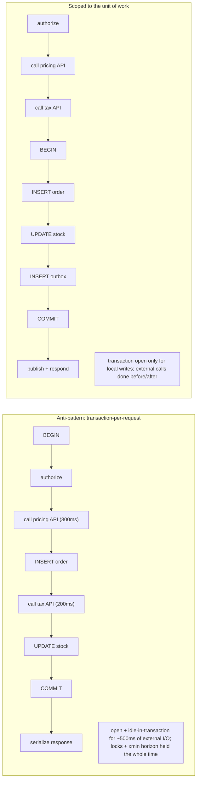
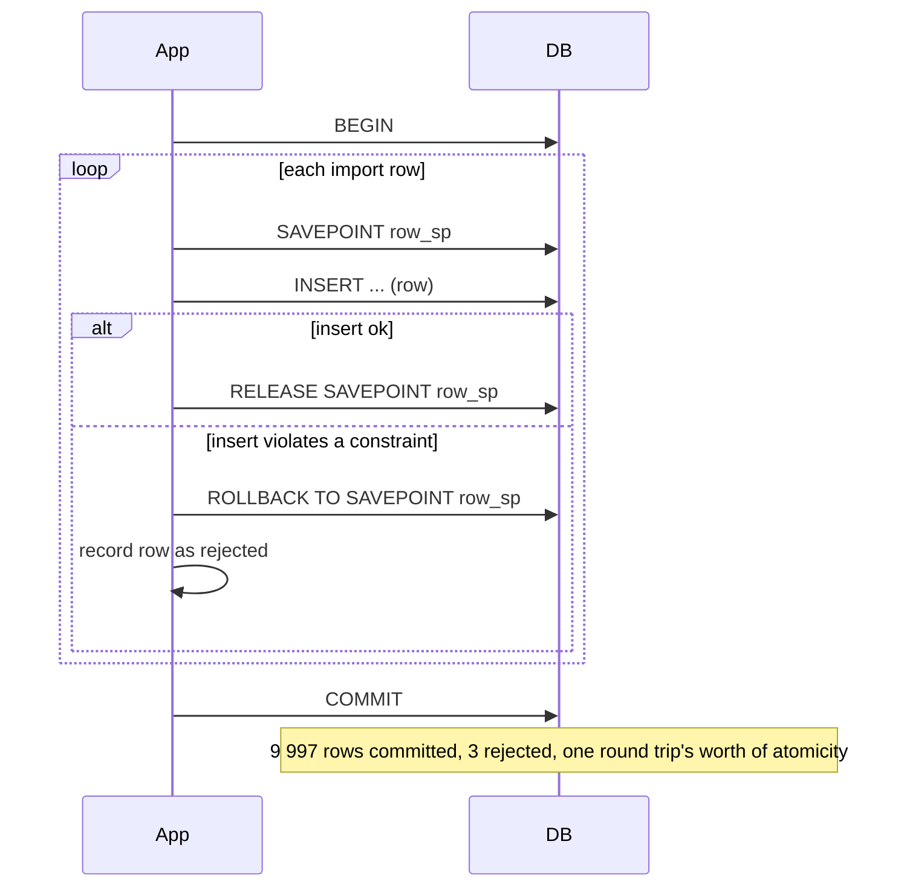

# 09 · Transaction Boundaries in Application Code

> Covers `ACID.json` item **L06.6.1** in depth: wrap a multi-statement unit of work in
> `BEGIN`/`COMMIT` from Npgsql, decide *deliberately* where the boundary sits, and judge
> whether savepoints are worth their partial-rollback complexity.

Lesson 01 covered what a transaction *is*. This lesson is about the design decision: given a
request coming into your .NET service, **where does `BEGIN` go and where does `COMMIT` go?**

---

## 1. Learning objectives

After this lesson you can:

- Place the transaction boundary around exactly one business unit of work — no wider, no
  narrower.
- Explain why external I/O must never sit between `BEGIN` and `COMMIT`, tying it to the
  mechanisms in lessons 01–02.
- Decide when a savepoint earns its complexity and when it is a smell.
- Use `NpgsqlTransaction` correctly with `async`, `await using`, cancellation, and the
  connection pool.
- Know the specific hazards of `TransactionScope`, EF Core `SaveChanges`, and a connection
  pooler in transaction-pooling mode.

---

## 2. Mental model

**One business operation = one transaction.** "Place an order" is a unit of work: insert the
order, insert the lines, decrement stock, write the outbox row — all or nothing. That is one
`BEGIN`/`COMMIT`. "Place an order" and "send the confirmation email" are **two** units; the
email is not part of the transaction.

**Open late, commit early.** The transaction should start at the first write of the unit of
work (or the first read that must be consistent with those writes) and end immediately after
the last one. Everything before (validation, auth, parsing, loading reference data that
doesn't need to be transactionally consistent) and everything after (serialising the
response, publishing events, logging) is outside.

**The boundary is a correctness *and* a resource decision.** Too wide → long transactions
that pin the VACUUM horizon (lesson 02 §5.6), hold locks, and sit `idle in transaction`
during I/O (lesson 01 §5.3). Too narrow → two transactions where you needed one, and an
invariant slips between them.

**Where the simple picture is wrong / misconceptions:**

| Misconception | Reality |
|---|---|
| "One transaction per HTTP request is a clean default." | It drags the boundary across auth, model binding, external calls, and response serialisation — all reasons for the transaction to be open longer and `idle in transaction`. Scope to the unit of work instead. |
| "Wrapping more in the transaction is safer." | Wider = longer locks, more `40001`, worse bloat, and it still doesn't make external effects atomic. |
| "A savepoint lets me 'undo' part of my work cheaply." | Savepoints cost an `xid` each and, in bulk, degrade visibility checks (subtransaction SLRU). They're for genuine try/fallback, not routine control flow. |
| "`using` on the connection is enough." | You also need `await using` on the **transaction**, or an exception path can return a connection to the pool mid-transaction. |
| "`TransactionScope` just works with `async`." | Only with `TransactionScopeAsyncFlowOption.Enabled`; otherwise the ambient transaction doesn't flow across `await` and you get surprising behaviour. |
| "The pooler is transparent." | In **transaction pooling** mode (PgBouncer), session state, session-level advisory locks, `SET` (without `LOCAL`), unnamed portals held across statements, and `WITH HOLD` cursors break. |

---

## 3. Key terms

- **Unit of work** — the smallest set of database changes that must commit or roll back
  together to keep an invariant. The transaction boundary goes exactly around it.
- **Ambient transaction** — a `System.Transactions.TransactionScope` that commands enlist in
  implicitly.
- **Savepoint / subtransaction** — `SAVEPOINT name` … `ROLLBACK TO SAVEPOINT name` /
  `RELEASE SAVEPOINT name`; a nested, partially-revertible section.
- **`idle in transaction`** — `BEGIN` issued, at least one statement run, now waiting on the
  client (lesson 01 §5.3). Holds snapshot + locks.
- **Transaction pooling** — a connection-pooler mode that hands a server connection to a
  client only for the duration of one transaction, maximising reuse but forbidding
  cross-transaction session state.
- **Outbox** — a table written inside the transaction that records events to publish after
  commit (lessons 03, 08).

---

## 4. Why boundary placement matters

Concretely, a transaction that stays open costs you:

1. **VACUUM horizon** — its snapshot pins `OldestXmin`; dead tuples database-wide can't be
   reclaimed → bloat (lesson 02 §5.6).
2. **Locks** — every row it wrote or `FOR UPDATE`-locked is unavailable to other writers
   until it ends (lesson 07).
3. **`idle in transaction`** — if it's waiting on an HTTP call or a message broker, all of the
   above is true *for the duration of that call*, and a slow dependency becomes a database
   incident.
4. **`40001` surface area** — at `REPEATABLE READ`/`SERIALIZABLE`, the longer the window, the
   more concurrent commits it can conflict with, the higher the retry rate.
5. **Connection-pool pressure** — a connection in a transaction can't be reused; wide
   boundaries under load exhaust the pool.

None of these are hypothetical; they are the top entries in most PostgreSQL incident
post-mortems.

---

## 5. How to place the boundary

### 5.1 The shape

```
HTTP request
  ├─ authenticate / authorize            (no transaction)
  ├─ validate & bind input               (no transaction)
  ├─ load non-critical reference data    (no transaction, or a separate short read)
  │
  ├─ BEGIN  ── unit of work ─────────────────────────────
  │    read the rows the decision depends on (consistent snapshot)
  │    decide
  │    INSERT / UPDATE / DELETE
  │    INSERT outbox row
  │  COMMIT ─────────────────────────────────────────────
  │
  ├─ publish events (from the return value, or via the outbox poller)
  ├─ send email / call downstream API
  └─ serialise response
```

### 5.2 Rules of thumb

- **Never** `await` network/disk I/O that isn't PostgreSQL between `BEGIN` and `COMMIT`.
- If you need data from another service to make the decision, fetch it **before** `BEGIN`.
  If the decision then depends on it being fresh, re-validate cheaply *inside* the
  transaction (e.g. a `WHERE status = 'active'` guard) rather than holding the transaction
  open across the call.
- **One connection per unit of work.** Don't share a connection/transaction across parallel
  tasks — PostgreSQL has no nested/concurrent transactions per connection, and `NpgsqlConnection`
  is not thread-safe for concurrent commands.
- If two units of work happen in one request, use **two** transactions and make the second
  safe to run even if the first's effects are already visible (idempotent, lesson 08).
- Put the boundary in **one place** — a `IUnitOfWork`/repository method, a MediatR behaviour,
  an interceptor — not scattered `BeginTransaction` calls in handlers.

### 5.3 Choosing the isolation level here

Set it at `BeginTransactionAsync` per the decision guide (lesson 06 §6.1). If the unit of
work enforces a cross-row invariant, it's `Serializable` + the retry helper from lesson 08 —
which means the boundary must enclose a body that is **safe to re-run** (§5.1's "read →
decide → write → outbox" is; "read → call API → write" is not).

### 5.4 Savepoints — when they earn their keep

**Good uses (genuine try/fallback where restarting the whole transaction is wasteful):**

- **Bulk import, skip bad rows.** Process 10 000 rows in one transaction; wrap each row in a
  savepoint so one constraint violation rolls back just that row and you continue.
  ```sql
  SAVEPOINT row_sp;
  INSERT INTO target (...) VALUES (...);   -- may fail on a bad row
  -- on error in the app:
  ROLLBACK TO SAVEPOINT row_sp;            -- keep the other 9 999
  -- on success:
  RELEASE SAVEPOINT row_sp;
  ```
- **"Try the fast path, fall back to the slow path"** within one atomic unit, where redoing
  the successful earlier work would be expensive or externally visible.
- **`INSERT` race you'd rather catch than pre-check**, when `ON CONFLICT` can't express it:
  savepoint → `INSERT` → on `23505` roll back to savepoint and `UPDATE` instead. (Prefer
  `INSERT ... ON CONFLICT`/`MERGE` when they fit — no savepoint needed.)

**Smells (reach for a different design):**

- A savepoint around **every** statement "to be safe" → you've reinvented autocommit with
  overhead; consider smaller transactions.
- Savepoints as **normal control flow** in hot paths → `xid` consumption + subtransaction
  SLRU pressure; at thousands of active subtransactions across the system, visibility checks
  slow down measurably.
- Using a savepoint to **keep working after an error you don't understand** → you're masking
  a bug; let it fail and fix the cause.

**Cost facts:** each savepoint that does work gets its own `xid`; `RELEASE` doesn't give it
back. Deeply nested / very numerous subtransactions are the classic "why did the whole
database slow down" cause (`pg_stat_activity` shows high `subxact`/SLRU waits).

---

## 6. Diagrams

### 6.1 Boundary too wide vs right-sized



**Reading the diagram.** Same work, two boundary placements. The top one holds a transaction
open across two API calls — 500 ms of `idle in transaction` per request, multiplied by
concurrency. The bottom one does all external I/O outside the boundary; the transaction is
open only for the few milliseconds of local `INSERT`/`UPDATE`. The bottom body is also
re-runnable, so it can be `SERIALIZABLE` + retry.

### 6.2 Savepoint in a bulk import



**Reading the diagram.** Without savepoints, one bad row aborts the whole import (all 10 000
lost) or forces 10 000 separate transactions (10 000 commit `fsync`s). The savepoint gives
per-row recoverability inside one transaction — a legitimate, load-bearing use.

---

## 7. Hands-on lab

### 7.1 See "transaction per request" hold the horizon during a fake API call

| Step | Session A (simulates the handler) | Session B (observer) | Expected |
|---|---|---|---|
| 1 | `BEGIN;` | | |
| 2 | `INSERT INTO lab.counter VALUES ('order-1', 1);` | | xid assigned, row locked |
| 3 | `SELECT pg_sleep(5);` *(stands in for an external API call)* | | A is `active` then `idle in transaction` |
| 4 | | `SELECT pid, state, now()-xact_start AS open_for, age(backend_xmin) AS xmin_age FROM pg_stat_activity WHERE state LIKE 'idle in transaction%';` | `open_for` ≈ 5s+, `xmin_age` > 0 |
| 5 | | `VACUUM (VERBOSE) lab.counter;` | reports dead tuples not removable |
| 6 | `COMMIT;` | `VACUUM (VERBOSE) lab.counter;` | now removable |

### 7.2 Savepoint: skip a bad row, keep the rest

| Step | Session A | Expected |
|---|---|---|
| 1 | `BEGIN;` | |
| 2 | `SAVEPOINT s;` `INSERT INTO lab.account (id,owner,balance) VALUES (10,'x',5);` `RELEASE SAVEPOINT s;` | ok |
| 3 | `SAVEPOINT s;` `INSERT INTO lab.account (id,owner,balance) VALUES (1,'dup',5);` | `ERROR 23505` |
| 4 | `ROLLBACK TO SAVEPOINT s;` | transaction usable again |
| 5 | `SAVEPOINT s;` `INSERT INTO lab.account (id,owner,balance) VALUES (11,'y',5);` `RELEASE SAVEPOINT s;` | ok |
| 6 | `COMMIT;` | rows 10 and 11 committed, row "dup" skipped |
| 7 | `DELETE FROM lab.account WHERE id IN (10,11);` | cleanup |

### 7.3 Without `await using` on the transaction, the pool gets a dirty connection

Reproduce in C# (see §8.3): open a connection from the pool, `BeginTransaction`, run one
`INSERT`, throw before `Commit`, and **do not** dispose the transaction. Observe (via
`pg_stat_activity`) the server session sitting `idle in transaction` until Npgsql's
connection reset kicks in on reuse. Then add `await using` and show the `ROLLBACK` is issued
promptly on scope exit.

---

## 8. In application code (C# / Npgsql)

### 8.1 The canonical scoped boundary

```csharp
public async Task<PlaceOrderResult> PlaceOrderAsync(PlaceOrderCommand cmd, CancellationToken ct)
{
    // --- outside the transaction ---
    await _authz.EnsureCanPlaceOrderAsync(cmd.UserId, ct);
    var pricing = await _pricingApi.QuoteAsync(cmd.Items, ct);   // external I/O BEFORE BEGIN
    var tax     = await _taxApi.ComputeAsync(cmd.ShipTo, pricing, ct);

    // --- the unit of work ---
    var result = await TransactionRetry.ExecuteAsync(
        _dataSource, IsolationLevel.ReadCommitted,
        async (conn, tx, token) =>
        {
            var orderId = await _orders.InsertAsync(conn, tx, cmd, pricing, tax, token);
            await _lines.InsertAsync(conn, tx, orderId, cmd.Items, token);

            var stockOk = await _stock.TryDecrementAsync(conn, tx, cmd.Items, token); // atomic UPDATE ... WHERE qty >= n
            if (!stockOk) throw new OutOfStockException();                            // business error -> no retry

            await _outbox.InsertAsync(conn, tx, new OrderPlaced(orderId), token);
            return new PlaceOrderResult(orderId);
        },
        ct: ct);

    // --- outside the transaction, after a durable commit ---
    await _bus.PublishAsync(new OrderPlaced(result.OrderId), ct);   // or leave it to the outbox poller
    return result;
}
```

### 8.2 Savepoints via Npgsql

```csharp
await using var tx = await conn.BeginTransactionAsync(ct);
foreach (var row in importRows)
{
    await tx.SaveAsync("row_sp", ct);           // no round trip; piggybacks on the next command
    try
    {
        await InsertRowAsync(conn, tx, row, ct);
        await tx.ReleaseAsync("row_sp", ct);
    }
    catch (PostgresException e) when (e.SqlState is PostgresErrorCodes.UniqueViolation
                                              or PostgresErrorCodes.CheckViolation)
    {
        await tx.RollbackAsync("row_sp", ct);   // roll back just this row
        rejected.Add((row, e.SqlState));
    }
}
await tx.CommitAsync(ct);
```

`NpgsqlTransaction` methods (Npgsql 8): `SaveAsync(name)`, `RollbackAsync(name)`,
`ReleaseAsync(name)` — and the sync `Save(name)` deliberately does **not** round-trip (the
`SAVEPOINT` statement is sent with the next command).

### 8.3 `async` / disposal / cancellation hygiene

```csharp
await using var conn = await _dataSource.OpenConnectionAsync(ct);
await using var tx   = await conn.BeginTransactionAsync(IsolationLevel.ReadCommitted, ct);
// ... work ...
await tx.CommitAsync(ct);
// if an exception or cancellation happens before CommitAsync, `await using` on `tx`
// issues ROLLBACK, then `await using` on `conn` returns a clean connection to the pool.
```

- Always `await using` **both** the connection and the transaction.
- Pass the `CancellationToken` to every `ExecuteAsync`/`CommitAsync`. A cancelled command
  leaves the transaction in an aborted state; disposal then rolls it back — fine, but don't
  swallow the `OperationCanceledException`.
- Never run two commands on one `NpgsqlConnection` concurrently. For parallel DB work, use
  multiple connections, each with its own transaction — and then you no longer have one
  atomic unit, so reconsider the design.
- Prefer `NpgsqlDataSource` (Npgsql 7+) as the single app-wide factory; it owns the pool.

### 8.4 `TransactionScope` (System.Transactions)

Works with Npgsql, useful when a unit of work spans repositories that each open their own
connection, or spans PostgreSQL + another resource manager:

```csharp
using var scope = new TransactionScope(
    TransactionScopeOption.Required,
    new TransactionOptions { IsolationLevel = System.Transactions.IsolationLevel.ReadCommitted },
    TransactionScopeAsyncFlowOption.Enabled);   // REQUIRED for async — do not omit

await using (var c1 = await _dataSource.OpenConnectionAsync(ct)) { /* enlists automatically */ }
await using (var c2 = await _dataSource.OpenConnectionAsync(ct)) { /* same ambient tx */ }

scope.Complete();   // omission = rollback
```

Caveats: `TransactionScopeAsyncFlowOption.Enabled` is mandatory with `async`; promotion to a
distributed transaction (MSDTC) is not supported on non-Windows and is a design smell anyway;
for single-connection units of work, an explicit `NpgsqlTransaction` is simpler and clearer.

### 8.5 Connection pooler (PgBouncer) in transaction-pooling mode

If your platform runs PgBouncer with `pool_mode = transaction`:

- **Session-level advisory locks** (`pg_advisory_lock`) leak across clients — use the
  **`_xact_`** variants (`pg_advisory_xact_lock`) which release at commit.
- **`SET`** (without `LOCAL`) persists on whatever server connection you land on next — use
  `SET LOCAL` inside the transaction.
- **Server-side prepared statements**: Npgsql handles automatic preparation, but with
  transaction pooling you typically disable it (`Max Auto Prepare = 0`) or use PgBouncer ≥
  1.21 prepared-statement support.
- **`LISTEN`/`NOTIFY`, `WITH HOLD` cursors, advisory session locks, temp tables** across
  transactions: don't rely on them.
- Net effect: keep transactions short and self-contained — which is what §5 already tells you
  to do.

### 8.6 EF Core `SaveChanges`

- One `SaveChanges`/`SaveChangesAsync` call wraps all its `INSERT`/`UPDATE`/`DELETE` in **one
  transaction** automatically. Multiple `SaveChanges` calls = multiple transactions unless you
  open an explicit `context.Database.BeginTransactionAsync()`.
- With an execution strategy (`EnableRetryOnFailure`), wrap any explicit
  `BeginTransaction` + multiple `SaveChanges` in
  `context.Database.CreateExecutionStrategy().ExecuteAsync(...)` so the whole block retries
  (lesson 08 §8.4).
- The boundary rules are identical: don't call an external service between the first tracked
  change and `SaveChanges`.

---

## 9. Practical exercises

### Beginner

1. Give the two-sentence rule for where `BEGIN` and `COMMIT` go relative to an HTTP request.
2. Name three concrete costs of a transaction that stays open for an extra 500 ms.
3. When is a savepoint appropriate, and name one pattern that is a "savepoint smell."

### Intermediate

4. Refactor a "transaction-per-request" handler (open in a filter, commit in a filter) to a
   scoped boundary. Move the two external calls out, add an outbox row, and show with
   `pg_stat_activity` that the transaction's `now()-xact_start` drops from ~hundreds of ms to
   single-digit ms under load.
5. Implement the bulk importer from §8.2. Feed it 1 000 rows with 5 deliberate constraint
   violations. Assert 995 committed, 5 reported, one `COMMIT`. Then measure how many `xid`s
   the transaction consumed (`SELECT txid_current()` before/after nearby transactions) and
   explain.
6. Reproduce lab 7.3 (missing `await using` on the transaction). Capture the server state
   with and without it. Explain what Npgsql does to the connection on pool reuse in the bad
   case.

### Advanced

7. A request must (a) reserve inventory in PostgreSQL and (b) authorize a card with an
   external PSP, atomically from the user's perspective. You cannot hold a DB transaction
   across the PSP call. Design the flow (reserve → authorize → confirm/settle or
   compensate), define each state, and specify the reaper that cleans up reservations
   orphaned by a crash between (a) and (b).
8. Your service runs behind PgBouncer in transaction pooling. Audit this list for breakage
   and give the fix for each: a per-tenant `pg_advisory_lock`, a `SET search_path` at
   connection open, an app that `LISTEN`s for cache-invalidation, a report using a
   `WITH HOLD` cursor, auto-prepared statements. 
9. Argue the boundary for a "saga step" worker: it consumes a message, does one DB unit of
   work, and emits the next message. Where is the transaction, how do you avoid losing or
   duplicating the outgoing message on a crash at each point, and why does the outbox pattern
   (not "publish then commit" or "commit then publish") fall out as the answer?

---

## 10. Key takeaways

- **Scope the transaction to one unit of work**, not to the HTTP request. Open late, commit
  early.
- **No external I/O between `BEGIN` and `COMMIT`.** Do it before (inputs) or after (effects),
  or record intent in an **outbox** row inside the transaction.
- A wide boundary costs VACUUM horizon, lock hold time, `idle in transaction`, more `40001`,
  and pool exhaustion — the top items in PostgreSQL incident reports.
- **Savepoints** are for genuine try/fallback (bulk-import row skipping, fast/slow path),
  not routine control flow — each consumes an `xid` and, en masse, slows visibility checks.
- Npgsql hygiene: `await using` **both** connection and transaction; pass the
  `CancellationToken`; one connection per unit of work; `NpgsqlDataSource` as the app-wide
  factory; `SaveAsync`/`RollbackAsync(name)`/`ReleaseAsync(name)` for savepoints.
- `TransactionScope` needs `TransactionScopeAsyncFlowOption.Enabled`; transaction-pooling
  poolers forbid cross-transaction session state — keep transactions short and self-contained.

Next: `10-production-guidelines-and-decision-guide.md`.
