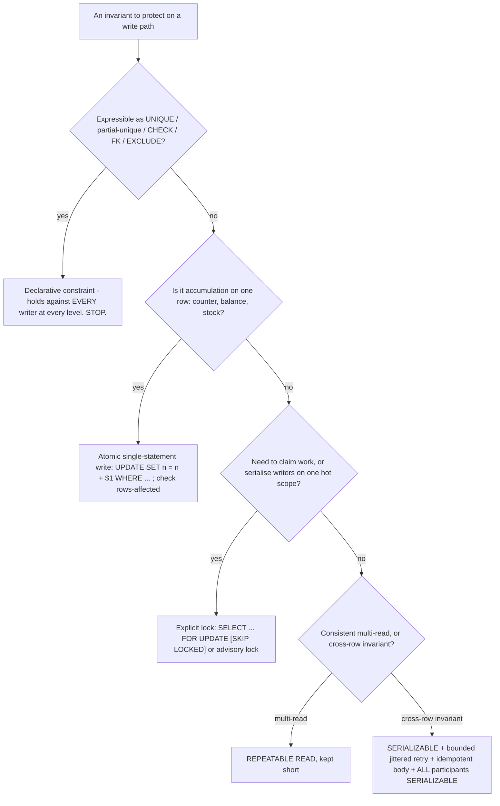

# 10 · Production Guidelines & Decision Guide

This lesson is the synthesis: the anomaly × level tables in one place, a decision guide for
choosing an isolation level and a concurrency-control strategy per workload, the honest cost
of "just use `SERIALIZABLE` everywhere," an anti-pattern catalogue, and the observability /
alerting you need to run this in production. It draws on all of lessons 01–09.

---

## 1. Learning objectives

After this lesson you can:

- Choose an isolation level **and** a concurrency-control mechanism for a given unit of work,
  and defend the choice.
- State the real costs of a blanket `SERIALIZABLE` policy and when it is nonetheless right.
- Recognise the common anti-patterns in code review.
- Stand up the dashboards and alerts that make transaction problems visible before they
  page you.
- Plan a safe rollout when changing an isolation level or concurrency strategy.

---

## 2. Mental model

**Correctness is layered, cheapest layer first:**

1. **Declarative constraints** (`UNIQUE`, partial-unique, `CHECK`, `FOREIGN KEY`, `EXCLUDE`) —
   the database enforces them against *every* writer at *every* isolation level, even buggy
   code and ad-hoc `psql`. Always prefer this when the invariant is expressible.
2. **Atomic single-statement writes** (`UPDATE ... SET n = n + 1 WHERE ...`,
   `INSERT ... ON CONFLICT`, `MERGE`) — no read-modify-write race because the engine
   re-reads under a row lock.
3. **Explicit locks** (`SELECT ... FOR UPDATE`, `SKIP LOCKED`, advisory locks) — when you
   need to claim work or serialise writers on a hot row/scope with waits instead of aborts.
4. **Isolation level** (`REPEATABLE READ`, `SERIALIZABLE` + retry) — for consistent
   multi-read units and cross-row invariants that can't be a constraint.

Reach for level 4 only when levels 1–3 don't fit. Most "we need `SERIALIZABLE`" turns out to
be "we needed a `UNIQUE` index" or "we needed `SET n = n + 1`."

**Isolation and mechanism are two separate choices.** "`SERIALIZABLE`" is not a strategy on
its own — it implies "+ bounded jittered retry + idempotent body + all participants
serializable." "`READ COMMITTED`" is not a strategy on its own — it implies "+ an atomic
write or a lock or a constraint for anything with an invariant."



**Reading the diagram.** Every write path with an invariant walks this ladder top to bottom
and stops at the first rung that fits. The rungs get more expensive and more fragile as you
descend: a constraint is enforced no matter what code runs; `SERIALIZABLE` only works if
every participant cooperates and you built the retry machinery. "We need `SERIALIZABLE`" is
usually a signal that rung 1 or rung 2 was skipped.

---

## 3. The tables (consolidated)

### 3.1 PostgreSQL 16, as implemented

| Anomaly | `READ COMMITTED` | `REPEATABLE READ` | `SERIALIZABLE` |
|---|---|---|---|
| Dirty read | prevented | prevented | prevented |
| Non-repeatable read | **possible** | prevented | prevented |
| Phantom read | **possible** | prevented *(stricter than the SQL standard)* | prevented |
| Lost update (app read-modify-write) | **possible** | prevented *(2nd writer → `40001`)* | prevented |
| Write skew | **possible** | **possible** | prevented *(SSI → `40001`)* |
| Read-only serialization anomaly | **possible** | **possible** | prevented *(SSI; or `READ ONLY DEFERRABLE`)* |
| Raises `40001` on conflicts? | no (re-checks via EPQ) | yes (write/write) | yes (write/write **and** read/write cycles) |
| Snapshot | per **statement** | per **transaction** | per **transaction** + read tracking |

### 3.2 SQL standard minimum vs PostgreSQL

| Level | Standard allows | PostgreSQL additionally prevents |
|---|---|---|
| `READ UNCOMMITTED` | dirty, non-repeatable, phantom, anomaly | **dirty reads** (it runs as `READ COMMITTED`) |
| `READ COMMITTED` | non-repeatable, phantom, anomaly | — (matches) |
| `REPEATABLE READ` | phantom, anomaly | **phantom reads** |
| `SERIALIZABLE` | nothing | — (matches; via SSI instead of locking) |

### 3.3 Mechanism cheat-sheet

| Invariant shape | Best mechanism | Isolation needed |
|---|---|---|
| "at most one X" / "no duplicate X" | `UNIQUE` or partial-unique index | any |
| "no two overlapping ranges" | `EXCLUDE USING gist (... WITH &&)` | any |
| "balance never negative", counters, stock | `UPDATE ... SET bal = bal - $1 WHERE bal >= $1` (check rows-affected) | `READ COMMITTED` |
| "read a whole aggregate, mutate in app, write back" | optimistic `version` column + retry | `READ COMMITTED` |
| "claim exactly one job / seat" | `SELECT ... FOR UPDATE SKIP LOCKED` | `READ COMMITTED` |
| "serialize all writers on one hot scope" | `SELECT ... FOR UPDATE` on a guard row, or `pg_advisory_xact_lock` | `READ COMMITTED` |
| "consistent snapshot across many reads" (report/export) | one transaction | `REPEATABLE READ` (or `SERIALIZABLE READ ONLY DEFERRABLE` for long ones) |
| "cross-row / cross-table invariant, not expressible as a constraint" (≥1 on call; per-user active count; approve-if-sum-under-limit) | `SERIALIZABLE` + retry, **all** participants | `SERIALIZABLE` |

---

## 4. Decision guide by workload

### 4.1 Read-mostly endpoints (list, detail, search)

- **Level:** `READ COMMITTED`.
- **Why:** no invariant to protect; per-statement snapshot is fine; no `40001` to handle.
- **Exception:** if one response is assembled from many queries and must reflect one instant
  (financial statement, "export account"), use `REPEATABLE READ` and keep it short.

### 4.2 Counters, balances, stock, rate limits (accumulate on one row)

- **Level:** `READ COMMITTED`.
- **Mechanism:** atomic write — `UPDATE ... SET n = n + $1 WHERE id = $2 [AND n + $1 >= 0]`;
  check `rows-affected`. Never `SELECT` then `UPDATE` with an app-computed literal.
- **If the row is *very* hot** (thousands of writes/s to one id): switch to an **append-only**
  design (`INSERT` deltas, `SUM()` or a periodically-rolled-up materialised total) or
  sharded sub-counters. `SERIALIZABLE` here just produces a retry storm.

### 4.3 "Load aggregate → apply command → save" (DDD-style)

- **Level:** `READ COMMITTED`.
- **Mechanism:** optimistic concurrency — a `version` (or `xmin`) token, `WHERE version =
  $original`, 0 rows ⇒ `ConcurrencyConflict` ⇒ reload + reapply + retry (bounded).
- **When to go pessimistic instead:** sustained contention on the same aggregate id ⇒
  `SELECT ... FOR UPDATE` the root row first, or a queue.

### 4.4 Job queues, outbox pollers, scheduled work

- **Level:** `READ COMMITTED`.
- **Mechanism:** `SELECT ... FROM job WHERE state='ready' ORDER BY id FOR UPDATE SKIP LOCKED
  LIMIT n`. For slow jobs, a `processing` state + `locked_at` + a reaper, not a long-held row
  lock.

### 4.5 Cross-row invariants that can't be a constraint

- **First:** try to *make* it a constraint (partial unique, `EXCLUDE`, a trigger, a
  materialised guard row you lock). A constraint beats an isolation level because it holds
  against every writer, including a stray `READ COMMITTED` job or a migration.
- **If truly not expressible:** `SERIALIZABLE` + the retry helper (lesson 08), and audit that
  **every** code path touching those tables is also `SERIALIZABLE`.

### 4.6 Long analytical reads / backups / nightly reconciliation

- **Level:** `SERIALIZABLE READ ONLY DEFERRABLE` if it must be perfectly consistent and can
  tolerate a short wait for a safe snapshot; otherwise `REPEATABLE READ`.
- **Keep off the primary** where possible (physical replica), accepting that the replica
  gives snapshot isolation, not SSI.
- Watch the VACUUM horizon (lesson 02 §5.6) — a 40-minute read holds it for 40 minutes.

---

## 5. "Just use SERIALIZABLE everywhere" — the honest analysis

### When it is a *good* default

- Correctness-critical domains (ledgers, entitlements, inventory) where reasoning about every
  interleaving by hand is more expensive and error-prone than paying for retries.
- Low-to-moderate write contention: the `40001` rate stays low, so the retry loop rarely
  fires.
- A team that has actually built the retry + idempotency infrastructure (lesson 08) and has
  the metrics to see abort rates.

### The costs you are signing up for

| Cost | Detail | Mitigation |
|---|---|---|
| **Mandatory retry loop everywhere** | Every write transaction can get `40001`; unhandled ⇒ user-facing 500s. | The lesson-08 helper as the *only* way to open a write transaction. |
| **Retry storms on hot rows/predicates** | High contention ⇒ many aborts ⇒ retries re-collide. | Full jitter; but really: use a constraint/lock/atomic write for the hot path instead. |
| **Idempotency tax** | Bodies must be safe to re-run; side effects must move to an outbox. | Enforced by code review + the helper's shape. |
| **Predicate-lock memory** | SIRead locks live in shared memory: `max_pred_locks_per_transaction × (max_connections + max_prepared_transactions)`, plus per-relation/per-page caps. Exhaustion ⇒ escalation ⇒ **false-positive aborts**. | Raise the GUCs for large-read-set workloads; monitor `pg_locks` `mode='SIReadLock'` granularity. |
| **False positives** | Escalation from tuple→page→relation aborts transactions that weren't truly in conflict. | Accept a small spurious retry rate; tune GUCs; narrow read sets with better indexes. |
| **No coverage on replicas / across databases** | SSI is primary-only, single-DB. | Don't assume serializable semantics for replica reads or multi-DB units of work. |
| **Harder latency tail** | Retries add p99 latency; a mis-set backoff cap makes it worse. | Bound attempts + cap; alert on `tx_retries_exhausted_total` and retry-attempt histograms. |

### The pragmatic middle

Default to `READ COMMITTED` + constraints + atomic writes + `FOR UPDATE` where needed. Use
`REPEATABLE READ` for consistent multi-read units. Reserve `SERIALIZABLE` for the specific
units of work with a cross-row invariant you couldn't make declarative — and there, commit
fully to retry + idempotency.

---

## 6. Anti-pattern catalogue (code-review checklist)

| Anti-pattern | Why it's wrong | Fix |
|---|---|---|
| `SELECT balance` … compute in app … `UPDATE SET balance = @newLiteral` | lost update under `READ COMMITTED` | atomic `SET balance = balance - $1 WHERE balance >= $1`; check rows-affected |
| `count(*)` check then `INSERT` to enforce a limit | write skew; `REPEATABLE READ` won't help | partial-unique / `EXCLUDE` / guard-row lock / `SERIALIZABLE` + retry |
| `BeginTransaction` then `await httpClient...` then write | `idle in transaction`; not atomic anyway | external I/O before/after; outbox row inside |
| transaction-per-HTTP-request filter | boundary spans auth, binding, I/O, serialisation | scope to the unit of work (lesson 09) |
| catch `Exception` and retry the DB call | retries deterministic failures (`23505`, `23514`, business errors) forever | retry only `40001`/`40P01`; bounded; bubble the rest |
| retry the failed **statement** on the same connection | transaction is aborted (`25P02`); snapshot still poisoned | retry the whole unit of work on a fresh connection/transaction |
| fixed-delay retry loop | herd re-collides every `delay` | full jitter: `random(0, min(cap, base·2^n))` |
| `publish event` then `COMMIT` | commit can fail after the event is out | `COMMIT` then publish, or outbox |
| `INSERT ... RETURNING id` used to publish before commit | ghost events if the txn rolls back | outbox row + post-commit poller |
| `SERIALIZABLE` on some paths, `READ COMMITTED` on others touching the same tables | SSI only reasons about serializable participants | make all participants serializable, or use a constraint |
| savepoint around every statement "to be safe" | `xid` burn + subtransaction SLRU pressure | smaller transactions; savepoints only for real try/fallback |
| `SELECT ... FOR UPDATE` to stop a matching **insert** | row locks don't cover rows that don't exist yet | `EXCLUDE`/predicate lock/`SERIALIZABLE` |
| long-lived transaction (open across a queue read, a big loop, a user think-time) | pins VACUUM horizon, holds locks | commit-early; chunk the work; `idle_in_transaction_session_timeout` |
| relying on no gaps in a `serial`/identity column | sequences are non-transactional; rollbacks leave gaps | don't encode meaning in contiguity |

---

## 7. Observability & alerting

### 7.1 Queries to scrape as metrics

```sql
-- rollback ratio (climbing = something aborting a lot: 40001, deadlocks, app bugs)
SELECT xact_commit, xact_rollback,
       round(100.0 * xact_rollback / NULLIF(xact_commit + xact_rollback, 0), 2) AS rollback_pct
FROM pg_stat_database WHERE datname = current_database();

-- deadlocks since stats reset
SELECT deadlocks FROM pg_stat_database WHERE datname = current_database();

-- oldest transaction age and oldest snapshot age (VACUUM horizon health)
SELECT max(now() - xact_start)              AS oldest_xact,
       max(age(backend_xmin))               AS oldest_snapshot_xid_age
FROM pg_stat_activity
WHERE state <> 'idle';

-- idle-in-transaction offenders
SELECT pid, usename, application_name, now() - state_change AS idle_for, query
FROM pg_stat_activity
WHERE state = 'idle in transaction' AND now() - state_change > interval '30 seconds';

-- current blocking tree
SELECT a.pid, now() - a.query_start AS waited, a.query AS blocked, pg_blocking_pids(a.pid) AS by
FROM pg_stat_activity a
WHERE cardinality(pg_blocking_pids(a.pid)) > 0;

-- SSI predicate-lock pressure (watch for page/relation granularity = escalation)
SELECT mode, granted, count(*)
FROM pg_locks WHERE mode = 'SIReadLock'
GROUP BY mode, granted;

-- wraparound headroom (from postgres-pro/maintenance.md)
SELECT datname, age(datfrozenxid) AS xid_age FROM pg_database ORDER BY xid_age DESC;

-- top serialization/deadlock error sources (needs log_min_messages / pg_stat_statements + log scraping)
-- grep the server log for 'could not serialize access' and 'deadlock detected'
```

### 7.2 Application metrics (from lesson 08 §8.5)

`tx_retry_attempts` histogram, `tx_retries_exhausted_total`,
`tx_serialization_failures_total{sqlstate}`, `tx_duration_seconds` (incl. retry waits),
per-unit-of-work labels.

### 7.3 Alerts

| Alert | Threshold (tune to your baseline) | Likely cause |
|---|---|---|
| `rollback_pct` up ≥ 3× baseline | — | `40001` storm, deadlocks, or a deploy that throws mid-transaction |
| `oldest_xact` > 5 min | — | a stuck/leaked transaction, a long report on the primary, `idle in transaction` |
| `idle in transaction` count > N for > 1 min | — | missing `await using` / error path / external I/O inside a transaction |
| `deadlocks` rate > baseline | — | inconsistent lock ordering; add `ORDER BY id` before locking |
| `tx_retries_exhausted_total` > 0 | any | a genuine hotspot — needs a constraint/lock/redesign, not more retries |
| SIReadLock at `page`/`relation` granularity, rising | — | predicate-lock escalation → raise `max_pred_locks_*`, narrow read sets |
| `xid_age` > 1.5e9 | — | autovacuum not keeping up with freezing → wraparound risk |

### 7.4 Server settings to review

- `default_transaction_isolation` — leave at `read committed` unless you have a deliberate,
  team-wide reason.
- `idle_in_transaction_session_timeout` — set (e.g. `15s`–`60s`) for application roles.
- `statement_timeout`, `lock_timeout` — set sane per-role defaults; tighter on migrations.
- `deadlock_timeout` — usually leave at `1s`.
- `max_pred_locks_per_transaction` (and `_per_relation`, `_per_page`) — raise if you run
  `SERIALIZABLE` over large read sets.
- `log_lock_waits = on` — logs waits longer than `deadlock_timeout`; invaluable for
  contention forensics.

---

## 8. Rollout: changing an isolation level or strategy safely

1. **Name the invariant** the change protects and write the failing interleaving as a test
   (two connections, deterministic step order).
2. **Prefer a constraint.** If you can add a `UNIQUE`/`EXCLUDE`/partial index that enforces
   it, do that first — `CREATE INDEX CONCURRENTLY` / `ADD CONSTRAINT ... NOT VALID` then
   `VALIDATE CONSTRAINT` to avoid a long `ACCESS EXCLUSIVE` lock (skill ref: `postgres-pro`
   "Use `CREATE INDEX CONCURRENTLY`").
3. **If raising isolation:** ship the retry helper (lesson 08) and idempotency changes
   **first**, behind the existing `READ COMMITTED` path. Verify the body is re-run-safe.
4. **Flip per unit of work**, not globally. Change one handler's `BeginTransactionAsync`
   level; watch `tx_serialization_failures_total` and latency for that route.
5. **Load-test the contended case** (many writers, same key/predicate). Measure abort rate,
   retry attempts, p99. If aborts are high, the answer is usually a lock or a constraint, not
   the new level.
6. **Roll out gradually** (feature flag / percentage) and keep the previous path one revert
   away.
7. **Update runbooks and alerts** with the new expected `40001` baseline for that route.

---

## 9. Practical exercises

### Beginner

1. For each: pick a level **and** a mechanism — (a) increment a page-view counter, (b) "one
   primary email per user", (c) export a customer's full account state, (d) "approve loan if
   total outstanding < limit", (e) drain a job queue with 8 workers.
2. Give three costs of running every transaction at `SERIALIZABLE`.
3. From the anti-pattern table, identify which one this is and fix it:
   `var n = SELECT n; UPDATE counter SET n = @n + 1;`.

### Intermediate

4. Stand up the §7.1 queries as a small dashboard (Grafana + `postgres_exporter`, or a
   script). Induce each alert condition deliberately (a leaked transaction; a deadlock; a
   `40001` storm) and confirm it fires.
5. Take a real cross-row invariant from a system you know. Implement it three ways
   (constraint; guard-row `FOR UPDATE`; `SERIALIZABLE` + retry), load-test all three at 32
   writers, and write the recommendation with numbers.
6. Write the two-connection regression test for one invariant (deterministic step ordering
   via advisory locks or manual stepping), failing on `READ COMMITTED` and passing after your
   fix. This is the artefact step 1 of §8 asks for.

### Advanced

7. Your ledger service is fully `SERIALIZABLE` + retry. Under a marketing spike, one "house"
   account receives 90% of writes and `tx_retries_exhausted_total` is climbing. Diagnose with
   the §7 metrics, then redesign the hot path (append-only entries + async rollup? sharded
   sub-accounts? a `FOR UPDATE` queue on the house account?) and quantify the trade-offs.
8. Write the migration plan to add `EXCLUDE USING gist (room_id WITH =, during WITH &&)` to a
   1-billion-row `booking` table that currently has overlaps, with zero downtime: how you find
   and quarantine existing violations, `NOT VALID` + `VALIDATE`, index build strategy, lock
   windows, and rollback.
9. Design the team policy: which isolation level is the default, how a unit of work is
   allowed to deviate, what must accompany a `SERIALIZABLE` path (retry helper, idempotency
   review, metric, alert baseline), and what the code-review checklist enforces. One page.

---

## 10. Key takeaways

- **Layer correctness cheapest-first:** declarative constraint → atomic single-statement
  write → explicit lock → isolation level. Most "need `SERIALIZABLE`" is really "need a
  `UNIQUE` index" or "`SET n = n + 1`."
- **Isolation and mechanism are separate choices.** `SERIALIZABLE` implies "+ retry +
  idempotency + all participants serializable." `READ COMMITTED` implies "+ constraint/lock/
  atomic write for any invariant."
- A blanket `SERIALIZABLE` policy is defensible for correctness-critical, low-contention
  domains *with* the retry/idempotency infrastructure — and costly (retry storms, predicate-
  lock memory, false positives, no replica coverage) otherwise.
- **Observe:** rollback ratio, deadlocks, oldest transaction / snapshot age, `idle in
  transaction`, blocking tree, SIReadLock granularity, wraparound headroom, and app-side
  retry histograms. Alert on exhausted retries and stuck transactions.
- **Roll out per unit of work**, constraint-first, retry-infra-first, load-test the contended
  case, keep the revert one flag away.

Next: `11-capstone-exercises-and-answers.md`.
